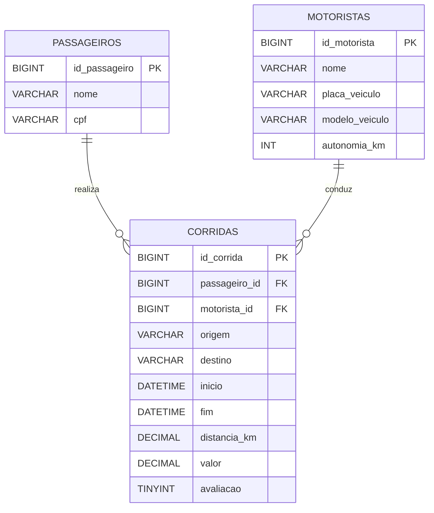

<!--
GABARITO — não faz parte do fluxo principal da aula e fica fora do `nav` do
mkdocs.yml de propósito. É acessível só pelo link no final de Aula_01_Revisao_Modelagem_Conceitual.md.
-->

# Gabarito — Aula 01 — Revisão de Modelagem de Dados (Conceitual)

**Disciplina:** Banco de Dados — Relacional (IBD015)
**Professor:** Ronan Adriel Zenatti · ronan.zenatti@cps.sp.gov.br
**Fatec Jahu — 2º Semestre/2026**

> ⚠️ Este gabarito é para conferência **depois** de você tentar resolver os checkpoints
> por conta própria na [Aula 01](Aula_01_Revisao_Modelagem_Conceitual.md). Resolver
> antes de tentar reduz o benefício de treinar a recuperação ativa do conteúdo — é
> exatamente esse esforço de tentar-antes-de-ver-a-resposta que fixa o aprendizado.

---

## Checkpoint 1 — Entidades: app de patinetes elétricos {: #checkpoint-1 }

**Enunciado resumido:** classificar `Usuários`, `Patinetes`, `Estações de Recarga` e `Manutenções` como entidade forte ou fraca.

**Resposta:**

| Entidade | Classificação | Justificativa |
|---|---|---|
| Usuários | Forte | Existe por si mesma — a pessoa é cadastrada independentemente de já ter alugado algum patinete. |
| Patinetes | Forte | Existe por si mesmo, com atributos próprios (série, bateria, localização) independentes de qualquer outra entidade. |
| Estações de Recarga | Forte | Existe independentemente de quais patinetes estão ou não atracados nela no momento. |
| Manutenções | Fraca | Só existe em relação a um Patinete específico — se o patinete for removido do sistema, o registro de manutenção perde sentido. É o mesmo padrão do exemplo Dependente/Funcionário do texto da aula. |

---

## Checkpoint 2 — Atributos: reserva de sala em coworking {: #checkpoint-2 }

**Enunciado resumido:** classificar `codigo_reserva`, `endereco_unidade`, `data_hora_inicio`/`data_hora_fim`, `duracao_minutos` e `recursos_solicitados`.

**Resposta:**

| Atributo | Tipo | Justificativa |
|---|---|---|
| `codigo_reserva` | Chave | Identifica unicamente cada instância da entidade `Reservas`. |
| `endereco_unidade` | Composto | Pode ser decomposto em partes com significado próprio: rua, número, bairro, cidade e CEP. |
| `data_hora_inicio` / `data_hora_fim` | Simples | Cada um é um valor atômico no contexto desta reserva — não são decompostos em partes menores relevantes ao negócio. |
| `duracao_minutos` | Derivado | Seu valor pode ser calculado a partir de `data_hora_inicio` e `data_hora_fim` — não precisa (e idealmente não deve) ser armazenado. |
| `recursos_solicitados` | Multivalorado | O membro pode selecionar mais de um recurso (projetor, quadro branco, cafeteira, webcam) para a mesma reserva — mais de um valor para a mesma instância. |

---

## Checkpoint 3 — Relacionamentos: plataforma de créditos de carbono {: #checkpoint-3 }

**Resposta:**

**a)** É um relacionamento **ternário**. A `Compensação` só faz sentido pela combinação das três entidades ao mesmo tempo — qual Empresa, qual Projeto Ambiental e qual Auditor Certificador validou aquela transação específica. Analisar apenas duas delas isoladamente (por exemplo, "Empresa compensou em Projeto") perde a informação de quem auditou aquela transação em particular — o mesmo padrão do exemplo Médico–Medicamento–Paciente do texto da aula.

**b)** A cardinalidade é **1:N** entre Empresas e Compensações — uma empresa pode ter várias compensações ao longo do tempo, mas cada registro de compensação pertence a exatamente uma empresa. A participação de Empresas é **parcial**: uma empresa pode estar cadastrada na plataforma e ainda não ter feito nenhuma compensação (ainda está avaliando projetos, por exemplo) — o mesmo padrão do exemplo Cliente/Pedido do texto da aula.

**c)** É um exemplo de **auto-relacionamento** — a entidade `Empresas` se relaciona com ela mesma através da indicação. A FK não pode se chamar `empresa_id` porque, ao referenciar a própria tabela `empresas`, esse nome não diria se representa "a empresa que foi indicada" ou "a empresa que indicou" — ambas são registros da mesma tabela. Por isso o nome usa o papel semântico, por exemplo `empresa_indicadora_id`.

---

## Checkpoint 4 — Generalização/Especialização: entrega por drone e robô {: #checkpoint-4 }

**Resposta:**

**a)** Superclasse `Veículos` com os atributos comuns: `identificador`, `status_operacional`, `latitude`, `longitude`. Subclasses:
- `Drones`: `autonomia_voo_minutos`, `altitude_maxima_metros`.
- `Robôs Terrestres`: `velocidade_maxima_kmh`, `sobe_meio_fio` (booleano).
- `Vans Elétricas`: `capacidade_carga_kg`, `autonomia_km`.

**b)** **Total Exclusiva.** Total porque toda entrega despachada usa exatamente um veículo — não existe veículo "genérico" sem tipo definido no sistema. Exclusiva porque nenhum veículo pode ser, ao mesmo tempo, de mais de um tipo (um drone nunca é também uma van).

**c)** Seguindo a Estratégia 2 (uma tabela por subclasse, com FK única para a superclasse):

```
veiculos (superclasse)
    id_veiculo         — PK
    identificador
    status_operacional
    latitude
    longitude

robos_terrestres (subclasse)
    id_robo_terrestre  — PK própria
    veiculo_id         — FK para veiculos (única, garante o 1:1)
    velocidade_maxima_kmh
    sobe_meio_fio
```

---

## Checkpoint 5 — Método das quatro perguntas: comprovante de corrida elétrica {: #checkpoint-5 }

**Resposta:**

**Passo 1 — Lista bruta:** nome/CPF do passageiro; nome, placa, modelo e autonomia do motorista/veículo; número do comprovante; origem, destino, início, término, distância, valor e avaliação da corrida.

**Passo 2 e 3 — Quatro perguntas e tabela de conclusões:**

| Elemento do comprovante | Pergunta que decide | Conclusão |
|---|---|---|
| Nome, CPF do passageiro | Descreve o passageiro (P3); continua valendo em outra corrida (P2) | Atributos da entidade `PASSAGEIROS` |
| Nome do motorista, placa, modelo, autonomia do veículo | Descrevem o motorista/veículo; continuam existindo em outra corrida (P2) | Atributos da entidade `MOTORISTAS` |
| Nº do comprovante | Identifica esta corrida específica | Atributo (chave) da entidade `CORRIDAS` |
| Origem, destino, início, término, distância, valor, avaliação | Só existem no encontro entre *este* passageiro e *este* motorista, nesta corrida específica (P4) | Atributos da entidade associativa `CORRIDAS` |

**Passo 4 — Diagrama:**



---

⬅️ [Voltar à Aula 01 — Revisão de Modelagem Conceitual](./Aula_01_Revisao_Modelagem_Conceitual.md)

---

*Fatec Jahu · IBD015 · Prof. Ronan Adriel Zenatti · 2026*
