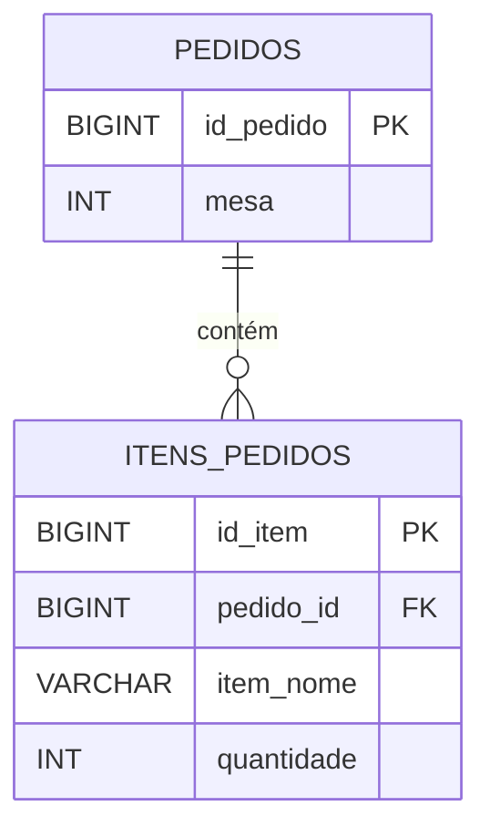
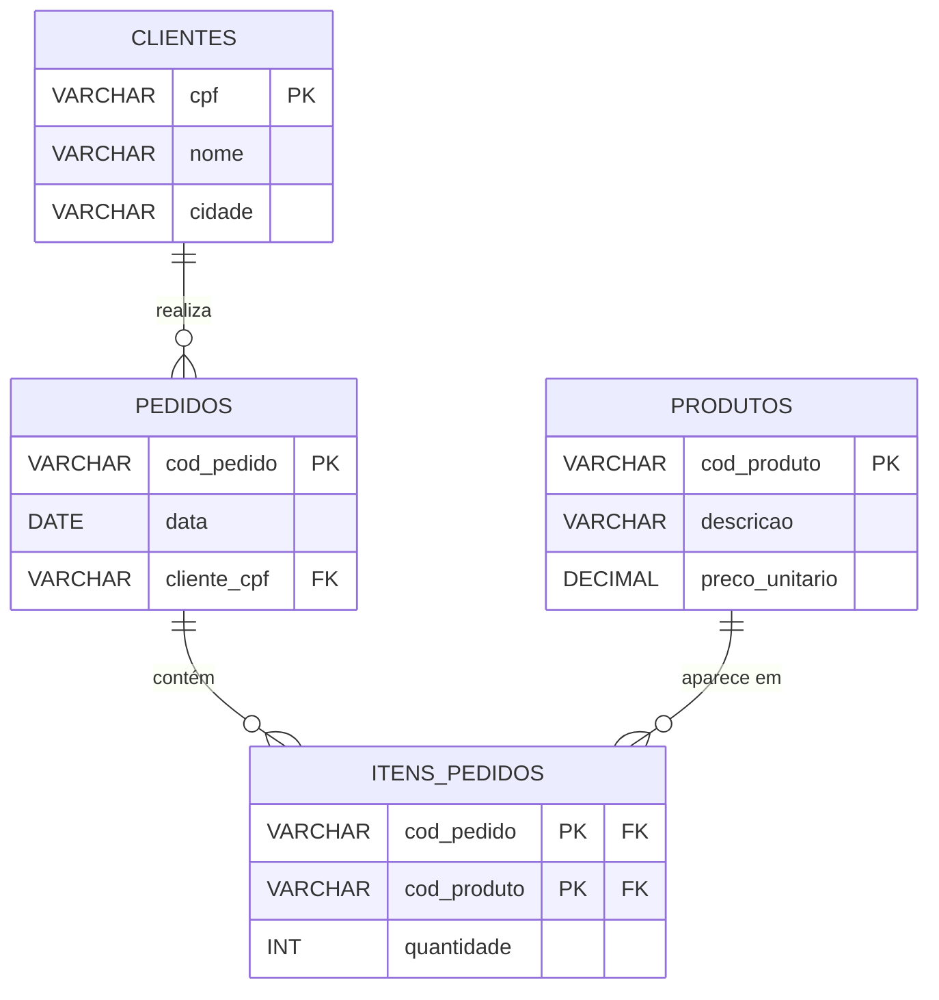

<!--
GABARITO — não faz parte do fluxo principal da aula e fica fora do `nav` do
mkdocs.yml de propósito. É acessível só pelo link no final de Aula_02_Normalizacao.md.
-->

# Gabarito — Aula 02 — Normalização e Passagem ao Modelo Lógico Relacional

**Disciplina:** Banco de Dados — Relacional (IBD015)
**Professor:** Ronan Adriel Zenatti · ronan.zenatti@cps.sp.gov.br
**Fatec Jahu — 2º Semestre/2026**

> ⚠️ Este gabarito é para conferência **depois** de você tentar resolver os checkpoints
> e os Exercícios de Fixação por conta própria na [Aula
> 02](Aula_02_Normalizacao.md). Resolver antes de tentar reduz o benefício de treinar a
> recuperação ativa do conteúdo.

---

## Checkpoint 1 — Anomalias: rede de eletropostos {: #checkpoint-1 }

**Resposta:**

**a)** Não é possível inserir o Eletroposto Faria Lima sem criar uma sessão de recarga fictícia — a chave primária da tabela é por sessão, e o posto só existe como atributo dentro de uma linha de sessão. Isso é uma **anomalia de inserção**.

**b)** Duas linhas (501 e 503) precisam ser atualizadas para manter a consistência. Se uma delas for esquecida, a base fica inconsistente, com Fernanda Reis tendo dois e-mails diferentes registrados ao mesmo tempo. Isso é uma **anomalia de atualização**.

**c)** Perde-se a informação de que Bruno Alves é motorista cadastrado no sistema, junto com seu e-mail — mesmo que ele continue sendo cliente da rede, sua existência no cadastro depende de uma sessão que acabou de ser excluída. Isso é uma **anomalia de exclusão**.

---

## Checkpoint 2 — Dependências Funcionais: plataforma de cloud gaming {: #checkpoint-2 }

**Resposta:**

**a)**
- `id_assinatura → jogador_nome`? **Sim** — dado um `id_assinatura`, existe sempre um único jogador correspondente.
- `id_assinatura → jogo_titulo`? **Não** — uma mesma assinatura pode incluir vários jogos (múltiplos valores de `jogo_titulo` para o mesmo `id_assinatura`).
- `jogo_titulo → genero_jogo`? **Sim** — cada jogo tem um gênero fixo.
- `plano_codigo → plano_nome`? **Sim** — cada código de plano corresponde a um único nome.

**b)** `preco_mensal` depende apenas de `id_assinatura` (o preço é da assinatura/plano contratado, não muda por jogo) — é uma **dependência parcial** em relação à chave composta `(id_assinatura, jogo_titulo)`, pois ignora a parte `jogo_titulo` da chave.

**c)** Sim: `id_assinatura → plano_codigo → preco_mensal` (e também `→ plano_nome`). O preço mensal depende do plano contratado, que por sua vez é referenciado pela assinatura — uma cadeia de dependência transitiva.

---

## Checkpoint 3 — 1FN: pedido por QR code em restaurante {: #checkpoint-3 }

**Resposta:**

**a)** A tabela viola a 1FN por **grupos repetidos** (colunas numeradas `item_1/qtd_1`, `item_2/qtd_2`, `item_3/qtd_3`). Na prática: um pedido com mais de 3 itens simplesmente não cabe na estrutura — o limite de 3 é artificial e arbitrário; e uma mesa que pede só 1 item deixa metade das colunas em `NULL`, desperdiçando espaço e tornando uma pergunta simples como "quantos itens tem o pedido X?" trabalhosa de responder (é preciso checar várias colunas em vez de contar linhas).

**b)** Solução — separar em duas tabelas:



---

## Checkpoint 4 — 2FN: marketplace de aluguel por temporada {: #checkpoint-4 }

**Resposta:**

**a)** Dependências em relação à chave composta `(id_reserva, id_imovel)`:

```
(id_reserva, id_imovel) → noites            ✅ Depende da chave inteira
id_imovel               → preco_diaria      ⚠️  Dependência PARCIAL
id_imovel               → nome_imovel       ⚠️  Dependência PARCIAL
id_imovel               → anfitriao_nome    ⚠️  Dependência PARCIAL
```

**b)** `preco_diaria`, `nome_imovel` e `anfitriao_nome` violam a 2FN — todos dependem apenas de `id_imovel`, que é só parte da chave composta, não da chave inteira.

**c)** Solução:

```
reservas (id_reserva PK, ...)

imoveis (id_imovel PK, nome_imovel, preco_diaria, anfitriao_nome)
  -- anfitriao_nome poderia futuramente virar uma tabela ANFITRIOES separada,
  -- mas isso é uma dependência transitiva (assunto de 3FN), fora do escopo deste checkpoint

itens_reserva (reserva_id PK FK, imovel_id PK FK, noites)
```

---

## Checkpoint 5 — 3FN: plataforma de telemedicina {: #checkpoint-5 }

**Resposta:**

**a)** Dependências em relação a `id_consulta`:

```
id_consulta → paciente_nome                  ✅ Depende diretamente da chave
id_consulta → medico_id                      ✅ Depende diretamente da chave
medico_id   → medico_nome                    ⚠️  Dependência TRANSITIVA
medico_id   → clinica_id                     ⚠️  Dependência TRANSITIVA
clinica_id  → clinica_nome, clinica_cidade   ⚠️  Dependência TRANSITIVA (encadeada)
```

Cadeia completa: `id_consulta → medico_id → clinica_id → clinica_nome / clinica_cidade`.

**b)** Se a Clínica Vitalis mudar de cidade, as linhas 4101 e 4102 (as duas consultas com `clinica_id = 3`) precisam ser atualizadas. Se uma delas for esquecida, a mesma clínica aparece com duas cidades diferentes no sistema — inconsistência.

**c)** Solução:

```
clinicas (id_clinica PK, nome, cidade)

medicos (id_medico PK, nome, clinica_id FK)

consultas (id_consulta PK, paciente_nome, medico_id FK, data_consulta)
```

---

## Checkpoint 6 — Passagem ao Modelo Lógico: plataforma de e-sports {: #checkpoint-6 }

**Resposta:**

```
-- Times (1) — Jogadores (N): Regra 8.2, FK no lado N, participação total → NOT NULL
times (id_time PK, nome, ...)
jogadores (id_jogador PK, nome, time_id FK NOT NULL, ...)

-- Times (N) — Torneios (M) com atributo do relacionamento: Regra 8.3, nova tabela intermediária
torneios (id_torneio PK, nome, data, ...)
participacoes_torneio (time_id PK FK, torneio_id PK FK, posicao_final)

-- Jogadores (1) — Contas_Streaming (1): Regra 8.1, FK no lado que "depende" (Critério 2,
-- mesmo padrão do exemplo PESSOAS/CNHS do texto) + UNIQUE para garantir o 1:1
contas_streaming (id_conta_streaming PK, jogador_id FK UNIQUE, ...)

-- Partidas: entidade fraca dependente de Torneios (Regra 8.4)
partidas (torneio_id PK FK, numero_partida PK, ...)
```

> 📐 Repare que a FK de `contas_streaming` fica na entidade "mais fraca" da relação
> (a conta pertence a um jogador, não o contrário) — mesmo raciocínio do exemplo
> PESSOAS/CNHS da Seção 8.1: mesmo com PESSOAS tendo participação parcial, a FK vai
> para o lado que semanticamente "depende" da outra entidade.

---

## Exercícios de Fixação (Seção 10)

### Exercício 1 — Identificação de Violações

**a)** Viola a **1FN** — há grupos repetidos (colunas numeradas representando uma lista de itens). A solução é criar a tabela ITENS_FATURAS com FK `fatura_id` para FATURAS.

**b)** Viola a **2FN** — `categoria_produto` tem dependência parcial (depende apenas de `produto_id`, e não da chave composta inteira). A solução é mover `categoria_produto` para a tabela PRODUTOS.

**c)** Viola a **3FN** — `nome_departamento` e `localizacao_departamento` são transitivamente dependentes de `id_funcionario` (a cadeia é `id_funcionario → departamento_id → nome_departamento`). A solução é criar a tabela DEPARTAMENTOS e manter apenas a FK `departamento_id` em FUNCIONARIOS.

### Exercício 2 — Normalização Completa

**1FN:** a tabela já está na 1FN (valores atômicos, sem grupos repetidos). A chave primária composta é `(cod_pedido, cod_produto)`.

**2FN:** identificamos dependências parciais:
- `cliente_cpf`, `cliente_nome`, `cliente_cidade`, `data` dependem apenas de `cod_pedido`;
- `produto_desc` e `preco_unit` dependem apenas de `cod_produto`.

Separamos em três tabelas: CLIENTES, PEDIDOS e PRODUTOS, mantendo ITENS_PEDIDOS com apenas `(cod_pedido, cod_produto, qtd)`.

**3FN:** verificamos se há dependências transitivas. Em PEDIDOS temos `cod_pedido → cliente_cpf`, e o cliente poderia determinar cidade (`cliente_cpf → cliente_cidade`). Isso é transitivo! Separamos CLIENTES de PEDIDOS.

Resultado final:



### Exercício 3 — Passagem do MER ao Modelo Lógico

```
AUTORES (id_autor PK, nome, nacionalidade)

CATEGORIAS (id_categoria PK, nome)

LIVROS (id_livro PK, titulo, isbn, ano, categoria_id FK)

AUTORIAS (autor_id PK FK, livro_id PK FK, tipo)
  -- PK composta: resolve o N:M entre AUTORES e LIVROS

USUARIOS (id_usuario PK, nome, email)

EMPRESTIMOS (id_emprestimo PK, usuario_id FK, livro_id FK,
            data_retirada, data_devolucao, status)
  -- EMPRESTIMOS tem PK própria pois registra um evento histórico
  -- Um usuário pode pegar o mesmo livro em momentos diferentes
```

> 📐 Todas as FKs acima seguem a Regra 6 (`tabela_id`) — repare que são o espelho das
> PKs correspondentes (Regra 5, `id_tabela`) com a ordem das palavras invertida.

---

⬅️ [Voltar à Aula 02 — Normalização](./Aula_02_Normalizacao.md)

---

*Fatec Jahu · IBD015 · Prof. Ronan Adriel Zenatti · 2026*
