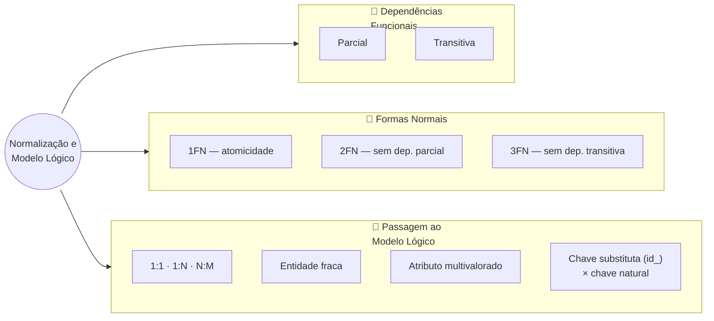
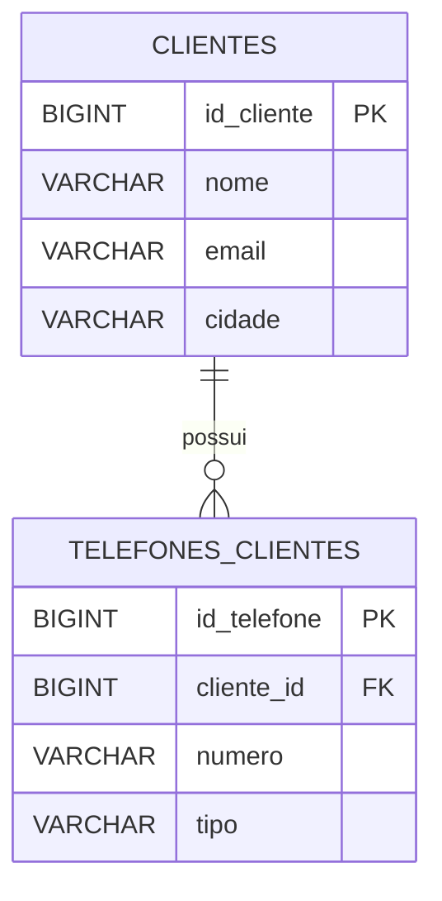
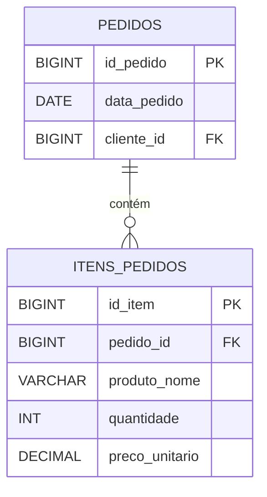
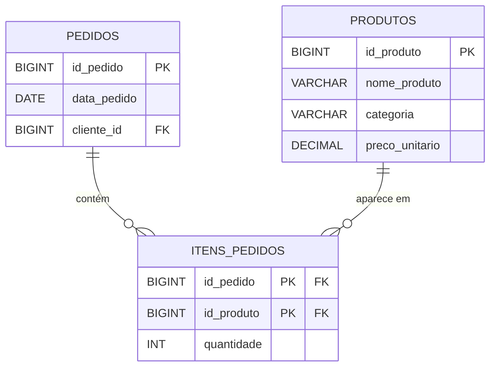
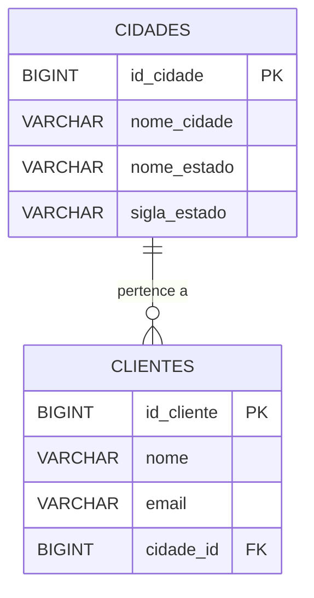
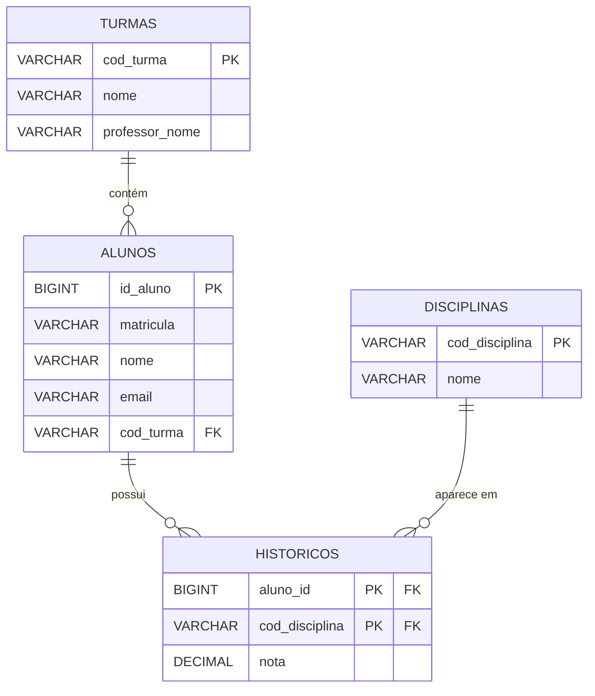
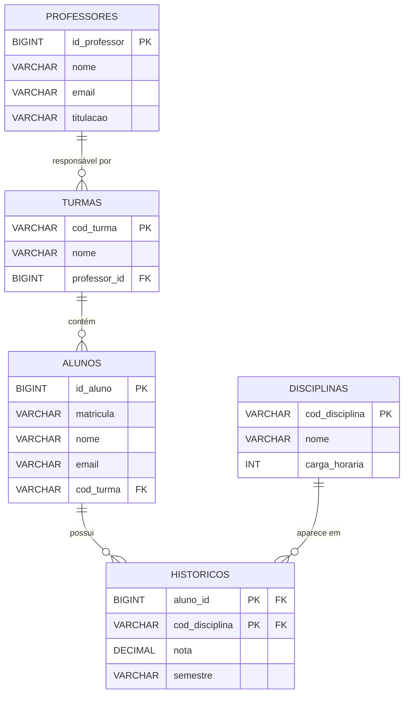
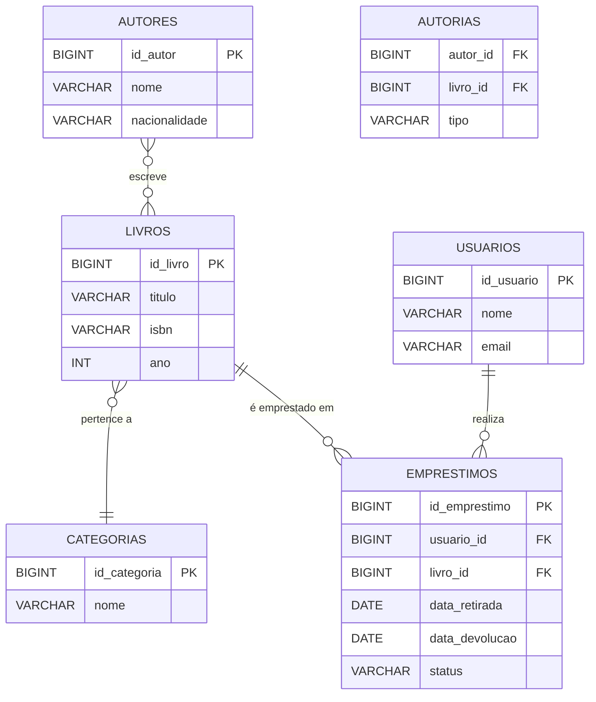

# Aula 02 — Normalização e Passagem ao Modelo Lógico Relacional

**Disciplina:** Banco de Dados — Relacional (IBD015)
**Professor:** Ronan Adriel Zenatti · ronan.zenatti@cps.sp.gov.br
**Fatec Jahu — 2º Semestre/2026**

---

## 🎯 Objetivos da Aula

Ao final desta aula você deverá ser capaz de:

- Identificar dependências funcionais — parciais e transitivas — em um conjunto de dados;
- Reconhecer anomalias de inserção, atualização e exclusão causadas por uma estrutura mal projetada;
- Aplicar as três primeiras Formas Normais (1FN, 2FN, 3FN) para reorganizar tabelas de forma consistente e não redundante;
- Realizar a passagem do modelo conceitual (MER) para o modelo lógico relacional, com regras formais para cada tipo de relacionamento.

---

## 🗺️ Mapa Mental da Aula



---

## 🧭 Por onde começar?

Na Aula 01 você aprendeu a representar um domínio de negócio como um diagrama de entidades e relacionamentos. Mas um diagrama conceitual bem feito ainda não é um banco de dados — é uma representação abstrata do problema. Para sair do diagrama e chegar às tabelas que realmente vão existir no sistema, precisamos percorrer duas etapas complementares que serão o foco desta aula.

A primeira é a **normalização**: um processo analítico e matemático, baseado em teoria de conjuntos e álgebra relacional, que garante que cada tabela do banco armazene apenas o que lhe compete, eliminando redundâncias e prevenindo inconsistências. A segunda é a **passagem ao modelo lógico**: a tradução sistemática do MER para um conjunto de tabelas relacionais, seguindo regras precisas para cada tipo de relacionamento.


Esses dois processos se complementam: você pode chegar ao modelo lógico pela normalização de tabelas existentes (quando há um banco legado, por exemplo) ou pela passagem direta do MER (quando está projetando do zero). Em ambos os casos, o resultado ideal deve satisfazer as mesmas regras formais. Por isso, estudaremos os dois caminhos.

---

## 1. O Problema que a Normalização Resolve

Antes de falar sobre as formas normais em si, é essencial entender *o que acontece quando não normalizamos*. Veja a tabela abaixo, que registra pedidos de uma loja:

| id_pedido | data_pedido | cliente_nome | cliente_email       | cliente_cidade | produto_nome | produto_preco | quantidade |
|-----------|-------------|--------------|---------------------|----------------|--------------|---------------|------------|
| 1         | 2026-03-10  | Ana Lima     | ana@email.com       | São Paulo      | Notebook     | 3500.00       | 1          |
| 1         | 2026-03-10  | Ana Lima     | ana@email.com       | São Paulo      | Mouse        | 120.00        | 2          |
| 2         | 2026-03-11  | Carlos Melo  | carlos@email.com    | Campinas       | Notebook     | 3500.00       | 1          |
| 3         | 2026-03-12  | Ana Lima     | ana@email.com       | São Paulo      | Teclado      | 250.00        | 1          |

À primeira vista, essa tabela parece "completa" — tem tudo em um lugar só. Mas observe com atenção os problemas que ela carrega:

**Anomalia de Inserção:** como cadastrar um novo produto no sistema se ele ainda não foi pedido por ninguém? Não é possível — precisaríamos criar um pedido fictício ou deixar campos em branco, o que viola a integridade.

**Anomalia de Atualização:** se Ana Lima mudar de cidade (digamos, de São Paulo para Jundiaí), precisamos atualizar *todas as linhas* onde ela aparece. Se atualizarmos apenas uma linha, a base ficará inconsistente, com Ana morando em duas cidades ao mesmo tempo.

**Anomalia de Exclusão:** se o pedido 2 for cancelado e a linha for removida, perdemos para sempre a informação de que Carlos Melo é cliente do sistema — junto com seu e-mail e cidade. A remoção de um dado elimina outro dado não relacionado.

Esses três tipos de anomalias — **inserção, atualização e exclusão** — são o sintoma mais visível de um banco desnormalizado. A normalização é o processo de reorganizar as tabelas para eliminar essas anomalias de forma sistemática e matematicamente fundamentada.

!!! example "🔍 Checkpoint 1 — Anomalias: rede de eletropostos para carros elétricos"
    Uma rede de recarga para veículos elétricos registra cada sessão de recarga na tabela abaixo:

    | id_sessao | data_sessao | motorista_nome | motorista_email | posto_nome | posto_cidade | energia_kwh | valor |
    |---|---|---|---|---|---|---|---|
    | 501 | 2026-01-10 | Fernanda Reis | fernanda@email.com | Eletroposto Ipiranga | São Paulo | 42.5 | 68.00 |
    | 502 | 2026-01-11 | Bruno Alves | bruno@email.com | Eletroposto Batel | Curitiba | 30.0 | 48.00 |
    | 503 | 2026-01-12 | Fernanda Reis | fernanda@email.com | Eletroposto Ipiranga | São Paulo | 38.0 | 60.80 |

    a) A rede quer cadastrar o Eletroposto Faria Lima, recém-inaugurado, que ainda não recebeu nenhuma sessão de recarga. É possível inserir esse posto nesta tabela sem criar uma sessão fictícia? Que anomalia isso evidencia?
    b) Fernanda Reis mudou de e-mail. Quantas linhas precisam ser atualizadas para manter a consistência, e o que acontece se uma delas for esquecida? Que anomalia é essa?
    c) Se a sessão 502 — a única de Bruno Alves — for excluída do sistema, o que se perde além do próprio registro de recarga? Que anomalia é essa?

    🔑 Resolução no [Gabarito da Aula 02](Aula_02_Gabarito.md#checkpoint-1) — tente resolver antes de conferir.

---

## 2. Dependências Funcionais — O Alicerce da Normalização

Toda a teoria da normalização é construída sobre um único conceito central: a **dependência funcional**. É fundamental dominar esse conceito antes de avançar para as formas normais.

### 2.1 Definição

Dizemos que o atributo **B** é **funcionalmente dependente** de **A** (notação: **A → B**, lê-se "A determina B") quando, para cada valor de A, existe **exatamente um** valor correspondente de B. Em outras palavras: conhecendo o valor de A, você consegue determinar o valor de B sem ambiguidade.

Pense assim: `cpf → nome_cliente`. Dado o CPF de uma pessoa, há exatamente um nome correspondente — você não pode ter dois nomes diferentes para o mesmo CPF. Portanto, o CPF *determina funcionalmente* o nome.

Atenção: a relação **não é necessariamente bidirecional**. `nome_cliente → cpf` provavelmente não é uma dependência funcional, porque duas pessoas diferentes podem ter o mesmo nome.

### 2.2 Dependência Funcional Parcial

Ocorre quando um atributo não-chave depende de **apenas parte** de uma chave composta — não da chave inteira. Esse tipo de dependência é exatamente o que viola a Segunda Forma Normal.

Exemplo: em uma tabela com chave primária composta por `(id_pedido, id_produto)`, o atributo `preco_produto` depende apenas de `id_produto` — independentemente do pedido. Isso é uma dependência parcial.

```
(id_pedido, id_produto) → quantidade        ← dependência TOTAL da chave composta
id_produto              → preco_produto     ← dependência PARCIAL (só parte da chave)
```

### 2.3 Dependência Funcional Transitiva

Ocorre quando um atributo não-chave depende de outro atributo não-chave, que por sua vez depende da chave primária. Forma uma "cadeia" de dependências.

Exemplo: `id_funcionario → id_departamento → nome_departamento`. O nome do departamento depende do ID do departamento, que depende do ID do funcionário. O `nome_departamento` é transitivamente dependente de `id_funcionario`.

```
id_funcionario → id_departamento → nome_departamento
     (chave)       (não-chave)         (não-chave)
```

Esse tipo de dependência é o que viola a Terceira Forma Normal.


### 2.4 Como Identificar Dependências Funcionais na Prática

Uma técnica muito útil é fazer a **pergunta de determinação** para cada par de atributos:

> *"Dado um valor de [A], existe sempre um único valor de [B]?"*

Se a resposta for **sim**, existe uma dependência funcional A → B. Se a resposta for **não** (pode haver vários valores de B para um mesmo valor de A), não há dependência funcional nessa direção.

Vamos aplicar isso à tabela de pedidos da Seção 1:

- `id_pedido → data_pedido`? Sim — cada pedido tem uma única data. ✅ Dependência funcional.
- `id_pedido → cliente_nome`? Sim — cada pedido pertence a um único cliente. ✅
- `produto_nome → produto_preco`? Sim — cada produto tem um preço fixo (supondo isso). ✅
- `id_pedido → produto_nome`? **Não** — um pedido pode ter vários produtos. ❌ Não é DF.
- `cliente_nome → cliente_cidade`? Sim (assumindo nome único). ✅ Mas é um atributo determinando outro atributo — isso é **transitivo** se `cliente_nome` não for a chave primária.

Identificar todas as dependências funcionais de uma tabela é o primeiro passo antes de aplicar qualquer forma normal.

!!! example "🔍 Checkpoint 2 — Dependências Funcionais: plataforma de cloud gaming"
    Uma plataforma de jogos em nuvem por assinatura mantém a tabela abaixo, onde cada assinatura lista os jogos incluídos no plano contratado (chave primária composta `(id_assinatura, jogo_titulo)`):

    | id_assinatura | jogador_nome | jogador_email | plano_codigo | plano_nome | preco_mensal | jogo_titulo | genero_jogo |
    |---|---|---|---|---|---|---|---|
    | 3001 | Yuri Tanaka | yuri@email.com | ULT | Ultra | 79.90 | Corrida Neon 2077 | Corrida |
    | 3001 | Yuri Tanaka | yuri@email.com | ULT | Ultra | 79.90 | Guerra Orbital | Estratégia |
    | 3002 | Camila Duarte | camila@email.com | PREM | Premium | 49.90 | Guerra Orbital | Estratégia |

    a) Aplique a "pergunta de determinação" (Seção 2.4) e diga se cada afirmação é uma dependência funcional válida: `id_assinatura → jogador_nome`? `id_assinatura → jogo_titulo`? `jogo_titulo → genero_jogo`? `plano_codigo → plano_nome`?
    b) Considerando a chave primária composta `(id_assinatura, jogo_titulo)`, classifique `preco_mensal` quanto ao tipo de dependência funcional em relação a essa chave — total, parcial ou nenhuma. Justifique.
    c) Existe alguma dependência transitiva nessa tabela? Se sim, escreva a cadeia (X → Y → Z).

    🔑 Resolução no [Gabarito da Aula 02](Aula_02_Gabarito.md#checkpoint-2) — tente resolver antes de conferir.

---

## 3. Primeira Forma Normal (1FN)

### 3.1 Definição

Uma tabela está na **Primeira Forma Normal** quando:

1. Todos os atributos contêm apenas **valores atômicos** (indivisíveis — um único valor por célula);
2. Não existem **grupos repetidos** ou atributos multivalorados;
3. Existe uma **chave primária** que identifica unicamente cada linha.

A 1FN é o requisito mínimo para que uma estrutura possa ser chamada de tabela relacional. Sem ela, não estamos dentro do modelo relacional.

### 3.2 Violações Comuns da 1FN

**Violação por valor não-atômico:** armazenar múltiplos valores em uma única célula.

| id_cliente | nome       | telefones                        |
|------------|------------|----------------------------------|
| 1          | Ana Lima   | (14) 99999-0001, (14) 3222-1111  |
| 2          | Carlos Melo| (19) 98888-0002                  |

A coluna `telefones` armazena múltiplos valores separados por vírgula — isso viola a atomicidade. Não é possível consultar apenas o DDD 14, por exemplo, sem recorrer a manipulações de texto.

**Violação por grupos repetidos:** criar colunas numeradas para representar listas.

| id_pedido | produto_1   | qtd_1 | produto_2 | qtd_2 | produto_3 | qtd_3 |
|-----------|-------------|-------|-----------|-------|-----------|-------|
| 1         | Notebook    | 1     | Mouse     | 2     | NULL      | NULL  |
| 2         | Teclado     | 1     | NULL      | NULL  | NULL      | NULL  |

Aqui, tentou-se representar múltiplos produtos por pedido criando colunas repetidas. O limite de produtos é artificialmente restrito, e a maioria das células fica vazia (NULL).

### 3.3 Aplicando a 1FN

**Problema com telefones:**

Para resolver valores não-atômicos, criamos uma tabela separada para o atributo multivalorado:

> 📐 **Por que os diagramas desta aula já usam nomes no plural (`CLIENTES`, `PEDIDOS`...)?**
> É comum — e correto — encontrar entidades nomeadas no singular na literatura acadêmica
> de modelagem conceitual, seguindo a notação clássica de Peter Chen (como fizemos na
> Aula 01). A partir desta aula, porém, já estamos falando de **modelo lógico** — um
> passo mais perto da tabela SQL de verdade, que a Regra 4 (Aula 03) exige no plural.
> Adotamos o plural já aqui, e não só a partir da Aula 03, para que a transição entre
> "entidade no diagrama" e "tabela no banco" não vire uma fonte extra de confusão — o
> nome não muda no meio do caminho.



**Problema com grupos repetidos:**

Para resolver grupos repetidos em pedidos, criamos uma tabela de itens:



> 💡 **Dica de reconhecimento:** se você ver colunas com nomes terminando em números (produto_1, produto_2, produto_3...) ou células com vírgulas separando valores, é quase certo que a 1FN está sendo violada.

!!! example "🔍 Checkpoint 3 — 1FN: pedido por QR code em restaurante"
    Um restaurante que recebe pedidos por QR code na mesa registra os pedidos na tabela abaixo:

    | id_pedido | mesa | item_1 | qtd_1 | item_2 | qtd_2 | item_3 | qtd_3 |
    |---|---|---|---|---|---|---|---|
    | 9001 | 12 | Hambúrguer Artesanal | 2 | Batata Frita | 1 | NULL | NULL |
    | 9002 | 5 | Suco Natural | 3 | NULL | NULL | NULL | NULL |

    a) Que violação da 1FN essa tabela apresenta? Aponte os dois problemas concretos que ela traz na prática (pense em um pedido com mais de três itens, e em uma mesa que peça só um item).
    b) Aplique a 1FN: redesenhe a estrutura em tabelas separadas (como foi feito para `PEDIDOS`/`ITENS_PEDIDOS` na Seção 3.3) e desenhe o `erDiagram` correspondente.

    🔑 Resolução no [Gabarito da Aula 02](Aula_02_Gabarito.md#checkpoint-3) — tente resolver antes de conferir.

---

## 4. Segunda Forma Normal (2FN)

### 4.1 Definição

Uma tabela está na **Segunda Forma Normal** quando:

1. Já está na **1FN**; e
2. Todos os atributos não-chave dependem da **chave primária inteira** — não de apenas parte dela.

A 2FN só é relevante quando a chave primária é **composta** (formada por dois ou mais atributos). Se a chave primária for simples (um único atributo), a tabela automaticamente satisfaz a 2FN desde que esteja na 1FN — pois não é possível ter dependência parcial de uma chave com um único atributo.

### 4.2 Identificando a Violação da 2FN

Considere a tabela ITENS_PEDIDOS que criamos, agora com mais atributos:

| id_pedido | id_produto | quantidade | preco_unitario | nome_produto   | categoria_produto |
|-----------|------------|------------|----------------|----------------|-------------------|
| 1         | 10         | 1          | 3500.00        | Notebook       | Informática       |
| 1         | 20         | 2          | 120.00         | Mouse          | Informática       |
| 2         | 10         | 1          | 3500.00        | Notebook       | Informática       |
| 3         | 30         | 1          | 250.00         | Teclado        | Informática       |

A chave primária composta é `(id_pedido, id_produto)`. Agora vamos mapear as dependências:

```
(id_pedido, id_produto) → quantidade        ✅ Depende da chave inteira
id_produto              → preco_unitario    ⚠️  Dependência PARCIAL — viola 2FN
id_produto              → nome_produto      ⚠️  Dependência PARCIAL — viola 2FN
id_produto              → categoria_produto ⚠️  Dependência PARCIAL — viola 2FN
```

`preco_unitario`, `nome_produto` e `categoria_produto` dependem apenas de `id_produto` — não importa qual é o `id_pedido`. Isso é uma dependência parcial e viola a 2FN.

**Consequências práticas desta violação:**
- Se o preço do Notebook mudar, precisamos atualizar todas as linhas onde ele aparece.
- Se excluirmos todos os pedidos que contêm o produto 30 (Teclado), perdemos as informações do próprio produto.

### 4.3 Aplicando a 2FN

A solução é **separar os atributos com dependência parcial** em uma nova tabela, criando uma entidade independente para eles:



Agora cada tabela armazena apenas o que lhe compete:

- PRODUTOS armazena dados do produto (incluindo o preço base);
- ITENS_PEDIDOS armazena apenas o que é específico da relação entre pedido e produto — a `quantidade`;
- PEDIDOS armazena os dados do pedido em si.

> 📌 **Regra prática:** quando você encontrar informações que se repetem identicamente em múltiplas linhas (como o nome e preço de um produto aparecendo em todos os itens que o contêm), isso é quase sempre sinal de violação da 2FN — os dados repetidos provavelmente pertencem a uma tabela separada.

!!! example "🔍 Checkpoint 4 — 2FN: marketplace de aluguel por temporada"
    Uma plataforma de aluguel de imóveis por temporada permite reservas que reúnem mais de um imóvel sob o mesmo código (ex.: uma viagem com estadias em cidades diferentes). A tabela `ITENS_RESERVA`, com chave primária composta `(id_reserva, id_imovel)`, está assim:

    | id_reserva | id_imovel | noites | preco_diaria | nome_imovel | anfitriao_nome |
    |---|---|---|---|---|---|
    | 701 | 55 | 3 | 320.00 | Loft Vista Mar | Camila Duarte |
    | 701 | 89 | 2 | 210.00 | Cabana na Serra | Rodrigo Nunes |
    | 702 | 55 | 5 | 320.00 | Loft Vista Mar | Camila Duarte |

    a) Mapeie as dependências funcionais desta tabela em relação à chave composta `(id_reserva, id_imovel)`, seguindo o formato usado na Seção 4.2.
    b) Quais atributos violam a 2FN, e por quê?
    c) Aplique a 2FN: proponha as tabelas resultantes (nomes, colunas, PKs e FKs).

    🔑 Resolução no [Gabarito da Aula 02](Aula_02_Gabarito.md#checkpoint-4) — tente resolver antes de conferir.

---

## 5. Terceira Forma Normal (3FN)

### 5.1 Definição

Uma tabela está na **Terceira Forma Normal** quando:

1. Já está na **2FN**; e
2. Nenhum atributo não-chave depende **transitivamente** da chave primária — ou seja, nenhum atributo não-chave depende de outro atributo não-chave.

Formalmente: para toda dependência funcional X → Y na tabela, ou X é uma superchave, ou Y é um atributo primo (faz parte de alguma chave candidata). Na prática do dia a dia, o que estamos eliminando é a situação em que um atributo "vai pela chave" para chegar a outro — uma cadeia de dependências intermediárias.

### 5.2 Identificando a Violação da 3FN

Considere agora a tabela de clientes com dados de endereço:

| id_cliente | nome        | id_cidade | nome_cidade | nome_estado |
|------------|-------------|-----------|-------------|-------------|
| 1          | Ana Lima    | 100       | São Paulo   | SP          |
| 2          | Carlos Melo | 200       | Campinas    | SP          |
| 3          | Beatriz     | 300       | Curitiba    | PR          |
| 4          | Diego       | 100       | São Paulo   | SP          |

A chave primária é `id_cliente`. Vamos mapear as dependências:

```
id_cliente → nome          ✅ Depende diretamente da chave
id_cliente → id_cidade     ✅ Depende diretamente da chave
id_cidade  → nome_cidade   ⚠️  Dependência TRANSITIVA — viola 3FN
id_cidade  → nome_estado   ⚠️  Dependência TRANSITIVA — viola 3FN
```

`nome_cidade` e `nome_estado` dependem de `id_cidade`, que por sua vez depende de `id_cliente`. Existe uma cadeia: `id_cliente → id_cidade → nome_cidade`. O `nome_cidade` chega à chave de forma **transitiva**.

**Consequência prática:** se a cidade de São Paulo mudar de nome (improvável, mas ilustrativo), precisaríamos atualizar todas as linhas de clientes dessa cidade — e poderíamos esquecer alguma, criando inconsistência. Além disso, se todos os clientes de uma cidade forem removidos, perdemos o registro dessa cidade no sistema.

### 5.3 Aplicando a 3FN

Novamente, a solução é extrair os atributos transitivos para sua própria tabela:



Agora `nome_cidade` e `nome_estado` residem apenas em CIDADES. Um cliente referencia sua cidade pela FK `cidade_id` (Regra 6), e qualquer alteração no nome da cidade é feita em um único lugar.

> 💡 **Dica de reconhecimento da violação da 3FN:** procure atributos que se repetem em grupos. No exemplo acima, "São Paulo" e "SP" aparecem sempre juntos para clientes de São Paulo — isso sugere que essas duas informações pertencem a outra entidade, e estão chegando aqui "carregadas" por um intermediário.

!!! example "🔍 Checkpoint 5 — 3FN: plataforma de telemedicina"
    Uma plataforma de telemedicina registra as consultas na tabela `CONSULTAS`, com chave primária `id_consulta`:

    | id_consulta | paciente_nome | medico_id | medico_nome | clinica_id | clinica_nome | clinica_cidade | data_consulta |
    |---|---|---|---|---|---|---|---|
    | 4101 | Larissa Prado | 12 | Dr. André Lima | 3 | Clínica Vitalis | Jahu | 2026-02-03 |
    | 4102 | Otávio Reis | 12 | Dr. André Lima | 3 | Clínica Vitalis | Jahu | 2026-02-04 |
    | 4103 | Larissa Prado | 27 | Dra. Beatriz Sá | 8 | Clínica Bem Estar | Bauru | 2026-02-10 |

    a) Mapeie as dependências funcionais em relação a `id_consulta`, seguindo o formato da Seção 5.2. Existe alguma dependência transitiva? Escreva a cadeia.
    b) O que acontece se a Clínica Vitalis mudar de cidade? Quantas linhas precisariam ser atualizadas, e qual o risco disso?
    c) Aplique a 3FN: proponha as tabelas resultantes.

    🔑 Resolução no [Gabarito da Aula 02](Aula_02_Gabarito.md#checkpoint-5) — tente resolver antes de conferir.

---

## 6. Resumo Comparativo das Três Formas Normais

A tabela abaixo consolida os conceitos em uma visão única para facilitar a revisão e o estudo:

| Forma Normal | Pré-requisito | O que elimina | Tipo de dependência eliminada | Pergunta de diagnóstico |
|---|---|---|---|---|
| **1FN** | — | Valores não-atômicos e grupos repetidos | Atributos multivalorados | "Existe mais de um valor por célula ou coluna repetida?" |
| **2FN** | Estar na 1FN | Dependências de parte da chave | Dependência parcial | "Algum atributo depende só de parte da chave composta?" |
| **3FN** | Estar na 2FN | Dependências entre não-chaves | Dependência transitiva | "Algum atributo não-chave depende de outro não-chave?" |


---

## 7. Exemplo Completo de Normalização — Passo a Passo

Vamos aplicar todo o processo a uma única tabela inicial e transformá-la progressivamente até a 3FN. Esta é a situação mais comum em provas e projetos reais: você recebe uma planilha ou tabela "bruta" e precisa normalizá-la.

**Tabela inicial (não normalizada) — Sistema de uma escola:**

| matricula | aluno_nome | aluno_email        | cod_turma | turma_nome       | professor_nome  | disciplinas_cursadas         | notas     |
|-----------|------------|--------------------|-----------|------------------|-----------------|------------------------------|-----------|
| 2026001   | Ana Lima   | ana@fatec.edu.br   | T01       | Turma da Manhã   | Prof. Ronan     | BD Relacional, Prog. Web     | 8.5, 7.0  |
| 2026002   | Carlos     | carlos@fatec.edu.br| T01       | Turma da Manhã   | Prof. Ronan     | BD Relacional                | 9.0       |
| 2026003   | Beatriz    | bi@fatec.edu.br    | T02       | Turma da Tarde   | Prof. Silva     | BD Relacional, Cloud         | 6.0, 8.0  |

### Passo 1 — Aplicar a 1FN

**Problemas identificados:**
- `disciplinas_cursadas` contém múltiplos valores por célula (não-atômico);
- `notas` também contém múltiplos valores;
- Ambas formam um "grupo repetido" implícito.

**Solução:** eliminar os valores múltiplos e criar linhas separadas para cada disciplina cursada. Também identificamos e separamos as entidades ALUNOS, TURMAS e HISTORICOS.

Tabela em 1FN (expandida com linhas atômicas):

| matricula | aluno_nome | aluno_email         | cod_turma | turma_nome     | professor_nome | cod_disciplina | disciplina_nome | nota |
|-----------|------------|---------------------|-----------|----------------|----------------|----------------|-----------------|------|
| 2026001   | Ana Lima   | ana@fatec.edu.br    | T01       | Turma da Manhã | Prof. Ronan    | D01            | BD Relacional   | 8.5  |
| 2026001   | Ana Lima   | ana@fatec.edu.br    | T01       | Turma da Manhã | Prof. Ronan    | D02            | Prog. Web       | 7.0  |
| 2026002   | Carlos     | carlos@fatec.edu.br | T01       | Turma da Manhã | Prof. Ronan    | D01            | BD Relacional   | 9.0  |
| 2026003   | Beatriz    | bi@fatec.edu.br     | T02       | Turma da Tarde | Prof. Silva    | D01            | BD Relacional   | 6.0  |
| 2026003   | Beatriz    | bi@fatec.edu.br     | T02       | Turma da Tarde | Prof. Silva    | D03            | Cloud           | 8.0  |

Agora a chave primária composta é `(matricula, cod_disciplina)`. A tabela está na 1FN, mas ainda tem problemas.

### Passo 2 — Aplicar a 2FN

**Dependências identificadas:**

```
(matricula, cod_disciplina) → nota            ✅ Depende da chave inteira
matricula                   → aluno_nome      ⚠️  Dependência PARCIAL
matricula                   → aluno_email     ⚠️  Dependência PARCIAL
matricula                   → cod_turma       ⚠️  Dependência PARCIAL
matricula                   → turma_nome      ⚠️  Dependência PARCIAL
matricula                   → professor_nome  ⚠️  Dependência PARCIAL
cod_disciplina              → disciplina_nome ⚠️  Dependência PARCIAL
```

**Solução:** separar os atributos com dependências parciais em suas próprias tabelas:



Repare que `id_aluno` (Regra 5) aparece aqui pela primeira vez, e `matricula` — que era a chave da tabela ainda desnormalizada — vira um atributo comum (com restrição `UNIQUE`, já que continua identificando o aluno de forma única no mundo real). Veja a nota **Por que uma chave substituta, e não a matrícula (ou o CPF)?** ao final desta seção para o porquê dessa troca.

A tabela está na 2FN. Mas ainda existe um problema: na tabela TURMAS, o `professor_nome` depende de quê?

### Passo 3 — Aplicar a 3FN

**Problema encontrado em TURMAS:**

A turma T01 tem "Prof. Ronan" como professor. Suponha que o professor tenha e-mail e titulação registrados. Então:

```
cod_turma       → professor_nome    ✅ Depende da chave
professor_nome  → professor_email   ⚠️  Transitiva (se armazenarmos aqui)
professor_nome  → professor_titulo  ⚠️  Transitiva
```

**Solução:** criar a entidade PROFESSORES e referenciar pela FK:



Agora o modelo está completamente na **3FN**. Cada tabela armazena exatamente o que lhe compete, sem redundâncias, sem dependências parciais e sem dependências transitivas.

---

## 8. Passagem do Modelo Conceitual ao Modelo Lógico

Quando partimos de um MER bem desenhado (como fizemos na Aula 01), a passagem ao modelo lógico segue regras precisas para cada tipo de relacionamento. Este é um processo mecânico — dado o diagrama, o resultado é determinístico.

> 📐 **Convenções de nomenclatura aplicadas a partir daqui:** toda chave primária
> segue o padrão `id_` + nome da tabela no singular (**Regra 5**), e toda chave
> estrangeira segue o padrão inverso — nome da tabela referenciada no singular + `_id`
> (**Regra 6**). Repare que a ordem das palavras se inverte entre PK e FK: isso não é
> estético, é o que permite distinguir visualmente "quem é dono da linha" de "quem
> está apontando para outra tabela" só de olhar o nome da coluna. Essas regras — e as
> outras sete que regem nomenclatura SQL nesta disciplina — são formalizadas por
> completo na [Aula 03](./Aula_03_SQL_DDL.md#1-convencoes-de-nomenclatura-desta-disciplina).

### 8.1 Regra para Relacionamentos 1:1

Em um relacionamento 1:1, a chave estrangeira pode ir para qualquer um dos dois lados. A decisão se baseia em dois critérios:

**Critério 1 — Participação:** a FK vai preferencialmente para o lado de participação **parcial** (mínimo 0), pois assim a coluna pode ser NULL quando não há associação, evitando linhas fantasmas.

**Critério 2 — Semântica:** a FK vai para a entidade que "depende" ou "pertence a" a outra conceitualmente.

Exemplo — FUNCIONARIOS e CRACHAS (1:1, participação total dos dois lados):

```
FUNCIONARIOS (id_funcionario PK, nome, data_admissao)
CRACHAS (id_cracha PK, numero_serie, data_emissao, funcionario_id FK UNIQUE)
```

A constraint `UNIQUE` na FK garante que o relacionamento seja realmente 1:1 no banco de dados — sem ela, a FK permitiria N crachás por funcionário. Note que a FK se chama `funcionario_id` (Regra 6) — não `id_funcionario`, que seria o padrão de uma PK (Regra 5), não de uma FK.

Exemplo — PESSOAS e CNHS (1:1, participação parcial de PESSOAS):

```
PESSOAS (id_pessoa PK, nome, cpf)
CNHS (id_cnh PK, numero_registro, data_validade, pessoa_id FK UNIQUE)
```

A FK fica em CNHS (o lado que "depende" de PESSOAS), nomeada `pessoa_id` pela Regra 6, e o UNIQUE garante o 1:1.

### 8.2 Regra para Relacionamentos 1:N

Esta é a regra mais simples e mais usada: **a chave estrangeira vai sempre para o lado N** (para a tabela do lado "muitos"). Ela recebe o valor da chave primária da entidade do lado 1.

Exemplo — DEPARTAMENTOS (1) e FUNCIONARIOS (N):

```
DEPARTAMENTOS (id_departamento PK, nome, localizacao)
FUNCIONARIOS (id_funcionario PK, nome, salario, departamento_id FK)
```

A FK `departamento_id` (Regra 6) vai para FUNCIONARIOS porque um funcionário pode pertencer a apenas um departamento (lado 1), e um departamento tem muitos funcionários (lado N).

### 8.3 Regra para Relacionamentos N:M

Relacionamentos N:M **sempre geram uma nova tabela** no modelo lógico. Essa tabela intermediária (também chamada de tabela de junção, tabela associativa ou tabela de relacionamento) contém:

1. A chave primária de cada uma das entidades originais, como **chaves estrangeiras**;
2. Juntas, essas FKs formam a **chave primária composta** da tabela intermediária;
3. Quaisquer **atributos do próprio relacionamento** (como `nota` em uma matrícula, ou `quantidade` em um item de pedido).

Exemplo — ALUNOS e DISCIPLINAS (N:M) com atributos `nota` e `semestre`:

```
ALUNOS (id_aluno PK, matricula, nome, email)
DISCIPLINAS (id_disciplina PK, nome, carga_horaria)
HISTORICOS (aluno_id PK FK, disciplina_id PK FK, nota, semestre)
```

A chave primária de HISTORICOS é `(aluno_id, disciplina_id)` — composta pelas duas FKs, ambas seguindo a Regra 6. Note que `matricula` continua em ALUNOS como um atributo comum (com `UNIQUE`) — ela identifica o aluno perante a instituição, mas quem identifica a linha na tabela é `id_aluno`.

### 8.4 Regra para Entidades Fracas

Uma entidade fraca não tem chave própria — ela depende da entidade forte para ser identificada. No modelo lógico, sua tabela inclui a FK da entidade forte como parte de sua chave primária.

Exemplo — FUNCIONARIOS e DEPENDENTES (entidade fraca):

```
FUNCIONARIOS (id_funcionario PK, nome, cpf)
DEPENDENTES (funcionario_id PK FK, nome_dependente PK, parentesco, data_nascimento)
```

A chave primária de DEPENDENTES é `(funcionario_id, nome_dependente)` — o dependente é identificado dentro do contexto do funcionário. A FK `funcionario_id` segue a Regra 6, mesmo participando de uma chave composta.

### 8.5 Regra para Atributos Multivalorados

Atributos multivalorados do MER sempre se tornam uma tabela separada, com FK referenciando a entidade original.

Exemplo — CLIENTES com atributo multivalorado `telefone`:

```
CLIENTES (id_cliente PK, nome, email)
TELEFONES_CLIENTES (cliente_id PK FK, numero PK, tipo)
```

A chave primária de TELEFONES_CLIENTES é `(cliente_id, numero)`, pois o número de telefone identifica cada registro dentro do contexto de um cliente. A FK `cliente_id` segue a Regra 6.

### 8.6 Por que uma Chave Substituta, e não a Matrícula (ou o CPF)?

Você deve ter reparado que, na Seção 7, a `matricula` era a chave primária de ALUNOS
enquanto a tabela ainda estava desnormalizada — mas ao formalizarmos o modelo lógico
(Passo 2 em diante), ela deu lugar a `id_aluno`, virando um atributo comum. Essa troca
não foi acidental, e vale entender o porquê, porque é uma dúvida que aparece o
semestre inteiro: *"por que não uso logo o CPF, ou a matrícula, como chave primária?
Já é único, não é?"*

Existem dois tipos de chave primária:

**Chave natural** é um identificador que já existe no mundo real, independente do seu
banco de dados — CPF, matrícula, código de barras, placa de veículo, ISBN. **Chave
substituta** (*surrogate key*) é um identificador criado *pelo* banco de dados, sem
nenhum significado de negócio — é exatamente o `id_tabela` da Regra 5, um número que
só existe para dar nome único a cada linha.

**Nesta disciplina, a chave primária é sempre a chave substituta `id_tabela`.** Os
motivos práticos são:

- **Estabilidade:** um identificador de negócio pode, em algum momento, mudar — uma
  matrícula pode ser reemitida após uma transferência de curso, um CPF pode ser
  retificado pela Receita Federal em casos raros, um código de produto pode ser
  renumerado em uma reestruturação de catálogo. Quando a PK muda, a mudança precisa se
  propagar para **toda FK que a referencia** — um problema que simplesmente não existe
  quando a PK é um `id_` que nunca teve significado de negócio para começo de conversa.
- **Disponibilidade no momento do cadastro:** em alguns sistemas, o identificador de
  negócio só é conhecido depois (ex.: um cliente que se cadastra antes de informar CPF
  completo, um produto que ainda não tem código de barras definido pelo fornecedor). Um
  `id_` autoincrementado sempre existe, desde o primeiro `INSERT`.
- **Tamanho e desempenho de índice:** `BIGINT UNSIGNED` ocupa 8 bytes fixos e é
  extremamente rápido de comparar e indexar. Um CPF como `CHAR(11)` ou uma matrícula em
  `VARCHAR` são mais lentos de indexar e comparar, especialmente quando essa mesma
  chave se repete como FK em várias outras tabelas.
- **Privacidade e segurança:** se o CPF fosse a PK de PESSOAS, ele apareceria como FK
  em toda tabela relacionada — pedidos, matrículas, prontuários — espalhando um dado
  sensível pelo esquema inteiro. Com `id_pessoa`, o CPF fica isolado como atributo em
  uma única tabela, mais fácil de proteger e de excluir seletivamente (ex.: LGPD).
- **Desacoplamento:** a identidade da linha no banco não deveria depender de uma regra
  de negócio externa que pode mudar (ex.: o formato da matrícula ser redefinido pela
  instituição). O `id_` garante que o banco continua íntegro mesmo que essas regras
  externas mudem.

Isso **não** significa que a matrícula ou o CPF deixem de existir na tabela — eles
continuam lá como atributos comuns, protegidos por uma constraint `UNIQUE` (a mesma
lógica que a Aula 03 vai formalizar com `CONSTRAINT uq_cpf UNIQUE (cpf)`). Você ganha
o melhor dos dois mundos: a garantia de unicidade do mundo real, e a estabilidade e
performance da chave substituta como identidade interna da linha.

> 🎯 **Fixe desde já:** toda PK criada por você, em qualquer aula ou atividade daqui em
> diante, é `id_` + nome da tabela no singular — nunca um CPF, matrícula, código de
> barras ou e-mail, por mais "único" que pareçam. Alunos que se acostumam com exemplos
> de chave natural nas primeiras aulas costumam travar mais à frente, quando o modelo
> cresce e a FK de uma chave de negócio muda de tabela em tabela. Comece certo agora e
> essa dúvida nunca mais aparece.

!!! example "🔍 Checkpoint 6 — Passagem ao Modelo Lógico: plataforma de e-sports"
    Uma plataforma de e-sports tem o seguinte MER conceitual:

    - `Times` (1) — `Jogadores` (N): um jogador pertence a um único time no momento; um time tem vários jogadores. Participação de Jogadores é total (todo jogador cadastrado pertence a algum time).
    - `Times` (N) — `Torneios` (M): um time participa de vários torneios, e um torneio reúne vários times — com um atributo `posicao_final` pertencente ao próprio relacionamento (a colocação daquele time naquele torneio específico).
    - `Jogadores` (1) — `Contas_Streaming` (1): um jogador pode vincular uma conta de streaming para transmitir suas partidas (participação parcial de Jogadores — nem todo jogador transmite; participação total de Contas_Streaming — toda conta vinculada pertence a exatamente um jogador).
    - `Partidas` é uma entidade fraca que só existe dentro de um `Torneio` — cada partida é identificada por um `numero_partida` que só é único *dentro* do torneio ao qual pertence.

    Escreva o modelo lógico completo (tabelas, colunas, PKs e FKs) aplicando as regras de passagem da Seção 8 a cada um dos quatro relacionamentos acima.

    🔑 Resolução no [Gabarito da Aula 02](Aula_02_Gabarito.md#checkpoint-6) — tente resolver antes de conferir.

---

## 9. Resumo das Regras de Passagem


| Elemento do MER | Regra de Passagem ao Modelo Lógico |
|---|---|
| Entidade forte | Torna-se uma tabela com seus atributos; chave vira PK |
| Entidade fraca | Tabela com FK da entidade forte como parte da PK composta |
| Relacionamento 1:1 | FK no lado de participação parcial + constraint UNIQUE |
| Relacionamento 1:N | FK no lado N |
| Relacionamento N:M | Nova tabela intermediária com PK composta pelas duas FKs |
| Atributo multivalorado | Nova tabela com FK da entidade original |
| Atributo composto | Decomposto em atributos simples na mesma tabela (ou separado, se necessário) |
| Atributo derivado | Geralmente **não** é armazenado (calculado em tempo de consulta) |

---

## 10. Exercícios de Fixação

> 🔑 As resoluções destes três exercícios estão no [Gabarito da Aula 02](Aula_02_Gabarito.md) — tente resolver antes de conferir.

### Exercício 1 — Identificação de Violações

Para cada situação abaixo, identifique qual forma normal está sendo violada e explique o motivo:

**a)** Uma tabela FATURAS com chave primária `id_fatura` contém as colunas `item1_nome`, `item1_valor`, `item2_nome`, `item2_valor`, `item3_nome`, `item3_valor`.

**b)** Uma tabela ITENS_VENDAS com chave primária composta `(venda_id, produto_id)` contém a coluna `categoria_produto`, que depende apenas de `produto_id`.

**c)** Uma tabela FUNCIONARIOS com chave primária `id_funcionario` contém `departamento_id`, `nome_departamento` e `localizacao_departamento`.

---

### Exercício 2 — Normalização Completa

Normalize a tabela abaixo até a 3FN, apresentando o diagrama final:

| cod_pedido | data | cliente_cpf | cliente_nome | cliente_cidade | cod_produto | produto_desc | preco_unit | qtd |
|------------|------|-------------|--------------|----------------|-------------|--------------|------------|-----|
| P001 | 2026-03-01 | 111.222.333-44 | Ana | São Paulo | PR01 | Notebook | 3500.00 | 1 |
| P001 | 2026-03-01 | 111.222.333-44 | Ana | São Paulo | PR02 | Mouse    | 120.00  | 2 |
| P002 | 2026-03-02 | 555.666.777-88 | Carlos | Campinas | PR01 | Notebook | 3500.00 | 1 |

---

### Exercício 3 — Passagem do MER ao Modelo Lógico

Dado o diagrama conceitual abaixo (sistema de uma biblioteca), escreva o modelo lógico completo com todas as tabelas, colunas, PKs e FKs:



---

## 11. Erros Comuns e Como Evitá-los

**Erro 1 — Parar na 1FN:** muitos iniciantes normalizam apenas para eliminar os valores múltiplos e acham que terminaram. Sempre verifique as dependências parciais (2FN) e transitivas (3FN) antes de declarar o modelo normalizado.

**Erro 2 — Ignorar a 2FN por ter chave simples:** lembre-se de que a 2FN só é aplicável quando há chave composta. Mas é um erro pensar que uma tabela com chave simples "automaticamente" está na 2FN — você ainda precisa verificar a 3FN.

**Erro 3 — Confundir dependência transitiva com dependência direta:** se `A → B` e `B → C`, então `A → C` é transitiva. Mas se você der uma PK nova para a entidade intermediária e criar uma tabela para ela, a dependência transitiva some — essa é exatamente a solução.

**Erro 4 — Não colocar UNIQUE em FK de relacionamento 1:1:** ao implementar um 1:1, a FK sem a constraint UNIQUE se comportará como um 1:N no banco de dados. O SGBD não saberá que você quer restringir a um único relacionamento.

**Erro 5 — Esquecer atributos do relacionamento N:M:** quando um N:M é resolvido com tabela intermediária, os atributos que pertencem ao *relacionamento* (como `quantidade` em ITENS_PEDIDOS, ou `nota` em HISTORICOS) devem ir para essa tabela — não para nenhuma das entidades originais.

---

## 📚 Referências desta Aula

- ELMASRI, R.; NAVATHE, S. B. *Sistemas de Banco de Dados*. 7 ed. Cap. 14 — Dependências Funcionais e Normalização para Bancos de Dados Relacionais. São Paulo: Pearson, 2018.
- SILBERSCHATZ, A.; KORTH, H. F.; SUNDARSHAN, S. *Sistema de banco de dados*. 6 ed. Cap. 7 — Projeto de Banco de Dados Relacional. Rio de Janeiro: Elsevier, 2016.
- DATE, C. J. *Introdução a sistemas de bancos de dados*. 8 ed. Cap. 11 — Teoria Relacional Avançada. Rio de Janeiro: Elsevier/Campus, 2004.

---

## 🃏 Flashcards de Revisão

??? question "O que é uma dependência funcional? Dê a notação."
    Dizemos que B é funcionalmente dependente de A (notação A → B) quando, para cada
    valor de A, existe exatamente um valor correspondente de B. Exemplo: `cpf →
    nome_cliente`.

??? question "Qual a diferença entre dependência funcional parcial e transitiva?"
    Parcial: um atributo não-chave depende de apenas parte de uma chave composta (viola
    a 2FN). Transitiva: um atributo não-chave depende de outro atributo não-chave, que
    por sua vez depende da chave primária (viola a 3FN).

??? question "Quais são os três requisitos da Primeira Forma Normal (1FN)?"
    Valores atômicos em todos os atributos, ausência de grupos repetidos ou atributos
    multivalorados, e existência de uma chave primária que identifique unicamente cada
    linha.

??? question "A 2FN é relevante em toda tabela, ou só em algumas?"
    Só é relevante quando a chave primária é composta (dois ou mais atributos). Uma
    tabela com chave simples satisfaz a 2FN automaticamente, desde que já esteja na 1FN.

??? question "Em um relacionamento 1:N, em qual tabela a chave estrangeira deve ficar?"
    Sempre na tabela do lado N (muitos). Ela recebe uma cópia do tipo da chave primária
    da entidade do lado 1 — nunca o contrário.

??? question "Pegadinha comum: uma tabela sem valores múltiplos por célula já está totalmente normalizada?"
    Não. Estar livre de valores não-atômicos garante apenas a 1FN. É preciso verificar
    também dependências parciais (2FN) e transitivas (3FN) antes de declarar o modelo
    normalizado.

??? question "Por que usamos id_tabela como chave primária em vez do CPF ou da matrícula, que já são únicos?"
    Porque um identificador de negócio (chave natural) pode mudar, pode não estar
    disponível no momento do cadastro, é mais lento de indexar que um `BIGINT`, e — no
    caso do CPF — espalha um dado sensível como FK por várias tabelas. A chave
    substituta (`id_`) nunca muda, sempre existe, e mantém o dado sensível isolado como
    atributo comum, protegido por `UNIQUE`.

---

## ✅ Quiz de Fixação

<quiz>
Uma tabela FATURA armazena as colunas item1_nome, item1_valor, item2_nome, item2_valor, item3_nome e item3_valor. Qual forma normal está sendo violada?
- [x] 1FN — grupos repetidos representados como colunas numeradas
- [ ] 2FN — dependência parcial da chave composta
- [ ] 3FN — dependência transitiva entre não-chaves
- [ ] Nenhuma — a tabela já está normalizada

Colunas numeradas (item1, item2, item3...) são o sintoma clássico de grupo repetido, que viola a atomicidade exigida pela 1FN.
</quiz>

<quiz>
Em uma tabela ITEM_VENDA com PK composta (id_venda, id_produto), o atributo categoria_produto depende apenas de id_produto. Isso viola qual forma normal?
- [ ] 1FN
- [x] 2FN
- [ ] 3FN
- [ ] Não viola nenhuma forma normal

categoria_produto depende de apenas parte da chave composta (id_produto), não da chave inteira — isso é uma dependência parcial, que viola especificamente a 2FN.
</quiz>

<quiz>
Marque todas as afirmações corretas sobre a Terceira Forma Normal (3FN).
- [x] Exige que a tabela já esteja na 2FN
- [x] Elimina dependências entre atributos não-chave
- [ ] Só se aplica quando a chave primária é composta
- [x] Uma cadeia como id_funcionario → id_departamento → nome_departamento viola a 3FN

A 3FN pressupõe a 2FN e elimina dependências transitivas (atributo não-chave dependendo de outro atributo não-chave). Diferente da 2FN, ela se aplica mesmo com chave simples.
</quiz>

<quiz>
Qual anomalia ocorre quando não é possível cadastrar um novo produto no sistema porque ele ainda não foi vinculado a nenhum pedido?
- [x] Anomalia de inserção
- [ ] Anomalia de atualização
- [ ] Anomalia de exclusão
- [ ] Anomalia de normalização (não existe esse termo)

É uma anomalia de inserção: a estrutura desnormalizada obriga a existência de um pedido para que um produto possa ser registrado, mesmo que o produto exista independentemente do pedido.
</quiz>

<quiz>
Em um relacionamento N:M entre ALUNOS e DISCIPLINAS, com atributos nota e situação na matrícula, qual é a regra de passagem ao modelo lógico?
- [ ] A FK vai para o lado de participação parcial
- [ ] Cria-se apenas uma FK na tabela ALUNOS
- [x] Cria-se uma tabela intermediária com PK composta pelas duas FKs, mais os atributos do relacionamento
- [ ] O N:M é implementado diretamente, sem tabela nova

Todo N:M sempre gera uma nova tabela intermediária, cuja chave primária é composta pelas FKs das duas entidades originais — e é essa tabela que recebe os atributos que pertencem ao relacionamento em si, como nota e situação.
</quiz>

<quiz>
Por que o CPF é uma má escolha de chave primária, mesmo sendo um identificador único no mundo real?
- [ ] Porque CPF é um dado numérico, e PKs devem ser sempre texto
- [x] Porque, sendo PK, o CPF se propagaria como FK sensível por várias tabelas, além de ser mais lento de indexar que um BIGINT
- [ ] Porque não existem CPFs verdadeiramente únicos
- [ ] Não há problema algum — CPF é a melhor escolha de PK

Usar CPF como PK espalha um dado sensível (LGPD) como FK em toda tabela relacionada, além de ser mais lento de indexar do que um BIGINT. A solução desta disciplina é sempre usar id_tabela como PK e manter o CPF como atributo único (UNIQUE).
</quiz>

---

## 📝 Resumo

Nesta aula vimos que a normalização resolve anomalias de inserção, atualização e
exclusão através da eliminação sistemática de dependências funcionais parciais e
transitivas. Percorremos as três primeiras Formas Normais — 1FN (atomicidade), 2FN
(sem dependência parcial da chave composta) e 3FN (sem dependência transitiva entre
não-chaves) — com um exemplo completo do zero até a 3FN. Também vimos as regras
formais e determinísticas de passagem do MER ao modelo lógico relacional, para
relacionamentos 1:1, 1:N, N:M, entidades fracas e atributos multivalorados — sempre
usando chaves substitutas (`id_tabela`) em vez de chaves naturais como CPF ou
matrícula, e entendemos por quê. Na próxima aula, esse modelo lógico já normalizado
vira SQL de verdade, com `CREATE TABLE`.

---

## 🏆 Conquista da Aula

!!! success "Selo desbloqueado: 🧹 Guardião(ã) da Normalização"
    Você aprendeu a identificar e eliminar as três principais fontes de redundância e
    inconsistência em um banco de dados, e já sabe traduzir qualquer MER em tabelas
    relacionais corretas. A próxima parada da Trilha do(a) Modelador(a) de Dados:
    transformar esse modelo lógico em SQL de verdade.

---

## 🔑 Gabarito desta Aula

As respostas dos 6 checkpoints espalhados pela aula, e dos 3 Exercícios de Fixação da
Seção 10, estão em um arquivo separado, para não estragar a tentativa de quem ainda não
chegou até aqui: [Gabarito — Aula 02](Aula_02_Gabarito.md).

---

## 🔗 Navegação

⬅️ [Aula 01 — Revisão de Modelagem Conceitual](./Aula_01_Revisao_Modelagem_Conceitual.md) · ➡️ [Aula 03 — SQL DDL](./Aula_03_SQL_DDL.md)

---

*Fatec Jahu · IBD015 · Prof. Ronan Adriel Zenatti · 2026*
