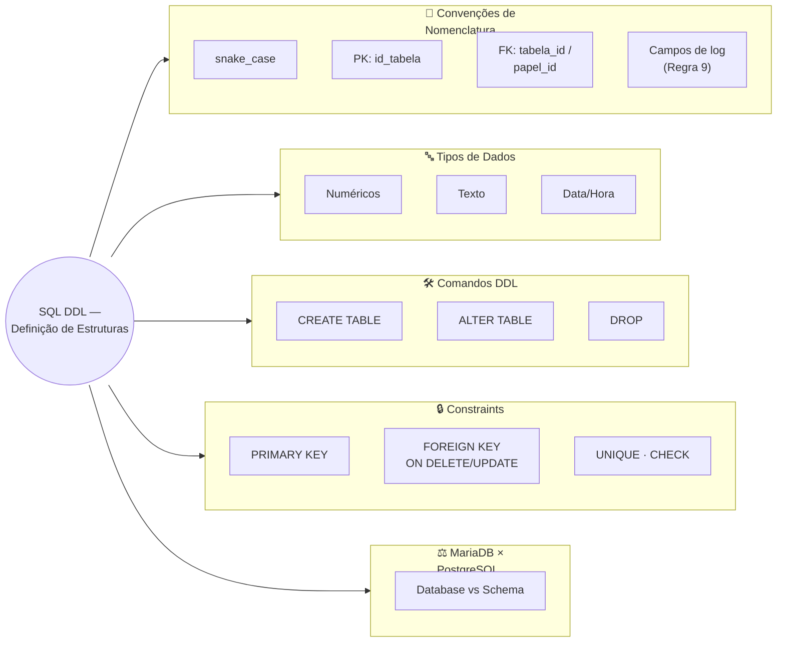

# Aula 03 — SQL e DDL: Definição de Estruturas

**Disciplina:** Banco de Dados — Relacional (IBD015)
**Professor:** Ronan Adriel Zenatti · ronan.zenatti@cps.sp.gov.br
**Fatec Jahu — 2º Semestre/2026**

---

## 🎯 Objetivos da Aula

Ao final desta aula você deverá ser capaz de:

- Criar e manipular estruturas de banco de dados usando os comandos DDL do SQL (`CREATE`, `ALTER`, `DROP`);
- Aplicar as convenções de nomenclatura adotadas nesta disciplina;
- Escolher os tipos de dados mais adequados para cada situação;
- Aplicar as principais constraints de integridade (`PRIMARY KEY`, `FOREIGN KEY`, `UNIQUE`, `CHECK`, `NOT NULL`);
- Compreender as diferenças práticas entre MariaDB (nosso ambiente principal via XAMPP) e PostgreSQL.

---

## 🗺️ Mapa Mental da Aula



---

## 🧭 O que é DDL e por que é o primeiro passo?

Na Aula 02 você aprendeu a construir um modelo lógico — um conjunto de tabelas, colunas, chaves primárias e estrangeiras existindo ainda apenas no papel (ou no diagrama). A DDL, **Data Definition Language** (Linguagem de Definição de Dados), é o subconjunto do SQL responsável por transformar esse modelo em estruturas reais dentro do banco de dados.

Pense na metáfora da construção: se o modelo lógico é a planta arquitetônica, a DDL é o ato de erguer as paredes, instalar as portas e definir as divisões do espaço. Tudo o que vier depois — inserir dados, fazer consultas, criar lógica de negócio — depende de você ter executado a DDL corretamente primeiro.

Os três comandos centrais da DDL são `CREATE` (criar), `ALTER` (modificar) e `DROP` (remover). Eles operam sobre **objetos de banco de dados**: schemas (ou databases), tabelas, índices, views, procedures, entre outros. Nesta aula, o foco é na criação e manipulação de schemas e tabelas.

---

## 1. Convenções de Nomenclatura desta Disciplina

Antes de escrever uma única linha de SQL, precisamos estabelecer um conjunto de convenções que seguiremos em toda a disciplina. Convenções não são caprichos estéticos — elas são acordos que tornam o código legível, previsível e manutenível por qualquer pessoa do time, inclusive você mesmo daqui a seis meses.

As regras a seguir estão alinhadas com as boas práticas da indústria e serão cobradas nas avaliações.

**Regra 1 — snake_case em tudo:** todas as palavras são separadas por underline, nunca por espaço, hífen ou camelCase. Exemplo: `data_nascimento`, não `DataNascimento` nem `data-nascimento`.

**Regra 2 — Sempre minúsculas para nomes criados pelo usuário:** tabelas, colunas, schemas, aliases — tudo em letras minúsculas. As únicas letras maiúsculas no seu código devem ser as palavras reservadas do SQL.

**Regra 3 — Palavras reservadas em MAIÚSCULAS:** `SELECT`, `CREATE`, `TABLE`, `INSERT`, `WHERE`, `NOT NULL`, `PRIMARY KEY` etc. Isso cria um contraste visual imediato entre o que é linguagem e o que é dado — fundamental para leitura rápida de código.

**Regra 4 — Nomes de tabelas sempre no plural:** a tabela armazena uma coleção de registros, então seu nome deve refletir isso. `clientes`, `pedidos`, `produtos` — nunca `cliente`, `pedido`, `produto`.

**Regra 5 — Chave primária no padrão `id_nome_tabela_singular`:** o nome da PK sempre usa o singular do nome da tabela com BIGINT UNSIGNED AUTO_INCREMENT PRIMARY KEY. Exemplos: tabela `clientes` → PK `id_cliente`; tabela `pedidos` → PK `id_pedido`; tabela `categorias_produtos` → PK `id_categoria_produto`.

**Regra 6 — Chave estrangeira no padrão `tabela_referencia_id`:** o nome da FK preferencialmente usa o nome da tabela na qual se quer referenciar. Exemplo: na tabela `itens_pedidos` a chave estrangeira que referencia a tabela `produtos` deve ser `produto_id`, com o mesmo tipo da chave primária referenciada — `BIGINT UNSIGNED`.

**Regra 7 — Chave estrangeira pelo papel semântico, não pelo nome da tabela:** este é o ponto mais sutil e importante. Quando uma FK referencia uma tabela cuja entidade pode exercer papéis diferentes, use o papel — não o nome da tabela. Veja o exemplo clássico:

```sql
-- ❌ ERRADO: não use pessoa1_id e pessoa2_id
-- Isso não comunica nada sobre o papel de cada pessoa

-- ✅ CORRETO: use o papel semântico de cada um (e siga TODAS as 9 regras)
CREATE TABLE vendas (
    id_venda        BIGINT UNSIGNED  NOT NULL AUTO_INCREMENT,
    cliente_id      BIGINT UNSIGNED  NOT NULL,                  -- referencia pessoas (papel: cliente)
    funcionario_id  BIGINT UNSIGNED  NOT NULL,                  -- referencia pessoas (papel: vendedor)
    data_venda      DATE             NOT NULL,
    criado_em       DATETIME         NOT NULL DEFAULT CURRENT_TIMESTAMP,
    atualizado_em   DATETIME         NOT NULL DEFAULT CURRENT_TIMESTAMP ON UPDATE CURRENT_TIMESTAMP,
    deletado_em     DATETIME             NULL,
    CONSTRAINT pk_venda              PRIMARY KEY (id_venda),
    CONSTRAINT fk_venda_cliente      FOREIGN KEY (cliente_id)     REFERENCES pessoas (id_pessoa),
    CONSTRAINT fk_venda_funcionario  FOREIGN KEY (funcionario_id) REFERENCES pessoas (id_pessoa)
);
```

O padrão de nomenclatura de FK neste caso, é, portanto, `papel_id` — onde `papel` descreve o que aquela entidade representa no contexto daquele relacionamento.

**Regra 8 — Tipos e tamanhos adequados:** escolha o tipo que reflete a natureza do dado, não o que parecer mais simples. Para campos `VARCHAR` cujo tamanho real é imprevisível (nome de pessoa, razão social, descrição livre), use `VARCHAR(255)` como padrão defensivo. Para campos com domínio conhecido (UF, CEP, CPF, código de barras), dimensione exatamente. Nunca use `FLOAT`/`DOUBLE` para dinheiro — use `DECIMAL(p, s)`.

**Regra 9 — Toda tabela tem campos de log:** acrescente sempre, ao final de cada `CREATE TABLE`, três colunas `DATETIME` para auditoria temporal:

```sql
criado_em      DATETIME  NOT NULL DEFAULT CURRENT_TIMESTAMP,
atualizado_em  DATETIME  NOT NULL DEFAULT CURRENT_TIMESTAMP ON UPDATE CURRENT_TIMESTAMP,
deletado_em    DATETIME      NULL
```

`criado_em` registra a inserção, `atualizado_em` é mantido pelo próprio MariaDB a cada `UPDATE` e `deletado_em` permite **soft delete** — em vez de remover fisicamente o registro, marcamos a data de exclusão e filtramos com `WHERE deletado_em IS NULL` nas consultas. Isso preserva histórico, permite restauração e protege contra deleções acidentais.

!!! example "🔍 Checkpoint 1 — Nomenclatura: plataforma de criadores de conteúdo"
    O trecho abaixo, escrito por um estagiário para uma plataforma de monetização de criadores de conteúdo (tipo assinatura de canal), viola várias das 9 regras desta seção:

    ```sql
    CREATE TABLE Criador (
        IdCriador int primary key,
        NomeCanal varchar(50),
        Inscritos int,
        ReceitaMensal float,
        ID_PLANO int,
        FOREIGN KEY (ID_PLANO) REFERENCES Plano(id)
    );
    ```

    Liste todos os erros encontrados, indicando **qual regra (1 a 9)** cada um viola, e reescreva o `CREATE TABLE` corretamente — incluindo os campos de log da Regra 9.

    🔑 Resolução no [Gabarito da Aula 03](Aula_03_Gabarito.md#checkpoint-1) — tente resolver antes de conferir.

---

## 2. Acessando o MariaDB via Terminal (XAMPP)

Antes de criar qualquer estrutura, você precisa saber como se conectar ao banco. O XAMPP instala o MariaDB com configurações padrão que você deve conhecer.

**Configurações padrão do XAMPP:**

| Parâmetro | Valor padrão |
|---|---|
| Host | `127.0.0.1` ou `localhost` |
| Porta | `3306` |
| Usuário root | `root` |
| Senha root | *(vazia — sem senha)* |

**Conexão via terminal — sem especificar porta (usa a padrão 3306):**

```bash
# Forma mais comum — porta 3306 é assumida automaticamente
mysql -u root -p

# Se o MariaDB estiver no PATH do sistema (Windows: geralmente não está por padrão)
# No Windows com XAMPP, navegue até a pasta bin primeiro:
# C:\xampp\mysql\bin\mysql.exe -u root -p
```

**Conexão via terminal — especificando a porta explicitamente:**

```bash
# Útil quando você tem múltiplas instâncias ou a porta foi alterada
mysql -u root -p --port=3306

# Forma abreviada com flag -P (P maiúsculo para porta, p minúsculo para senha)
mysql -u root -p -P 3306 -h 127.0.0.1
```

**Conexão com usuário e senha já informados (não recomendado em produção, mas útil em aula):**

```bash
# A senha fica visível no histórico do terminal — evite em ambientes reais
mysql -u root -pSUASENHA

# Com porta e host explícitos — útil para scripts de automação em aula
mysql -u root -p123456 -P 3306 -h 127.0.0.1
```

> ⚠️ **Atenção:** no XAMPP padrão, a senha do root é **vazia**. Então você digita `mysql -u root -p` e pressiona Enter sem digitar nada quando solicitado. Em um ambiente real de produção, isso seria inadmissível — sempre defina uma senha forte para o usuário administrador.

**Verificando a versão após conectar:**

```sql
-- Confirma se você está no MariaDB e qual versão
SELECT VERSION();

-- Resultado esperado (exemplo): 10.4.32-MariaDB
```

---

## 3. MariaDB vs MySQL vs PostgreSQL — Entendendo o Cenário

Antes de mergulhar nos comandos, é importante entender o ecossistema em que estamos trabalhando, porque você encontrará esses três SGBDs em projetos reais e na literatura.

**MariaDB** nasceu como um *fork* (ramificação) do MySQL em 2009, criado pelos fundadores originais do MySQL após a aquisição deste pela Oracle. O objetivo foi manter um SGBD open source com desenvolvimento comunitário ativo. O MariaDB mantém compatibilidade quase total com o MySQL em nível de SQL, mas tem evoluído de forma independente — com otimizações de performance, novos mecanismos de armazenamento e funcionalidades exclusivas. É o SGBD instalado pelo XAMPP a partir da versão 5.7+.

**MySQL** é o SGBD open source mais usado no mundo historicamente. Desde a aquisição pela Oracle, seu desenvolvimento ficou dividido entre a versão Community (gratuita) e a Enterprise (paga). Para fins de aprendizado e para a maior parte do que faremos em DDL, DML e DQL, MySQL e MariaDB são praticamente intercambiáveis — as diferenças aparecem em funcionalidades avançadas.

**PostgreSQL** é o SGBD open source mais avançado tecnicamente. Segue o padrão SQL de forma mais rigorosa que MySQL/MariaDB, suporta tipos de dados mais ricos (como arrays, JSON nativo, tipos geométricos), tem um sistema de constraints mais poderoso e é amplamente preferido em aplicações que exigem integridade e consistência absolutas. É o banco padrão em muitas plataformas cloud (Heroku, Supabase, Railway).

### 3.1 Diferença estrutural: Databases vs Schemas

Esta é uma diferença fundamental que confunde muitos desenvolvedores ao migrar entre os dois sistemas.

**No MySQL/MariaDB**, os termos `DATABASE` e `SCHEMA` são **sinônimos** — comandos como `CREATE DATABASE` e `CREATE SCHEMA` fazem exatamente a mesma coisa. Um "banco de dados" é o nível mais alto de organização, e dentro dele ficam as tabelas. Você cria múltiplos databases para separar projetos diferentes.

```sql
-- No MariaDB/MySQL, estes dois comandos são idênticos:
CREATE DATABASE loja_virtual;
CREATE SCHEMA loja_virtual;  -- faz a mesma coisa
```

**No PostgreSQL**, a hierarquia é diferente e mais granular. Existe o **cluster** (instância do servidor) → **database** (banco) → **schema** (namespace lógico dentro do banco) → **tabelas**. Um database pode conter múltiplos schemas, e o schema padrão se chama `public`. Isso permite organizar tabelas de módulos diferentes dentro de um mesmo banco sem misturá-las.

```sql
-- No PostgreSQL, você cria o banco UMA VEZ e depois schemas dentro dele:
CREATE DATABASE loja_virtual;
\c loja_virtual  -- conecta ao banco (comando do psql)

CREATE SCHEMA financeiro;
CREATE SCHEMA estoque;
CREATE SCHEMA clientes;

-- As tabelas ficam dentro dos schemas:
CREATE TABLE financeiro.pedidos ( ... );
CREATE TABLE estoque.produtos ( ... );
```


!!! tip "✅ Verificação Rápida — MariaDB, MySQL e PostgreSQL"
    Bloco puramente conceitual — sem exercício prático ainda, então confira seu entendimento com os dois quizzes abaixo. A resposta é revelada na hora.

<quiz>
No PostgreSQL, qual é a hierarquia correta, da mais externa para a mais interna?
- [ ] Schema → Database → Tabela
- [x] Database → Schema → Tabela
- [ ] Tabela → Schema → Database
- [ ] Não existe hierarquia — schema e database são sinônimos, como no MariaDB

No PostgreSQL, um database pode conter múltiplos schemas (o padrão se chama `public`), e cada schema organiza suas próprias tabelas — diferente do MariaDB/MySQL, onde DATABASE e SCHEMA são apenas nomes diferentes para a mesma coisa.
</quiz>

<quiz>
Por que o MariaDB existe como um projeto separado do MySQL?
- [ ] Porque o MySQL foi descontinuado
- [x] Porque foi criado como um fork pelos fundadores originais do MySQL após a aquisição deste pela Oracle, para manter um SGBD open source com desenvolvimento comunitário ativo
- [ ] Porque o MariaDB roda apenas em sistemas Windows
- [ ] Não há relação entre os dois — são SGBDs desenvolvidos de forma totalmente independente desde o início

O MariaDB nasceu em 2009 como fork do MySQL, criado pelos fundadores originais do MySQL após a aquisição pela Oracle, mantendo compatibilidade quase total em nível de SQL mas evoluindo de forma independente.
</quiz>

---

## 4. Criando um Database — Construção Gradual

Vamos construir o comando `CREATE DATABASE` de forma incremental, adicionando um atributo por vez e entendendo o motivo de cada um. Esta abordagem gradual é exatamente como você deve pensar ao escrever DDL em projetos reais.

### 4.1 Forma mínima

```sql
-- Versão mais simples: apenas cria o banco com as configurações padrão do servidor
CREATE DATABASE loja_virtual;
```

Funciona, mas delega as configurações de caracteres ao padrão do servidor — o que pode causar problemas se o servidor estiver configurado com um charset diferente do que você espera. Nunca use esta forma em projetos reais.

### 4.2 Adicionando proteção contra erro

```sql
-- IF NOT EXISTS evita erro se o banco já existir
-- Útil em scripts que podem ser executados mais de uma vez (idempotência)
CREATE DATABASE IF NOT EXISTS loja_virtual;
```

O `IF NOT EXISTS` torna o script **idempotente** — você pode rodá-lo múltiplas vezes sem quebrar nada. É uma boa prática em scripts de setup de ambiente.

### 4.3 Especificando o CHARACTER SET

```sql
-- Definindo explicitamente o conjunto de caracteres
CREATE DATABASE IF NOT EXISTS loja_virtual
    CHARACTER SET utf8mb4;
```

O `CHARACTER SET` (ou `CHARSET`) define **como os caracteres são armazenados em bytes** no disco. É a escolha mais impactante que você fará ao criar um banco, porque uma vez que há dados, mudar o charset é trabalhoso.

**Por que `utf8mb4` e não simplesmente `utf8`?** Esta é uma das armadilhas mais clássicas do MySQL/MariaDB. O tipo chamado `utf8` no MySQL é, na verdade, uma implementação **incompleta** do UTF-8 — ele suporta apenas caracteres de até 3 bytes, o que exclui emojis, caracteres chineses de planos suplementares e outros símbolos modernos. O `utf8mb4` é a implementação **completa e correta** do UTF-8, suportando todos os 1.114.112 pontos de código Unicode (incluindo emojis como 🎉, que usam 4 bytes). **Sempre use `utf8mb4`.**

A tabela abaixo resume os principais charsets disponíveis:

| Charset | Bytes por caractere | Suporte | Quando usar |
|---|---|---|---|
| `latin1` | 1 | Apenas caracteres ocidentais (ISO 8859-1) | Sistemas legados, nunca em projetos novos |
| `utf8` (MySQL) | 1–3 | Unicode básico, **sem emojis** | Nunca — use utf8mb4 |
| `utf8mb4` | 1–4 | Unicode completo, emojis incluídos | **Sempre — padrão recomendado** |
| `utf16` | 2–4 | Unicode completo | Casos especiais de integração |
| `ascii` | 1 | Apenas 128 caracteres ASCII | Colunas técnicas internas (ex: hashes) |

### 4.4 Especificando o COLLATION

```sql
-- Adicionando a collation — como os caracteres são COMPARADOS e ORDENADOS
CREATE DATABASE IF NOT EXISTS loja_virtual
    CHARACTER SET utf8mb4
    COLLATE utf8mb4_unicode_ci;
```

Se o `CHARACTER SET` define *como armazenar*, o `COLLATE` define *como comparar*. A collation determina as regras de ordenação e de igualdade entre strings — o que afeta diretamente operações de `WHERE`, `ORDER BY`, `GROUP BY` e índices em colunas de texto.

O sufixo `_ci` significa **Case Insensitive** (não diferencia maiúsculas de minúsculas): `'Ana'` = `'ana'` = `'ANA'`. O sufixo `_cs` significa **Case Sensitive**. O sufixo `_bin` compara byte a byte — é o mais estrito.

As collations mais usadas com `utf8mb4` no MariaDB são:

| Collation | Diferencia maiúsc./minúsc. | Diferencia acentos | Quando usar |
|---|---|---|---|
| `utf8mb4_general_ci` | Não | Não | Performance ligeiramente melhor, menos preciso |
| `utf8mb4_unicode_ci` | Não | Não (agrupa `e`, `é`, `ê`) | **Recomendado para a maioria dos casos** |
| `utf8mb4_unicode_520_ci` | Não | Parcialmente | Unicode 5.2.0 — mais atual que unicode_ci |
| `utf8mb4_0900_ai_ci` | Não | Não | MySQL 8.0+ / MariaDB 10.10+ — padrão moderno |
| `utf8mb4_bin` | Sim | Sim | Comparação byte a byte — campos técnicos |

> 💡 **Diferença importante entre `general_ci` e `unicode_ci`:** a `unicode_ci` usa as regras do algoritmo Unicode de comparação (UCA), o que a torna mais correta em situações como a comparação de letras com diacríticos em idiomas não-ingleses. Para um sistema em português, `utf8mb4_unicode_ci` é a escolha mais segura e semânticamente correta.

### 4.5 Comando final completo e comentado

```sql
-- Criação completa e idiomática do banco de dados
-- Pronto para uso em projetos reais com dados em português
CREATE DATABASE IF NOT EXISTS loja_virtual
    CHARACTER SET utf8mb4          -- UTF-8 completo: suporta todos os caracteres Unicode
    COLLATE utf8mb4_unicode_ci;    -- Comparação case-insensitive seguindo o padrão Unicode

-- Selecionar o banco para uso nas próximas operações
USE loja_virtual;

-- Confirmar configurações aplicadas
SHOW CREATE DATABASE loja_virtual;
```

**Equivalente no PostgreSQL** (para referência — a sintaxe é bem diferente):

```sql
-- No PostgreSQL, o encoding equivalente ao utf8mb4 é simplesmente UTF8
-- A collation é definida via locale do sistema operacional
CREATE DATABASE loja_virtual
    ENCODING    'UTF8'
    LC_COLLATE  'pt_BR.UTF-8'   -- locale para português do Brasil
    LC_CTYPE    'pt_BR.UTF-8'
    TEMPLATE    template0;       -- necessário quando LC_ difere do template padrão
```

!!! example "🔍 Checkpoint 2 — CREATE DATABASE: carteira digital"
    Uma fintech está lançando uma carteira digital com transferências via Pix. Escreva o comando `CREATE DATABASE` completo e idiomático para o banco `carteira_digital`, seguindo exatamente o padrão da Seção 4.5 desta aula: idempotente (não falha se o banco já existir), com o charset correto para suportar todos os caracteres Unicode (incluindo emojis, usados nas notificações do app) e a collation recomendada para comparações em português. Ao final, escreva também o comando para confirmar as configurações aplicadas.

    🔑 Resolução no [Gabarito da Aula 03](Aula_03_Gabarito.md#checkpoint-2) — tente resolver antes de conferir.

---

## 5. Tipos de Dados — Guia Aprofundado

A escolha do tipo de dado correto é uma das decisões mais importantes do DDL. Um tipo errado desperdiça espaço em disco, compromete a performance de índices e pode causar bugs silenciosos — como truncamento de strings ou imprecisão em cálculos financeiros.

### 5.1 Tipos Numéricos Inteiros

Os tipos inteiros diferem apenas na faixa de valores que suportam e no espaço que ocupam. Escolha sempre o menor tipo que comporte os valores esperados — isso impacta diretamente o tamanho dos índices.

| Tipo (MariaDB/MySQL) | Equivalente PostgreSQL | Bytes | Faixa (com sinal) | Faixa (sem sinal) | Caso de uso típico |
|---|---|---|---|---|---|
| `TINYINT` | `SMALLINT` | 1 | -128 a 127 | 0 a 255 | Flags, status com poucos valores |
| `SMALLINT` | `SMALLINT` | 2 | -32.768 a 32.767 | 0 a 65.535 | Quantidades pequenas, códigos |
| `MEDIUMINT` | *(sem equivalente)* | 3 | -8.388.608 a 8.388.607 | 0 a 16.777.215 | Contadores médios |
| `INT` / `INTEGER` | `INTEGER` | 4 | -2.147.483.648 a 2.147.483.647 | 0 a ~4,29 bilhões | Quantidades, contadores de domínio limitado |
| `BIGINT` | `BIGINT` | 8 | -9,22 quintilhões a 9,22 quintilhões | 0 a ~18,4 quintilhões | **Chaves primárias e estrangeiras (padrão da disciplina)**, timestamps Unix |

Repare que a faixa **com sinal** é sempre deslocada para incluir valores negativos, mas o número total de valores representáveis é o mesmo — um `TINYINT` representa exatamente 256 valores distintos, com ou sem sinal (`-128` a `127`, ou `0` a `255`). O `UNSIGNED` não "ganha espaço extra": ele apenas redistribui a mesma faixa inteiramente para o lado positivo, o que dobra o maior valor possível às custas de eliminar os negativos.

> 🎯 **Padrão da disciplina (Regra 5):** toda chave primária é `BIGINT UNSIGNED AUTO_INCREMENT` e toda chave estrangeira é `BIGINT UNSIGNED`. Mesmo que o domínio caiba em `INT`, padronizamos em `BIGINT UNSIGNED` para evitar erros sutis em `JOIN`s entre tipos diferentes e para acompanhar a prática da indústria em sistemas que crescem.

**Armadilha clássica — `INT(11)` não é o que parece:**  no MySQL/MariaDB, o número entre parênteses em `INT(11)` **não** define o tamanho de armazenamento nem a faixa de valores — ele apenas especifica a largura de exibição ao usar o flag `ZEROFILL`. Um `INT(1)` e um `INT(11)` ocupam exatamente 4 bytes e armazenam os mesmos valores. Essa confusão é tão comum que o MariaDB 10.7+ e o MySQL 8.0+ **depreciaram** a sintaxe de largura de exibição para tipos inteiros.

```sql
-- ❌ Confuso e depreciado no MariaDB 10.7+:
id_produto INT(11) NOT NULL

-- ✅ Correto e moderno:
id_produto INT NOT NULL
```

**`UNSIGNED` — quando usar:** o modificador `UNSIGNED` elimina os valores negativos e dobra o limite positivo. Chaves primárias auto-incrementadas **nunca** serão negativas, então faz sentido usá-lo — mas atenção: operações de subtração entre dois `UNSIGNED` podem gerar erro se o resultado for negativo.

```sql
-- Padrão da disciplina para PK: BIGINT UNSIGNED AUTO_INCREMENT
id_cliente BIGINT UNSIGNED NOT NULL AUTO_INCREMENT
```

### 5.2 Tipos Numéricos com Ponto Flutuante e Decimais

Esta é a área onde mais ocorrem bugs silenciosos. A diferença entre `FLOAT`/`DOUBLE` e `DECIMAL` é fundamental.

| Tipo (MariaDB/MySQL) | Equivalente PostgreSQL | Armazenamento | Precisão | Caso de uso |
|---|---|---|---|---|
| `FLOAT` | `REAL` | 4 bytes | ~7 dígitos decimais | Medições científicas — **nunca valores monetários** |
| `DOUBLE` | `DOUBLE PRECISION` | 8 bytes | ~15 dígitos decimais | Cálculos científicos — **nunca valores monetários** |
| `DECIMAL(p,s)` | `NUMERIC(p,s)` | Variável | Exata — até 65 dígitos | **Valores monetários, notas, medidas precisas** |

**Por que nunca usar FLOAT ou DOUBLE para dinheiro?** Porque esses tipos usam representação de ponto flutuante binário (IEEE 754), que não consegue representar exatamente todos os decimais. `0.1 + 0.2` em ponto flutuante resulta em `0.30000000000000004`, não em `0.3`. Isso é tolerável em cálculos científicos, mas catastrófico em sistemas financeiros.

```sql
-- ❌ ERRADO para valores monetários — pode causar erros de arredondamento:
preco FLOAT NOT NULL

-- ✅ CORRETO: DECIMAL(10, 2) armazena até 10 dígitos no total, 2 após a vírgula
-- Suporta valores de -99999999.99 até 99999999.99
preco DECIMAL(10, 2) NOT NULL

-- Para sistemas que exigem mais casas (câmbio, criptomoedas):
cotacao DECIMAL(18, 8) NOT NULL
```

O `DECIMAL(p, s)` onde `p` é a **precisão** (total de dígitos) e `s` é a **escala** (dígitos após o ponto decimal). Um `DECIMAL(10, 2)` suporta valores como `99999999.99`.

### 5.3 Tipos de Texto

| Tipo (MariaDB/MySQL) | Equivalente PostgreSQL | Tamanho máximo | Quando usar |
|---|---|---|---|
| `CHAR(n)` | `CHAR(n)` | 255 caracteres | Strings de tamanho **fixo** (CPF, CEP, siglas) |
| `VARCHAR(n)` | `VARCHAR(n)` | 65.535 bytes | Strings de tamanho **variável** — uso mais comum |
| `TINYTEXT` | `TEXT` | 255 bytes | Textos curtos (raramente necessário) |
| `TEXT` | `TEXT` | 65.535 bytes | Descrições, comentários |
| `MEDIUMTEXT` | `TEXT` | 16 MB | Artigos, conteúdo longo |
| `LONGTEXT` | `TEXT` | 4 GB | Logs, documentos muito longos |

**`CHAR` vs `VARCHAR` — a diferença que importa:** `CHAR(n)` sempre ocupa `n` bytes, preenchendo com espaços à direita quando o valor é menor. `VARCHAR(n)` ocupa apenas o espaço necessário mais 1–2 bytes de overhead para armazenar o comprimento. Use `CHAR` quando o dado sempre terá o mesmo tamanho — o acesso é ligeiramente mais rápido porque o banco sabe exatamente onde termina cada valor.

A [documentação oficial do MySQL](https://dev.mysql.com/doc/refman/9.7/en/char.html) ilustra exatamente esse comportamento comparando o armazenamento de um mesmo conjunto de valores em `CHAR(4)` e `VARCHAR(4)`:

| Valor inserido | Em `CHAR(4)` | Armazenamento | Em `VARCHAR(4)` | Armazenamento |
|---|---|---|---|---|
| `''` | `'    '` | 4 bytes | `''` | 1 byte |
| `'ab'` | `'ab  '` | 4 bytes | `'ab'` | 3 bytes |
| `'abcd'` | `'abcd'` | 4 bytes | `'abcd'` | 5 bytes |
| `'abcdefgh'` | `'abcd'` (truncado) | 4 bytes | `'abcd'` (truncado) | 5 bytes |

Dois detalhes importantes que a tabela revela:

- **Espaços à direita são removidos na leitura do `CHAR`, mas preservados no `VARCHAR`.** Se você inserir `'ab  '` (com espaços) em uma coluna `CHAR(4)`, ao consultar de volta recebe `'ab'` — os espaços de preenchimento somem. Na coluna `VARCHAR(4)` equivalente, os espaços digitados fazem parte do dado e voltam exatamente como foram inseridos.
- **`VARCHAR` sempre soma 1 byte de overhead ao tamanho real do valor** (ou 2 bytes, se o `n` declarado for maior que 255) — por isso `'abcd'` em `VARCHAR(4)` ocupa 5 bytes, um a mais que os 4 bytes fixos do `CHAR(4)` para o mesmo conteúdo. Esse overhead é o preço para o banco saber onde a string termina sem precisar preencher com espaços.

Isso reforça a regra prática: para strings **sempre do mesmo tamanho** (CPF sem pontuação, sigla de UF, CEP), `CHAR` evita tanto o overhead do comprimento quanto qualquer surpresa em comparações — a diferença de 1 byte por linha é irrelevante, mas a previsibilidade não é. Para tudo que varia (nome, e-mail, descrição), `VARCHAR` evita desperdiçar espaço preenchendo com espaços que nunca serão úteis.

```sql
-- CHAR é ideal para campos de tamanho fixo e previsível:
cpf          CHAR(14)     NOT NULL,  -- '000.000.000-00' sempre 14 caracteres
cep          CHAR(9)      NOT NULL,  -- '00000-000' sempre 9 caracteres
sigla_estado CHAR(2)      NOT NULL,  -- 'SP', 'RJ', 'PR' sempre 2 caracteres

-- VARCHAR para texto de comprimento variável:
nome         VARCHAR(100) NOT NULL,
email        VARCHAR(255) NOT NULL,
descricao    VARCHAR(500)            -- nullable: sem NOT NULL
```

> ⚠️ **Armadilha do `VARCHAR` no MariaDB:** o limite de `VARCHAR(n)` é calculado em bytes, não em caracteres. Com `utf8mb4`, cada caractere pode ocupar até 4 bytes. Então `VARCHAR(255)` pode armazenar **no máximo 255 caracteres** apenas se todos forem ASCII — na prática, o limite real de bytes por linha impõe restrições. Para strings longas com caracteres especiais, prefira `TEXT`.

**PostgreSQL** não tem `TINYTEXT`, `MEDIUMTEXT` ou `LONGTEXT` — tudo é `TEXT` sem limite fixo (até o espaço disponível). O `VARCHAR` sem tamanho máximo em PostgreSQL é equivalente a `TEXT`.

### 5.4 Tipos de Data e Hora

| Tipo (MariaDB/MySQL) | Equivalente PostgreSQL | Formato | Faixa | Quando usar |
|---|---|---|---|---|
| `DATE` | `DATE` | `YYYY-MM-DD` | 1000-01-01 a 9999-12-31 | Datas sem hora (nascimento, vencimento) |
| `TIME` | `TIME` | `HHH:MM:SS` | -838:59:59 a 838:59:59 | Horários, durações |
| `DATETIME` | `TIMESTAMP` | `YYYY-MM-DD HH:MM:SS` | 1000 a 9999 | Timestamps sem fuso horário |
| `TIMESTAMP` | `TIMESTAMPTZ` | `YYYY-MM-DD HH:MM:SS` | 1970 a 2038 | Timestamps **com fuso** (armazena UTC) |
| `YEAR` | *(use INTEGER)* | `YYYY` | 1901 a 2155 | Apenas anos |

**`DATETIME` vs `TIMESTAMP` — a diferença crítica:** o `TIMESTAMP` armazena o valor convertido para UTC e o converte para o fuso do servidor ao retornar. Isso significa que o mesmo registro pode exibir horas diferentes dependendo da configuração de fuso do servidor — o que é ótimo para sistemas distribuídos, mas pode surpreender quem não sabe. O `DATETIME` armazena o valor exatamente como foi inserido, sem conversão de fuso.

**O problema do ano 2038 com `TIMESTAMP`:** o `TIMESTAMP` usa um inteiro **de 32 bits com sinal** contando segundos a partir de 1970-01-01 00:00:00 UTC (o mesmo `time_t` usado por Unix, Linux e boa parte dos sistemas C/C++ há décadas). O maior valor representável nesse inteiro é `2.147.483.647`, alcançado em **19 de janeiro de 2038, às 03:14:07 UTC**. No segundo seguinte, o contador estoura (*overflow*) e volta ao menor valor negativo — na prática, o relógio do sistema "salta" de volta para **13 de dezembro de 1901**, exatamente como o bug do ano 2000 (Y2K) fazia datas voltarem para 1900. Isso é conhecido como o **"Y2038" ou "Epochalypse"**.

O impacto não é exclusivo de bancos de dados: qualquer sistema que armazene tempo como inteiro de 32 bits está exposto — sistemas embarcados (controladores industriais, equipamentos médicos, sistemas de navegação de aeronaves), firmwares antigos, sistemas de arquivos, protocolos de rede e código C legado que ainda não migrou para `time_t` de 64 bits. Diferente do Y2K, cuja correção em massa ocorreu antes do problema acontecer, uma parcela relevante da infraestrutura embarcada do mundo tem ciclo de vida de décadas e pode nunca ser atualizada antes de 2038 — por isso o tema já é tratado como risco de infraestrutura crítica, não apenas curiosidade histórica.

**O que os SGBDs estão fazendo a respeito:**

- **MySQL** mantém, até as versões mais recentes (8.4 LTS / 9.x, em 2026), o `TIMESTAMP` limitado ao intervalo 1970–2038 — a Oracle ainda não migrou o tipo para armazenamento de 64 bits. Funções como `UNIX_TIMESTAMP()` e `FROM_UNIXTIME()` já aceitam valores de 64 bits desde a versão 8.0.28, mas isso não resolve a limitação da **coluna** `TIMESTAMP` em si. A recomendação oficial para dados que ultrapassem 2038 continua sendo evitar `TIMESTAMP` e usar `DATETIME` (sem limite prático até o ano 9999) ou um `BIGINT` armazenando o epoch manualmente.
- **MariaDB já corrigiu o problema.** A partir da versão **11.8 LTS** (2025), a faixa máxima do `TIMESTAMP` foi estendida de 2038-01-19 para **2106-02-07**, mantendo compatibilidade de armazenamento com servidores antigos (funciona em plataformas de 64 bits). É um dos motivos pelos quais, na prática, ambientes que já rodam MariaDB recente sofrem menos com essa armadilha do que ambientes MySQL — mas **atenção**: o XAMPP normalmente empacota uma versão de MariaDB anterior a 11.8 (lembre da Seção 2, onde vimos `10.4.32-MariaDB` como exemplo), então **verifique sua versão com `SELECT VERSION()`** antes de assumir que está protegido.
- **PostgreSQL nunca teve esse problema.** Diferente do MySQL/MariaDB, o PostgreSQL armazena `TIMESTAMP` internamente como um inteiro de **64 bits** (8 bytes) desde suas versões mais antigas — não há reaproveitamento do `time_t` de 32 bits do sistema operacional. Isso dá ao tipo `TIMESTAMP` do PostgreSQL uma faixa de datas válidas que vai de **4713 a.C. até 294276 d.C.**, tornando o estouro do ano 2038 irrelevante para quem usa esse SGBD. O custo é 8 bytes por valor (contra os 4 bytes do `TIMESTAMP` tradicional do MySQL) — uma troca deliberada de espaço em disco por segurança de longo prazo.

Para esta disciplina, isso reforça por que a Regra 9 padroniza os campos de log (`criado_em`, `atualizado_em`, `deletado_em`) como `DATETIME` em vez de `TIMESTAMP`: além de evitar a conversão silenciosa de fuso horário, também elimina qualquer exposição ao estouro de 2038 — independentemente da versão exata do MariaDB em uso.

```sql
-- Datas de eventos passados ou futuros distantes: use DATE
data_nascimento  DATE        NOT NULL,
data_vencimento  DATE        NOT NULL,

-- Padrão da disciplina (Regra 9) para colunas de log: DATETIME
-- Evitamos TIMESTAMP por causa do limite de 2038 e da conversão de fuso silenciosa
criado_em        DATETIME    NOT NULL DEFAULT CURRENT_TIMESTAMP,
atualizado_em    DATETIME    NOT NULL DEFAULT CURRENT_TIMESTAMP
                             ON UPDATE CURRENT_TIMESTAMP,
deletado_em      DATETIME        NULL
```

### 5.5 Tipos Especiais

| Tipo (MariaDB/MySQL) | Equivalente PostgreSQL | Quando usar |
|---|---|---|
| `BOOLEAN` / `TINYINT(1)` | `BOOLEAN` | Verdadeiro/falso — no MariaDB, é apenas alias de TINYINT(1) |
| `ENUM('a','b','c')` | `CREATE TYPE ... AS ENUM` | Lista fechada de valores — use com moderação |
| `JSON` | `JSON` / `JSONB` | Dados semiestruturados — disponível no MariaDB 10.2+ |
| `BINARY(n)` / `VARBINARY(n)` | `BYTEA` | Dados binários, hashes |

> 💡 **Sobre `ENUM`:** embora conveniente, `ENUM` tem desvantagens sérias — adicionar um novo valor exige um `ALTER TABLE` (que pode travar a tabela em produção) e o valor não é portável entre SGBDs. Uma alternativa mais flexível é criar uma tabela de domínio (ex: `status_pedidos`) e usar uma FK.

!!! example "🔍 Checkpoint 3 — Tipos de Dados: geração de energia solar residencial"
    Uma plataforma de energia solar residencial (geração distribuída) precisa armazenar, para cada usina instalada na casa de um cliente, os seguintes atributos: `numero_serie_inversor` (sempre 12 caracteres alfanuméricos, tamanho fixo), `potencia_instalada_kwp` (ex.: 5.75), `energia_gerada_hoje_kwh` (ex.: 23.400), `data_instalacao`, `valor_credito_energia_acumulado` (em reais, usado para abater a conta de luz), `esta_ativo` (indica se a usina está gerando energia normalmente) e `observacoes_tecnicas` (texto livre de tamanho imprevisível, preenchido pelo técnico na instalação). Para cada atributo, escreva a declaração de coluna completa (tipo + tamanho, quando aplicável), justificando a escolha com base nesta seção.

    🔑 Resolução no [Gabarito da Aula 03](Aula_03_Gabarito.md#checkpoint-3) — tente resolver antes de conferir.

---

## 6. Criando Tabelas — `CREATE TABLE`

Com o vocabulário de tipos de dados e convenções estabelecido, podemos agora criar tabelas de verdade. Vamos construir o schema de um sistema de e-commerce, seguindo todas as convenções desta disciplina.

### 6.1 Estrutura geral do `CREATE TABLE`

```sql
CREATE TABLE IF NOT EXISTS nome_tabela (
    -- Definição das colunas
    nome_coluna TIPO [constraints_inline],
    ...
    -- Constraints de tabela (PK, FK, UNIQUE compostos)
    [CONSTRAINT nome_constraint] TIPO_CONSTRAINT (coluna),
    ...
);
```

**Sobre `ENGINE=InnoDB DEFAULT CHARSET=utf8mb4 COLLATE=utf8mb4_unicode_ci`:** especificar essa cláusula é uma **boa prática documental**, mas **não é obrigatória**. Tanto o MariaDB quanto o MySQL modernos já aplicam, no momento da criação, o melhor padrão disponível — InnoDB como engine, `utf8mb4` como charset e a collation associada. Vamos demonstrar a cláusula completa apenas na primeira tabela desta aula (`pessoas`, abaixo). A partir daí, **todos os `CREATE TABLE` desta disciplina serão escritos sem essa cláusula**, confiando no padrão do SGBD — assim o foco fica nas colunas, constraints e relacionamentos, que é o que de fato muda de tabela para tabela.

> **Diferença MariaDB vs MySQL:** ambos usam InnoDB como engine padrão. Você só precisa declarar `ENGINE=...` explicitamente quando quer um engine diferente (`MyISAM`, `Aria`, `Memory` etc.) — algo raro fora de casos muito específicos.

### 6.1.1 O que é uma *storage engine* e por que InnoDB é a padrão

Uma particularidade do MySQL/MariaDB que não existe no PostgreSQL é a **storage engine** (mecanismo de armazenamento) — o componente responsável por como cada tabela efetivamente grava, lê, indexa e trava seus dados em disco. Diferente do PostgreSQL, onde há um único mecanismo de armazenamento para todas as tabelas, no MySQL/MariaDB **cada tabela pode usar uma engine diferente**, escolhida com a cláusula `ENGINE=` no `CREATE TABLE`.

| Engine | Transações (ACID) | Chaves estrangeiras | Nível de trava (*locking*) | *Crash-safe* | Quando usar |
|---|---|---|---|---|---|
| **InnoDB** (padrão) | Sim | Sim | Linha (*row-level*) | Sim | Uso geral — praticamente sempre, inclusive todas as tabelas desta disciplina |
| `MyISAM` | Não | Não | Tabela (*table-level*) | Não | Legado apenas — evite em projetos novos |
| `Aria` | Não | Não | Tabela (*table-level*) | Sim | Tabelas internas de sistema do MariaDB; sucessor do MyISAM com recuperação a falhas |
| `Memory` | Não | Não | Tabela (*table-level*) | Não (dados somem ao reiniciar o servidor) | Cache temporário, tabelas de trabalho voláteis em memória RAM |

**Por que `InnoDB` é a engine padrão desde MariaDB 5.5 / MySQL 5.5:** é a única das quatro que oferece as três garantias que praticamente todo sistema real precisa — suporte a **transações ACID** (`COMMIT`/`ROLLBACK` de forma segura, tema da Aula 13), suporte a **chaves estrangeiras** com `ON DELETE`/`ON UPDATE` (o que usamos nesta própria aula) e **recuperação automática após falha** (*crash recovery*, via logs de redo/undo — se o servidor cair no meio de uma escrita, o InnoDB reconstrói o estado consistente ao reiniciar). Além disso, o `InnoDB` trava apenas a **linha** sendo modificada (*row-level locking*), não a tabela inteira — isso permite que múltiplas transações escrevam em linhas diferentes da mesma tabela simultaneamente, o que é essencial em qualquer sistema com mais de um usuário concorrente.

O `MyISAM`, por comparação, é o mecanismo histórico do MySQL (anterior ao InnoDB se tornar padrão): mais simples e, em cargas de **apenas leitura**, ligeiramente mais rápido — mas sem transações, sem FK, sem recuperação a falhas, e com trava de **tabela inteira** a cada escrita (uma única `INSERT`/`UPDATE` bloqueia toda a tabela para outros usuários). O `Aria`, criado pela própria equipe do MariaDB, é essencialmente um MyISAM modernizado com recuperação a falhas — mas ainda sem transações nem FK, por isso é usado majoritariamente para tabelas internas do próprio SGBD, não para dados de aplicação. Já o `Memory` mantém os dados inteiramente em RAM (nunca grava em disco), o que o torna extremamente rápido, mas **todo o conteúdo é perdido** a cada reinício do servidor — apropriado apenas para caches ou tabelas de trabalho temporárias, nunca para dados que precisam sobreviver.

Por isso, nesta disciplina, nunca declaramos `ENGINE=MyISAM`, `ENGINE=Aria` ou `ENGINE=Memory`: como visto no aviso acima, deixamos o `InnoDB` como padrão implícito (ou o declaramos explicitamente, como na tabela `pessoas` a seguir) em toda tabela que armazena dados de negócio.

### 6.2 Tabela `pessoas` — a base do sistema

Começamos pela tabela que vai servir de base para clientes e funcionários, demonstrando o padrão de auto-referência mencionado na regra 6:

```sql
-- Tabela base de pessoas físicas
-- Usada para clientes e funcionários via papéis (FKs semânticas)
CREATE TABLE IF NOT EXISTS pessoas (
    id_pessoa        BIGINT UNSIGNED  NOT NULL AUTO_INCREMENT,
    nome             VARCHAR(255)     NOT NULL,
    cpf              CHAR(11)         NOT NULL,  -- apenas dígitos, sem pontuação
    email            VARCHAR(255)     NOT NULL,
    data_nascimento  DATE             NOT NULL,
    telefone         CHAR(11)             NULL,  -- nullable: nem todo cadastro tem
    criado_em        DATETIME         NOT NULL DEFAULT CURRENT_TIMESTAMP,
    atualizado_em    DATETIME         NOT NULL DEFAULT CURRENT_TIMESTAMP
                                               ON UPDATE CURRENT_TIMESTAMP,
    deletado_em      DATETIME             NULL,

    -- Constraints de tabela: nomeadas para facilitar debugging
    CONSTRAINT pk_pessoa  PRIMARY KEY (id_pessoa),
    CONSTRAINT uq_cpf     UNIQUE      (cpf),
    CONSTRAINT uq_email   UNIQUE      (email)

) ENGINE=InnoDB
  DEFAULT CHARSET=utf8mb4
  COLLATE=utf8mb4_unicode_ci
  COMMENT='Cadastro base de pessoas físicas (clientes e funcionários)';
```

Observe algumas decisões de projeto aqui: o CPF é armazenado como `CHAR(11)` apenas com dígitos (sem pontos e traço), porque a formatação é responsabilidade da camada de apresentação, não do banco. O `COMMENT` na tabela documenta o propósito diretamente no schema — isso aparece em ferramentas como MySQL Workbench e DBeaver. As três últimas colunas (`criado_em`, `atualizado_em`, `deletado_em`) seguem a Regra 9 e estarão presentes em **todas** as tabelas desta disciplina.

### 6.3 Tabela `categorias` — simples e autoexplicativa

```sql
CREATE TABLE IF NOT EXISTS categorias (
    id_categoria   BIGINT UNSIGNED  NOT NULL AUTO_INCREMENT,
    nome           VARCHAR(255)     NOT NULL,
    descricao      TEXT                 NULL,
    ativa          TINYINT(1)       NOT NULL DEFAULT 1,  -- 1=ativa, 0=inativa
    criado_em      DATETIME         NOT NULL DEFAULT CURRENT_TIMESTAMP,
    atualizado_em  DATETIME         NOT NULL DEFAULT CURRENT_TIMESTAMP
                                             ON UPDATE CURRENT_TIMESTAMP,
    deletado_em    DATETIME             NULL,

    CONSTRAINT pk_categoria  PRIMARY KEY (id_categoria),
    CONSTRAINT uq_cat_nome   UNIQUE      (nome)
);
```

### 6.4 Tabela `produtos` — com FK e CHECK

```sql
CREATE TABLE IF NOT EXISTS produtos (
    id_produto      BIGINT UNSIGNED  NOT NULL AUTO_INCREMENT,
    categoria_id    BIGINT UNSIGNED  NOT NULL,            -- FK para categorias (mesmo tipo da PK referenciada)
    nome            VARCHAR(255)     NOT NULL,
    descricao       TEXT                 NULL,
    preco           DECIMAL(10, 2)   NOT NULL,
    estoque         INT UNSIGNED     NOT NULL DEFAULT 0,
    ativo           TINYINT(1)       NOT NULL DEFAULT 1,
    criado_em       DATETIME         NOT NULL DEFAULT CURRENT_TIMESTAMP,
    atualizado_em   DATETIME         NOT NULL DEFAULT CURRENT_TIMESTAMP
                                              ON UPDATE CURRENT_TIMESTAMP,
    deletado_em     DATETIME             NULL,

    CONSTRAINT pk_produto         PRIMARY KEY (id_produto),
    CONSTRAINT fk_produto_categoria FOREIGN KEY (categoria_id)
                                  REFERENCES categorias (id_categoria)
                                  ON DELETE RESTRICT
                                  ON UPDATE CASCADE,
    CONSTRAINT ck_produto_preco   CHECK (preco >= 0),
    CONSTRAINT ck_produto_estoque CHECK (estoque >= 0)
);
```

> ⚠️ **Diferença importante — `CHECK` no MariaDB vs MySQL:**
> - No **MySQL** até a versão 8.0.15, constraints `CHECK` eram **aceitas na sintaxe mas completamente ignoradas** — o banco não as validava. A partir do MySQL 8.0.16, passaram a funcionar.
> - No **MariaDB**, constraints `CHECK` funcionam corretamente **desde a versão 10.2.1** (lançada em 2016).
> - Como usamos MariaDB via XAMPP, as constraints `CHECK` funcionam normalmente — mas sempre verifique a versão com `SELECT VERSION()` se tiver dúvidas.

### 6.5 Tabela `pedidos` — com FKs semânticas duplas

Este é o exemplo que demonstra a Regra 6 das convenções — duas FKs que referenciam a mesma tabela `pessoas`, mas com papéis diferentes:

```sql
CREATE TABLE IF NOT EXISTS pedidos (
    id_pedido       BIGINT UNSIGNED  NOT NULL AUTO_INCREMENT,
    cliente_id      BIGINT UNSIGNED  NOT NULL,  -- pessoa no papel de cliente
    funcionario_id  BIGINT UNSIGNED      NULL,  -- pessoa no papel de atendente (pode ser nulo: venda online)
    data_pedido     DATETIME         NOT NULL DEFAULT CURRENT_TIMESTAMP,
    status          ENUM(
                        'pendente',
                        'confirmado',
                        'em_separacao',
                        'enviado',
                        'entregue',
                        'cancelado'
                    )                NOT NULL DEFAULT 'pendente',
    valor_total     DECIMAL(12, 2)   NOT NULL DEFAULT 0.00,
    observacoes     TEXT                 NULL,
    criado_em       DATETIME         NOT NULL DEFAULT CURRENT_TIMESTAMP,
    atualizado_em   DATETIME         NOT NULL DEFAULT CURRENT_TIMESTAMP
                                              ON UPDATE CURRENT_TIMESTAMP,
    deletado_em     DATETIME             NULL,

    CONSTRAINT pk_pedido          PRIMARY KEY (id_pedido),

    -- FKs com nomes semânticos: indicam o PAPEL de cada pessoa
    CONSTRAINT fk_pedido_cliente      FOREIGN KEY (cliente_id)
                                      REFERENCES pessoas (id_pessoa)
                                      ON DELETE RESTRICT
                                      ON UPDATE CASCADE,

    CONSTRAINT fk_pedido_funcionario  FOREIGN KEY (funcionario_id)
                                      REFERENCES pessoas (id_pessoa)
                                      ON DELETE SET NULL
                                      ON UPDATE CASCADE,

    CONSTRAINT ck_pedido_valor CHECK (valor_total >= 0)
);
```

### 6.6 Tabela `itens_pedidos` — chave composta e relacionamento N:M

```sql
-- Tabela que resolve o relacionamento N:M entre pedidos e produtos
-- Um pedido pode conter muitos produtos; um produto pode estar em muitos pedidos
CREATE TABLE IF NOT EXISTS itens_pedidos (
    pedido_id       BIGINT UNSIGNED  NOT NULL,
    produto_id      BIGINT UNSIGNED  NOT NULL,
    quantidade      INT UNSIGNED     NOT NULL,
    preco_unitario  DECIMAL(10, 2)   NOT NULL,  -- snapshot do preço no momento da compra
    desconto        DECIMAL(5, 2)    NOT NULL DEFAULT 0.00,
    criado_em       DATETIME         NOT NULL DEFAULT CURRENT_TIMESTAMP,
    atualizado_em   DATETIME         NOT NULL DEFAULT CURRENT_TIMESTAMP
                                              ON UPDATE CURRENT_TIMESTAMP,
    deletado_em     DATETIME             NULL,

    -- Chave primária composta pelas duas FKs
    CONSTRAINT pk_item_pedido PRIMARY KEY (pedido_id, produto_id),

    CONSTRAINT fk_item_pedido   FOREIGN KEY (pedido_id)
                                REFERENCES pedidos (id_pedido)
                                ON DELETE CASCADE    -- excluir pedido exclui seus itens
                                ON UPDATE CASCADE,

    CONSTRAINT fk_item_produto  FOREIGN KEY (produto_id)
                                REFERENCES produtos (id_produto)
                                ON DELETE RESTRICT  -- não deixa excluir produto que está em pedido
                                ON UPDATE CASCADE,

    CONSTRAINT ck_item_qtd      CHECK (quantidade > 0),
    CONSTRAINT ck_item_preco    CHECK (preco_unitario >= 0),
    CONSTRAINT ck_item_desc     CHECK (desconto >= 0 AND desconto <= 100)
);
```

> 💡 **Por que armazenar `preco_unitario` na tabela de itens?** Porque o preço do produto pode mudar depois que o pedido foi feito. Se você armazenar apenas a FK do produto e consultar o preço atual, o valor do pedido histórico mudaria retroativamente — um erro grave em qualquer sistema comercial. O `preco_unitario` é um *snapshot* (fotografia) do preço no momento da compra.

---

## 7. Constraints em Detalhe

### 7.1 PRIMARY KEY

A chave primária identifica unicamente cada linha da tabela. Ela implica automaticamente `NOT NULL` e `UNIQUE`. Pode ser simples (uma coluna) ou composta (múltiplas colunas).

```sql
-- PK simples — forma inline (para tabelas com PK de uma coluna):
id_cliente BIGINT UNSIGNED NOT NULL AUTO_INCREMENT PRIMARY KEY

-- PK simples — forma de constraint nomeada (recomendada — facilita ALTER TABLE):
CONSTRAINT pk_cliente PRIMARY KEY (id_cliente)

-- PK composta — apenas como constraint de tabela:
CONSTRAINT pk_item PRIMARY KEY (id_pedido, id_produto)
```

**`AUTO_INCREMENT` no MariaDB vs PostgreSQL:** no MariaDB/MySQL, usa-se `AUTO_INCREMENT` diretamente no tipo. No PostgreSQL, o equivalente é o tipo `BIGSERIAL` (para `BIGINT`) ou `SERIAL` (para `INT`), que internamente cria uma sequence:

```sql
-- MariaDB/MySQL (padrão da disciplina):
id_cliente BIGINT UNSIGNED NOT NULL AUTO_INCREMENT

-- PostgreSQL equivalente:
id_cliente BIGSERIAL PRIMARY KEY
-- ou mais explicitamente no PostgreSQL moderno:
id_cliente BIGINT GENERATED ALWAYS AS IDENTITY PRIMARY KEY
```

### 7.2 FOREIGN KEY com ON DELETE e ON UPDATE

A FK garante a **integridade referencial** — impede que exista um valor na coluna filho que não exista na coluna pai. As ações `ON DELETE` e `ON UPDATE` definem o comportamento quando o registro pai é excluído ou tem sua PK alterada.

| Ação | Comportamento | Quando usar |
|---|---|---|
| `RESTRICT` | Impede a operação no pai se houver filhos | Padrão mais seguro — use quando a exclusão deve ser explícita |
| `NO ACTION` | Similar ao RESTRICT (verificado ao final da transação) | Padrão do SQL — comportamento igual ao RESTRICT no MariaDB |
| `CASCADE` | Propaga a operação para os filhos | Itens de pedido, dependentes — quando o filho não faz sentido sem o pai |
| `SET NULL` | Define a FK como NULL nos filhos | Quando a associação é opcional (ex: funcionário demitido) |
| `SET DEFAULT` | Define a FK como seu valor DEFAULT | Raro — pouco suportado na prática |

```sql
-- Exemplos comentados de cada cenário:

-- CASCADE em DELETE: excluir um pedido remove seus itens automaticamente
CONSTRAINT fk_item_pedido FOREIGN KEY (pedido_id)
    REFERENCES pedidos (id_pedido)
    ON DELETE CASCADE
    ON UPDATE CASCADE,

-- RESTRICT em DELETE: não deixa excluir uma categoria que tem produtos
CONSTRAINT fk_produto_categoria FOREIGN KEY (categoria_id)
    REFERENCES categorias (id_categoria)
    ON DELETE RESTRICT
    ON UPDATE CASCADE,

-- SET NULL em DELETE: se o funcionário for desligado, os pedidos
-- que ele atendeu ficam sem atendente (funcionario_id = NULL)
CONSTRAINT fk_pedido_funcionario FOREIGN KEY (funcionario_id)
    REFERENCES pessoas (id_pessoa)
    ON DELETE SET NULL
    ON UPDATE CASCADE
```

> ⚠️ **Diferença MariaDB vs MySQL — verificação de FK:**
> No **MariaDB**, é possível temporariamente desabilitar a verificação de FK com `SET FOREIGN_KEY_CHECKS = 0` para operações de carga em massa ou scripts de setup — mas lembre-se de reabilitar com `SET FOREIGN_KEY_CHECKS = 1` depois. No **MySQL**, o comportamento é idêntico. Em ambos, desabilitar FKs durante carga e reabilitar sem verificar a consistência pode deixar o banco em estado inválido — use com cuidado.

### 7.3 NOT NULL e DEFAULT

`NOT NULL` impede que uma coluna armazene o valor `NULL`. `DEFAULT` define o valor aplicado quando nenhum é fornecido no `INSERT`.

```sql
-- NOT NULL sem DEFAULT: o INSERT deve sempre fornecer um valor
nome VARCHAR(255) NOT NULL,

-- NOT NULL com DEFAULT: se não fornecido, usa o valor padrão
ativo        TINYINT(1)    NOT NULL DEFAULT 1,
criado_em    DATETIME      NOT NULL DEFAULT CURRENT_TIMESTAMP,
estoque      INT UNSIGNED  NOT NULL DEFAULT 0,

-- NULL explícito: o campo é opcional
observacoes  TEXT NULL,
-- ou simplesmente:
observacoes  TEXT,  -- NULL é o padrão quando não especificado
```

> 💡 **Sobre `NULL` em bancos de dados:** `NULL` não significa zero, string vazia ou falso — significa *ausência de valor* ou *valor desconhecido*. Isso tem implicações em consultas: `NULL = NULL` é `FALSE` em SQL (use `IS NULL` ou `IS NOT NULL` para comparar). Colunas que permitem NULL aumentam a complexidade das queries, então use `NOT NULL` sempre que possível.

### 7.4 UNIQUE e CHECK

`UNIQUE` garante que não existam dois registros com o mesmo valor em uma coluna (ou combinação de colunas). Diferente da PK, uma coluna com `UNIQUE` pode conter `NULL` — e múltiplos `NULL`s são permitidos (porque `NULL ≠ NULL` em SQL).

```sql
-- UNIQUE em coluna única:
CONSTRAINT uq_pessoa_cpf   UNIQUE (cpf),
CONSTRAINT uq_pessoa_email UNIQUE (email),

-- UNIQUE composto: a combinação das duas colunas deve ser única
-- (cada aluno pode estar matriculado em cada disciplina apenas uma vez por semestre)
CONSTRAINT uq_matricula UNIQUE (id_aluno, id_disciplina, semestre)
```

`CHECK` valida se os valores inseridos satisfazem uma expressão booleana. Qualquer linha que viole o CHECK é rejeitada:

```sql
-- Restrições de domínio com CHECK:
CONSTRAINT ck_preco_positivo   CHECK (preco >= 0),
CONSTRAINT ck_desconto_valido  CHECK (desconto >= 0 AND desconto <= 100),
CONSTRAINT ck_nota_valida      CHECK (nota >= 0 AND nota <= 10),
CONSTRAINT ck_email_formato    CHECK (email LIKE '%@%.%'),  -- validação básica de formato
CONSTRAINT ck_data_valida      CHECK (data_fim >= data_inicio)
```

!!! example "🔍 Checkpoint 4 — CREATE TABLE e Constraints: plataforma de cursos online"
    Uma plataforma de cursos online (bootcamps de tecnologia) já tem as tabelas `alunos (id_aluno PK, ...)` e `cursos (id_curso PK, ...)`. Escreva o `CREATE TABLE` completo de `matriculas_cursos`, que resolve o relacionamento N:M entre alunos e cursos, com os atributos: `progresso_percentual` (0 a 100), `nota_final` (0 a 10, pode ser NULL enquanto o curso não termina), `data_matricula` e os campos de log da Regra 9. Aplique: PK composta pelas duas FKs; `ON DELETE CASCADE` para aluno (se o aluno for removido, suas matrículas somem) e `ON DELETE RESTRICT` para curso (não pode excluir um curso que tem alunos matriculados); `CHECK` garantindo que `progresso_percentual` esteja entre 0 e 100; `CHECK` garantindo que `nota_final`, quando não for NULL, esteja entre 0 e 10.

    🔑 Resolução no [Gabarito da Aula 03](Aula_03_Gabarito.md#checkpoint-4) — tente resolver antes de conferir.

---

## 8. Modificando Tabelas — `ALTER TABLE`

O `ALTER TABLE` permite modificar a estrutura de uma tabela existente sem perder os dados. É o comando que você usará quando os requisitos do sistema mudarem depois que o banco já foi populado.

```sql
-- Adicionar uma nova coluna ao final da tabela:
ALTER TABLE produtos
    ADD COLUMN peso DECIMAL(8, 3) NULL COMMENT 'Peso em quilogramas';

-- Adicionar coluna em posição específica (MariaDB/MySQL — não existe no PostgreSQL):
ALTER TABLE produtos
    ADD COLUMN codigo_barras VARCHAR(13) NULL AFTER nome;

-- Adicionar coluna como a primeira da tabela:
ALTER TABLE produtos
    ADD COLUMN codigo_interno VARCHAR(20) NOT NULL FIRST;

-- Modificar o tipo ou constraints de uma coluna existente:
-- MODIFY (MariaDB/MySQL) — redefine a coluna inteira
ALTER TABLE pessoas
    MODIFY COLUMN telefone VARCHAR(20) NULL;

-- CHANGE (MariaDB/MySQL) — renomeia E redefine a coluna
-- Sintaxe: CHANGE nome_antigo novo_nome tipo_novo [constraints]
ALTER TABLE pessoas
    CHANGE COLUMN telefone celular CHAR(11) NULL;

-- Remover uma coluna:
ALTER TABLE produtos
    DROP COLUMN codigo_interno;

-- Adicionar uma constraint FK após a criação da tabela:
ALTER TABLE produtos
    ADD CONSTRAINT fk_produto_fornecedor
        FOREIGN KEY (fornecedor_id)
        REFERENCES fornecedores (id_fornecedor)
        ON DELETE RESTRICT
        ON UPDATE CASCADE;

-- Remover uma constraint pelo nome:
ALTER TABLE produtos
    DROP FOREIGN KEY fk_produto_fornecedor;

ALTER TABLE pessoas
    DROP INDEX uq_email;  -- UNIQUE é armazenado como índice no MariaDB/MySQL

-- Renomear a tabela:
ALTER TABLE itens_pedidos RENAME TO itens_pedido;

-- Equivalente no MariaDB (sintaxe alternativa):
-- RENAME TABLE itens_pedidos TO itens_pedido;
```

> ⚠️ **Cuidado com `ALTER TABLE` em tabelas com dados:** modificar o tipo de uma coluna que já tem dados pode causar truncamento ou conversão implícita. Por exemplo, reduzir um `VARCHAR(255)` para `VARCHAR(50)` truncará silenciosamente valores maiores que 50 caracteres em algumas versões. Sempre faça backup antes de executar `ALTER TABLE` em produção.

**Diferença MariaDB/MySQL vs PostgreSQL no `ALTER TABLE`:**

```sql
-- No MariaDB/MySQL, MODIFY e CHANGE são exclusivos:
ALTER TABLE pessoas MODIFY COLUMN nome VARCHAR(150) NOT NULL;

-- No PostgreSQL, usa-se ALTER COLUMN com subcláusulas específicas:
ALTER TABLE pessoas ALTER COLUMN nome TYPE VARCHAR(150);
ALTER TABLE pessoas ALTER COLUMN nome SET NOT NULL;
ALTER TABLE pessoas ALTER COLUMN nome SET DEFAULT 'Não informado';
ALTER TABLE pessoas RENAME COLUMN telefone TO celular;
```

!!! example "🔍 Checkpoint 5 — ALTER TABLE: marketplace de freelancers"
    Um marketplace de freelancers (gig economy) já tem a tabela `freelancers (id_freelancer PK, nome, email, criado_em, atualizado_em, deletado_em)` em produção, com dados reais cadastrados. Escreva os comandos `ALTER TABLE` para: (a) adicionar a coluna `valor_hora DECIMAL(8, 2) NOT NULL DEFAULT 0.00`; (b) renomear a coluna `email` para `email_contato`, mantendo o tipo `VARCHAR(255)`; (c) adicionar uma `FOREIGN KEY` `categoria_id` referenciando uma nova tabela `categorias_servico (id_categoria_servico PK)`, com `ON DELETE RESTRICT`; (d) adicionar uma constraint `CHECK` garantindo que `valor_hora` seja maior que zero.

    🔑 Resolução no [Gabarito da Aula 03](Aula_03_Gabarito.md#checkpoint-5) — tente resolver antes de conferir.

---

## 9. Removendo Objetos — `DROP`

O `DROP` remove permanentemente um objeto do banco. **Não há desfazer** — sempre faça backup antes.

```sql
-- Remover uma tabela (e todos os seus dados e índices):
DROP TABLE IF EXISTS itens_pedidos;

-- Remover múltiplas tabelas de uma vez — atenção à ordem (filhos antes dos pais):
DROP TABLE IF EXISTS itens_pedidos, pedidos, produtos, categorias, pessoas;

-- Remover o banco de dados inteiro:
DROP DATABASE IF EXISTS loja_virtual;

-- Remover o schema (MariaDB/MySQL — equivalente a DROP DATABASE):
DROP SCHEMA IF EXISTS loja_virtual;
```

**O problema da ordem ao dropar:** se você tentar remover uma tabela que é referenciada por uma FK em outra tabela, o MariaDB/MySQL rejeitará a operação. Você deve sempre dropar os "filhos" antes dos "pais", ou desabilitar temporariamente a verificação de FK:

```sql
-- Sequência correta para dropar o schema de e-commerce:
SET FOREIGN_KEY_CHECKS = 0;  -- desabilita verificação temporariamente

DROP TABLE IF EXISTS itens_pedidos;  -- filhos primeiro
DROP TABLE IF EXISTS pedidos;
DROP TABLE IF EXISTS produtos;
DROP TABLE IF EXISTS categorias;
DROP TABLE IF EXISTS pessoas;

SET FOREIGN_KEY_CHECKS = 1;  -- sempre reabilite
```

!!! example "🔍 Checkpoint 6 — DROP e ordem de exclusão: rede de lockers inteligentes"
    Uma rede de lockers inteligentes para retirada de encomendas tem três tabelas: `lockers (id_locker PK, ...)`, `compartimentos (id_compartimento PK, locker_id FK REFERENCES lockers, ...)` e `entregas (id_entrega PK, compartimento_id FK REFERENCES compartimentos, ...)`.

    a) Se você executar `DROP TABLE lockers;` diretamente, o que acontece? Por quê?
    b) Escreva a sequência correta de comandos `DROP TABLE IF EXISTS` para remover as três tabelas sem erro, sem usar `SET FOREIGN_KEY_CHECKS`.
    c) Reescreva a solução do item (b) agora usando `SET FOREIGN_KEY_CHECKS` para desabilitar temporariamente a verificação — em que situação real (fora deste exercício) isso seria útil?

    🔑 Resolução no [Gabarito da Aula 03](Aula_03_Gabarito.md#checkpoint-6) — tente resolver antes de conferir.

---

## 10. Comandos Utilitários Essenciais

Estes comandos não são DDL propriamente ditos, mas você os usará constantemente durante o desenvolvimento:

```sql
-- Listar todos os databases disponíveis:
SHOW DATABASES;

-- Selecionar o banco para uso:
USE loja_virtual;

-- Verificar qual banco está selecionado:
SELECT DATABASE();

-- Listar tabelas do banco atual:
SHOW TABLES;

-- Ver a estrutura de uma tabela:
DESCRIBE produtos;
-- ou:
DESC produtos;

-- Ver o CREATE TABLE completo (com todas as constraints como foram definidas):
SHOW CREATE TABLE produtos;

-- Ver todos os índices de uma tabela (PKs, UNIQUEs, FKs geram índices):
SHOW INDEX FROM produtos;

-- Ver as constraints de FK de uma tabela específica (usando information_schema):
SELECT
    constraint_name,
    column_name,
    referenced_table_name,
    referenced_column_name
FROM
    information_schema.key_column_usage
WHERE
    table_schema    = 'loja_virtual'
    AND table_name  = 'produtos'
    AND referenced_table_name IS NOT NULL;
```

---

## 11. Script Completo — Sistema de E-commerce

O script abaixo reúne tudo que foi apresentado nesta aula em um arquivo coeso, seguindo todas as convenções. Este é o padrão esperado para as entregas da disciplina:

```sql
-- =============================================================================
-- Schema: loja_virtual
-- Disciplina: IBD015 — Banco de Dados Relacional
-- Professor: Ronan Adriel Zenatti — FATEC Jahu
-- Descrição: DDL completo de um sistema de e-commerce simplificado
-- SGBD: MariaDB 10.4+ (XAMPP)
-- =============================================================================

-- Remove o banco se existir e recria do zero (útil em desenvolvimento)
DROP DATABASE IF EXISTS loja_virtual;

CREATE DATABASE loja_virtual
    CHARACTER SET utf8mb4
    COLLATE utf8mb4_unicode_ci;

USE loja_virtual;

-- -----------------------------------------------------------------------------
-- Tabela: pessoas
-- Cadastro base de pessoas físicas — clientes e funcionários compartilham esta tabela
-- -----------------------------------------------------------------------------
CREATE TABLE IF NOT EXISTS pessoas (
    id_pessoa        BIGINT UNSIGNED  NOT NULL AUTO_INCREMENT,
    nome             VARCHAR(255)     NOT NULL,
    cpf              CHAR(11)         NOT NULL COMMENT 'Apenas dígitos, sem formatação',
    email            VARCHAR(255)     NOT NULL,
    data_nascimento  DATE             NOT NULL,
    telefone         CHAR(11)             NULL COMMENT 'Apenas dígitos',
    criado_em        DATETIME         NOT NULL DEFAULT CURRENT_TIMESTAMP,
    atualizado_em    DATETIME         NOT NULL DEFAULT CURRENT_TIMESTAMP
                                               ON UPDATE CURRENT_TIMESTAMP,
    deletado_em      DATETIME             NULL,

    CONSTRAINT pk_pessoa   PRIMARY KEY (id_pessoa),
    CONSTRAINT uq_cpf      UNIQUE (cpf),
    CONSTRAINT uq_email    UNIQUE (email)
)
  COMMENT='Cadastro base de pessoas físicas';

-- -----------------------------------------------------------------------------
-- Tabela: enderecos
-- Um relacionamento 1:N: uma pessoa pode ter múltiplos endereços
-- -----------------------------------------------------------------------------
CREATE TABLE IF NOT EXISTS enderecos (
    id_endereco   BIGINT UNSIGNED  NOT NULL AUTO_INCREMENT,
    pessoa_id     BIGINT UNSIGNED  NOT NULL,
    logradouro    VARCHAR(255)     NOT NULL,
    numero        VARCHAR(10)      NOT NULL,
    complemento   VARCHAR(50)          NULL,
    bairro        VARCHAR(255)     NOT NULL,
    cidade        VARCHAR(255)     NOT NULL,
    estado        CHAR(2)          NOT NULL,
    cep           CHAR(8)          NOT NULL COMMENT 'Apenas dígitos',
    principal     TINYINT(1)       NOT NULL DEFAULT 0 COMMENT '1 = endereço principal',
    criado_em     DATETIME         NOT NULL DEFAULT CURRENT_TIMESTAMP,
    atualizado_em DATETIME         NOT NULL DEFAULT CURRENT_TIMESTAMP
                                            ON UPDATE CURRENT_TIMESTAMP,
    deletado_em   DATETIME             NULL,

    CONSTRAINT pk_endereco       PRIMARY KEY (id_endereco),
    CONSTRAINT fk_endereco_pessoa FOREIGN KEY (pessoa_id)
                                  REFERENCES pessoas (id_pessoa)
                                  ON DELETE CASCADE
                                  ON UPDATE CASCADE,
    CONSTRAINT ck_estado         CHECK (LENGTH(estado) = 2)
);

-- -----------------------------------------------------------------------------
-- Tabela: categorias
-- -----------------------------------------------------------------------------
CREATE TABLE IF NOT EXISTS categorias (
    id_categoria  BIGINT UNSIGNED  NOT NULL AUTO_INCREMENT,
    nome          VARCHAR(255)     NOT NULL,
    descricao     TEXT                 NULL,
    ativa         TINYINT(1)       NOT NULL DEFAULT 1,
    criado_em     DATETIME         NOT NULL DEFAULT CURRENT_TIMESTAMP,
    atualizado_em DATETIME         NOT NULL DEFAULT CURRENT_TIMESTAMP
                                            ON UPDATE CURRENT_TIMESTAMP,
    deletado_em   DATETIME             NULL,

    CONSTRAINT pk_categoria  PRIMARY KEY (id_categoria),
    CONSTRAINT uq_cat_nome   UNIQUE (nome)
);

-- -----------------------------------------------------------------------------
-- Tabela: produtos
-- -----------------------------------------------------------------------------
CREATE TABLE IF NOT EXISTS produtos (
    id_produto    BIGINT UNSIGNED  NOT NULL AUTO_INCREMENT,
    categoria_id  BIGINT UNSIGNED  NOT NULL,
    nome          VARCHAR(255)     NOT NULL,
    descricao     TEXT                 NULL,
    preco         DECIMAL(10, 2)   NOT NULL,
    estoque       INT UNSIGNED     NOT NULL DEFAULT 0,
    ativo         TINYINT(1)       NOT NULL DEFAULT 1,
    criado_em     DATETIME         NOT NULL DEFAULT CURRENT_TIMESTAMP,
    atualizado_em DATETIME         NOT NULL DEFAULT CURRENT_TIMESTAMP
                                            ON UPDATE CURRENT_TIMESTAMP,
    deletado_em   DATETIME             NULL,

    CONSTRAINT pk_produto          PRIMARY KEY (id_produto),
    CONSTRAINT fk_produto_categoria FOREIGN KEY (categoria_id)
                                    REFERENCES categorias (id_categoria)
                                    ON DELETE RESTRICT
                                    ON UPDATE CASCADE,
    CONSTRAINT ck_preco            CHECK (preco >= 0),
    CONSTRAINT ck_estoque          CHECK (estoque >= 0)
);

-- -----------------------------------------------------------------------------
-- Tabela: pedidos
-- Demonstra FKs semânticas duplas referenciando a mesma tabela (pessoas)
-- -----------------------------------------------------------------------------
CREATE TABLE IF NOT EXISTS pedidos (
    id_pedido      BIGINT UNSIGNED  NOT NULL AUTO_INCREMENT,
    cliente_id     BIGINT UNSIGNED  NOT NULL,   -- pessoa no papel de cliente
    funcionario_id BIGINT UNSIGNED      NULL,   -- pessoa no papel de atendente
    endereco_id    BIGINT UNSIGNED      NULL,   -- endereço de entrega
    data_pedido    DATETIME         NOT NULL DEFAULT CURRENT_TIMESTAMP,
    status         ENUM(
                       'pendente',
                       'confirmado',
                       'em_separacao',
                       'enviado',
                       'entregue',
                       'cancelado'
                   )                NOT NULL DEFAULT 'pendente',
    valor_total    DECIMAL(12, 2)   NOT NULL DEFAULT 0.00,
    observacoes    TEXT                 NULL,
    criado_em      DATETIME         NOT NULL DEFAULT CURRENT_TIMESTAMP,
    atualizado_em  DATETIME         NOT NULL DEFAULT CURRENT_TIMESTAMP
                                             ON UPDATE CURRENT_TIMESTAMP,
    deletado_em    DATETIME             NULL,

    CONSTRAINT pk_pedido             PRIMARY KEY (id_pedido),
    CONSTRAINT fk_pedido_cliente     FOREIGN KEY (cliente_id)
                                     REFERENCES pessoas (id_pessoa)
                                     ON DELETE RESTRICT
                                     ON UPDATE CASCADE,
    CONSTRAINT fk_pedido_funcionario FOREIGN KEY (funcionario_id)
                                     REFERENCES pessoas (id_pessoa)
                                     ON DELETE SET NULL
                                     ON UPDATE CASCADE,
    CONSTRAINT fk_pedido_endereco    FOREIGN KEY (endereco_id)
                                     REFERENCES enderecos (id_endereco)
                                     ON DELETE SET NULL
                                     ON UPDATE CASCADE,
    CONSTRAINT ck_valor_total        CHECK (valor_total >= 0)
);

-- -----------------------------------------------------------------------------
-- Tabela: itens_pedidos
-- Resolve o N:M entre pedidos e produtos
-- Armazena snapshot do preço no momento da compra
-- -----------------------------------------------------------------------------
CREATE TABLE IF NOT EXISTS itens_pedidos (
    pedido_id      BIGINT UNSIGNED  NOT NULL,
    produto_id     BIGINT UNSIGNED  NOT NULL,
    quantidade     INT UNSIGNED     NOT NULL,
    preco_unitario DECIMAL(10, 2)   NOT NULL COMMENT 'Preço no momento da compra',
    desconto       DECIMAL(5, 2)    NOT NULL DEFAULT 0.00 COMMENT 'Percentual de desconto',
    criado_em      DATETIME         NOT NULL DEFAULT CURRENT_TIMESTAMP,
    atualizado_em  DATETIME         NOT NULL DEFAULT CURRENT_TIMESTAMP
                                             ON UPDATE CURRENT_TIMESTAMP,
    deletado_em    DATETIME             NULL,

    CONSTRAINT pk_item_pedido   PRIMARY KEY (pedido_id, produto_id),
    CONSTRAINT fk_item_pedido   FOREIGN KEY (pedido_id)
                                REFERENCES pedidos (id_pedido)
                                ON DELETE CASCADE
                                ON UPDATE CASCADE,
    CONSTRAINT fk_item_produto  FOREIGN KEY (produto_id)
                                REFERENCES produtos (id_produto)
                                ON DELETE RESTRICT
                                ON UPDATE CASCADE,
    CONSTRAINT ck_item_qtd      CHECK (quantidade > 0),
    CONSTRAINT ck_item_preco    CHECK (preco_unitario >= 0),
    CONSTRAINT ck_item_desconto CHECK (desconto >= 0 AND desconto <= 100)
);
```

---

## 12. Exercícios de Fixação

> 🔑 As resoluções destes três exercícios estão no [Gabarito da Aula 03](Aula_03_Gabarito.md) — tente resolver antes de conferir.

**Exercício 1 — Identifique os erros:** o trecho abaixo possui violações das convenções desta disciplina. Liste todos os erros encontrados e reescreva o código corretamente.

```sql
CREATE TABLE Produto (
    idProduto INT(11) PRIMARY KEY,
    NomeProduto varchar(100),
    Preco FLOAT,
    ID_CATEGORIA int,
    FOREIGN KEY (ID_CATEGORIA) REFERENCES Categoria(id)
);
```

**Exercício 2 — Criação guiada:** crie o DDL completo para um sistema de biblioteca com as entidades: `autores`, `livros`, `usuarios`, `emprestimos`. Siga todas as convenções. Um livro pode ter múltiplos autores; um usuário pode ter múltiplos empréstimos; cada empréstimo é de um único livro.

**Exercício 3 — ALTER TABLE:** dada a tabela `produtos` criada nesta aula, escreva os comandos `ALTER TABLE` para: (a) adicionar a coluna `peso DECIMAL(8, 3) NULL`; (b) renomear a coluna `ativo` para `disponivel` mantendo o mesmo tipo; (c) adicionar uma constraint CHECK que garanta que `peso > 0` quando não for NULL.

---

## 📚 Referências desta Aula

- ELMASRI, R.; NAVATHE, S. B. *Sistemas de Banco de Dados*. 7 ed. Cap. 6 — SQL Básico. São Paulo: Pearson, 2018.
- Documentação oficial do MariaDB — [CREATE TABLE](https://mariadb.com/kb/en/create-table/)
- Documentação oficial do MariaDB — [Data Types](https://mariadb.com/kb/en/data-types/)
- Documentação oficial do PostgreSQL — [Data Types](https://www.postgresql.org/docs/current/datatype.html)

---

## 🃏 Flashcards de Revisão

??? question "Pelas convenções desta disciplina, como se nomeia a PK de uma tabela `pedidos`? E a FK em `itens_pedidos` que referencia `produtos`?"
    PK de `pedidos`: `id_pedido` (Regra 5 — `id_` + nome da tabela no singular). FK em
    `itens_pedidos` para `produtos`: `produto_id` (Regra 6 — nome da tabela referenciada
    no singular + `_id`). A ordem das palavras se inverte entre PK e FK.

??? question "Por que usar `utf8mb4` em vez de `utf8` no MariaDB/MySQL?"
    O tipo `utf8` do MySQL/MariaDB é uma implementação incompleta do UTF-8, suportando
    apenas caracteres de até 3 bytes — o que exclui emojis e diversos símbolos modernos.
    O `utf8mb4` é a implementação completa, suportando todos os pontos de código
    Unicode. Deve ser sempre a escolha padrão.

??? question "Por que nunca usar FLOAT ou DOUBLE para valores monetários?"
    Porque usam representação de ponto flutuante binário (IEEE 754), que não representa
    exatamente todos os decimais — `0.1 + 0.2` pode resultar em `0.30000000000000004`.
    Para dinheiro, use sempre `DECIMAL(p, s)`, que tem precisão exata.

??? question "Qual a diferença entre DATETIME e TIMESTAMP no MariaDB?"
    TIMESTAMP armazena o valor convertido para UTC e o reconverte para o fuso do
    servidor ao exibir — e sofre do problema do ano 2038 (estoura com inteiro de 32
    bits). DATETIME armazena o valor exatamente como foi inserido, sem conversão de
    fuso, e é o padrão desta disciplina para colunas de log.

??? question "O que a ação ON DELETE CASCADE faz em uma FOREIGN KEY?"
    Propaga a exclusão: se o registro pai for excluído, todos os registros filhos que o
    referenciam também são excluídos automaticamente. Útil quando o filho não faz
    sentido sem o pai (ex.: excluir um pedido remove seus itens).

??? question "O que são os 'campos de log' da Regra 9, e por que usamos deletado_em em vez de excluir a linha de verdade?"
    Toda tabela desta disciplina tem `criado_em`, `atualizado_em` e `deletado_em`. Em
    vez de fisicamente remover um registro, marcamos `deletado_em` com a data da
    exclusão (soft delete) e filtramos com `WHERE deletado_em IS NULL` nas consultas —
    isso preserva histórico e protege contra deleções acidentais.

---

## ✅ Quiz de Fixação

<quiz>
Qual tipo de dado é o correto para armazenar o preço de um produto?
- [ ] FLOAT
- [ ] DOUBLE
- [x] DECIMAL(10, 2)
- [ ] INT

FLOAT e DOUBLE usam ponto flutuante binário, que não representa decimais com exatidão — inadequado para dinheiro. DECIMAL(p, s) tem precisão exata e é o padrão desta disciplina para valores monetários.
</quiz>

<quiz>
Pela Regra 6 de nomenclatura desta disciplina, como deve se chamar a chave estrangeira, na tabela `pedidos`, que referencia a tabela `pessoas` no papel de "vendedor"?
- [ ] pessoa_id
- [ ] id_pessoa
- [x] funcionario_id (ou o papel semântico correspondente, não "pessoa_id")
- [ ] vendedor_pessoa_id

Pela Regra 7, quando a FK referencia uma tabela cuja entidade pode exercer papéis diferentes, usa-se o papel semântico no nome — não o nome da tabela — para evitar ambiguidade entre, por exemplo, cliente_id e funcionario_id apontando para a mesma tabela pessoas.
</quiz>

<quiz>
Marque todas as ações válidas de ON DELETE em uma FOREIGN KEY no MariaDB.
- [x] CASCADE
- [x] SET NULL
- [x] RESTRICT
- [ ] TRUNCATE

CASCADE, SET NULL, RESTRICT, NO ACTION e SET DEFAULT são as ações válidas de ON DELETE/ON UPDATE. TRUNCATE não é uma ação de FK — é um comando separado que esvazia uma tabela inteira.
</quiz>

<quiz>
Constraints CHECK funcionam corretamente no MariaDB a partir de qual versão?
- [ ] Nunca funcionaram no MariaDB
- [x] A partir da versão 10.2.1
- [ ] Apenas a partir do MariaDB 11
- [ ] Desde a primeira versão do MariaDB

No MySQL, CHECK era aceito na sintaxe mas ignorado até a versão 8.0.15. No MariaDB, CHECK funciona corretamente desde a versão 10.2.1 (2016) — versão amplamente disponível no XAMPP usado nesta disciplina.
</quiz>

<quiz>
Por que a tabela itens_pedidos armazena preco_unitario, em vez de apenas consultar o preço atual em produtos via JOIN?
- [ ] Porque JOIN é proibido nesta disciplina
- [x] Porque o preço do produto pode mudar depois da compra, e o valor do pedido histórico não deve mudar retroativamente
- [ ] Porque produtos não tem coluna de preço
- [ ] Para economizar espaço em disco

preco_unitario é um snapshot (fotografia) do preço no momento da compra. Se dependêssemos só do preço atual em produtos, o valor de pedidos antigos mudaria toda vez que o preço do produto fosse atualizado — um erro grave em qualquer sistema comercial.
</quiz>

---

## 📝 Resumo

Nesta aula saímos do papel para o banco de dados de verdade: aplicamos as 9 regras de
nomenclatura desta disciplina, escolhemos os tipos de dados corretos para cada
situação (com atenção especial a `DECIMAL` para dinheiro e `utf8mb4` para texto),
e construímos um schema completo de e-commerce com `CREATE TABLE`, incluindo todas
as constraints de integridade (`PRIMARY KEY`, `FOREIGN KEY` com `ON DELETE`/`ON
UPDATE`, `UNIQUE`, `CHECK`). Vimos também `ALTER TABLE` e `DROP` para evoluir e
remover estruturas, e as principais diferenças práticas entre MariaDB e PostgreSQL.
Na próxima aula, essas tabelas ganham vida com `INSERT`, `UPDATE` e `DELETE`.

---

## 🏆 Conquista da Aula

!!! success "Selo desbloqueado: 🛠️ Construtor(a) DDL"
    Você já sabe transformar qualquer modelo lógico em um schema SQL real, seguindo
    convenções profissionais de nomenclatura e tipos de dados. A próxima parada da
    Trilha do(a) Modelador(a) de Dados: popular essas tabelas com dados de verdade.

---

## 🔑 Gabarito desta Aula

As respostas dos 6 checkpoints espalhados pela aula, e dos 3 Exercícios de Fixação da
Seção 12, estão em um arquivo separado, para não estragar a tentativa de quem ainda não
chegou até aqui: [Gabarito — Aula 03](Aula_03_Gabarito.md).

---

## 🔗 Navegação

⬅️ [Aula 02 — Normalização](./Aula_02_Normalizacao.md) · ➡️ 🔒 Aula 04 — em breve.

---

*Fatec Jahu · IBD015 · Prof. Ronan Adriel Zenatti · 2026*
