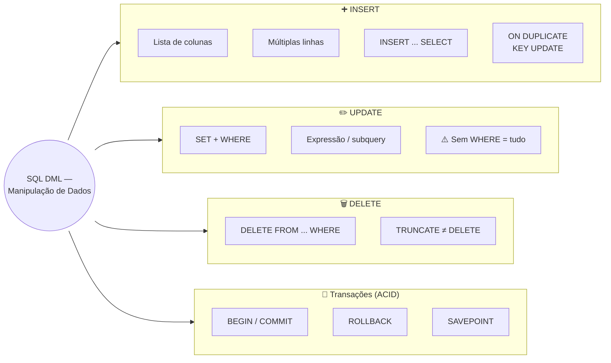

# Aula 04 — SQL DML: Manipulação de Dados

**Disciplina:** Banco de Dados — Relacional (IBD015)
**Professor:** Ronan Adriel Zenatti · ronan.zenatti@cps.sp.gov.br
**Fatec Jahu — 2º Semestre/2026**

---

## 🎯 Objetivos da Aula

Ao final desta aula você deverá ser capaz de:

- Inserir novos registros em tabelas relacionais com `INSERT`, incluindo inserção múltipla e inserção a partir de uma consulta (`INSERT ... SELECT`);
- Atualizar registros existentes com `UPDATE`, entendendo por que um `UPDATE` sem `WHERE` é uma das operações mais perigosas do SQL;
- Remover registros com `DELETE` e diferenciar `DELETE` de `TRUNCATE`;
- Compreender o princípio de Atomicidade (o "A" do ACID) e controlar transações explícitas com `BEGIN`, `COMMIT`, `ROLLBACK` e `SAVEPOINT`.

---

## 🗺️ Mapa Mental da Aula



---

## 🧭 Contexto

Na Aula 03 você criou as estruturas do schema `loja_virtual` — tabelas, colunas, constraints — mas elas estão vazias. Agora vamos **popular** essas estruturas com dados reais, e depois modificá-las com segurança. A DML — **Data Manipulation Language** — é o subconjunto do SQL responsável por inserir, modificar e remover registros. Os três comandos centrais são `INSERT`, `UPDATE` e `DELETE`. Todos os exemplos desta aula continuam operando sobre o schema `loja_virtual` criado na Aula 03 (tabelas `pessoas`, `enderecos`, `categorias`, `produtos`, `pedidos` e `itens_pedidos`) — nada de tabela nova aparece do nada.

[prompt para nanobanana: "Educational illustration showing three database operations as colored icons: INSERT as a green plus symbol adding a row to a table, UPDATE as a blue pencil editing a row, DELETE as a red trash can removing a row. Clean flat design, white background, labeled in Portuguese below each icon."]


---

## 1. INSERT — Inserindo Dados

O `INSERT` adiciona novas linhas a uma tabela. Existem várias formas de uso, cada uma útil em um cenário diferente.

### 1.1 INSERT com lista de colunas (forma recomendada)

```sql
-- Sempre especifique as colunas: o código fica resistente a mudanças no schema
INSERT INTO pessoas (nome, cpf, email, data_nascimento, telefone)
VALUES ('Ana Lima', '11122233344', 'ana@email.com', '1995-03-15', '14999990001');
```

### 1.2 INSERT múltiplo — várias linhas em um único comando

```sql
-- Muito mais eficiente que múltiplos INSERTs individuais
INSERT INTO categorias (nome, descricao) VALUES
    ('Eletrônicos', 'Computadores, smartphones e acessórios'),
    ('Vestuário',   'Roupas e calçados'),
    ('Livros',      'Livros técnicos e literatura'),
    ('Casa',        'Utensílios e decoração');
```

### 1.3 INSERT com SELECT — inserindo a partir de uma consulta

O `INSERT ... SELECT` insere no destino o resultado de uma consulta, em vez de valores literais digitados à mão. Um caso de uso real no e-commerce: a funcionalidade "comprar novamente", que recria um pedido antigo como um novo pedido pendente.

```sql
-- Cliente clica em "Comprar novamente" no pedido #12: primeiro recria o cabeçalho do pedido
INSERT INTO pedidos (cliente_id, funcionario_id, status, valor_total)
SELECT cliente_id, NULL, 'pendente', valor_total
FROM   pedidos
WHERE  id_pedido = 12;

-- ...depois copia os itens do pedido antigo para dentro do pedido recém-criado.
-- LAST_INSERT_ID() ainda aponta para o pedido que acabamos de inserir acima
INSERT INTO itens_pedidos (pedido_id, produto_id, quantidade, preco_unitario)
SELECT LAST_INSERT_ID(), produto_id, quantidade, preco_unitario
FROM   itens_pedidos
WHERE  pedido_id = 12;
```

> 💡 Repare que o novo pedido nasce com `status = 'pendente'` (precisa ser confirmado de novo) e reaproveita o `preco_unitario` salvo no pedido original — não o preço atual em `produtos`, que pode ter mudado (o mesmo raciocínio de snapshot histórico visto na Aula 03).

### 1.4 INSERT IGNORE / ON DUPLICATE KEY UPDATE

```sql
-- MariaDB/MySQL: ignora o INSERT se violar uma constraint UNIQUE
INSERT IGNORE INTO categorias (nome) VALUES ('Eletrônicos');

-- Atualiza o registro existente se houver conflito de PK ou UNIQUE
INSERT INTO produtos (id_produto, categoria_id, nome, preco, estoque)
VALUES (1, 1, 'Notebook Pro', 3800.00, 10)
ON DUPLICATE KEY UPDATE
    preco   = VALUES(preco),
    estoque = VALUES(estoque);
```

> 💡 **Boas práticas no INSERT:** sempre especifique a lista de colunas. Um `INSERT INTO tabela VALUES (...)` sem lista de colunas quebra silenciosamente se a ordem ou quantidade de colunas mudar. Isso causa bugs difíceis de rastrear em produção.

!!! example "🔍 Checkpoint 1 — INSERT: bike-sharing elétrico"
    Uma startup de bike-sharing elétrico está cadastrando sua primeira leva de bicicletas na tabela `bicicletas (id_bicicleta PK, modelo, nivel_bateria, estacao_id FK, disponivel)`. Escreva um único comando `INSERT` que cadastre 3 bicicletas de uma vez: uma "Aro 29 E-bike" com 100% de bateria na estação 1, uma "Urbana Compacta" com 87% na estação 1, e uma "Urbana Compacta" com 45% na estação 2 — todas disponíveis (`disponivel = 1`).

    🔑 Resolução no [Gabarito da Aula 04](Aula_04_Gabarito.md#checkpoint-1) — tente resolver antes de conferir.

---

## 2. UPDATE — Atualizando Dados

O `UPDATE` modifica valores em linhas existentes. É o comando que exige mais atenção: um `UPDATE` sem `WHERE` altera **todas as linhas** da tabela.

### 2.1 UPDATE básico

```sql
-- Atualiza o email de uma pessoa específica
UPDATE pessoas
SET    email = 'ana.lima@novoemail.com'
WHERE  id_pessoa = 1;
```

### 2.2 UPDATE com múltiplas colunas

```sql
-- Várias colunas separadas por vírgula
UPDATE produtos
SET    preco   = 3200.00,
       estoque = estoque + 50
       -- alterado_em é mantido automaticamente pelo MariaDB (ON UPDATE CURRENT_TIMESTAMP)
WHERE  id_produto = 5;
```

### 2.3 UPDATE com expressão e subquery

```sql
-- Aplica 10% de desconto em todos os produtos de uma categoria
-- Note: em produtos, a FK é categoria_id (Regra 6); em categorias, a PK é id_categoria (Regra 5)
UPDATE produtos
SET    preco = preco * 0.90
WHERE  categoria_id = (SELECT id_categoria FROM categorias WHERE nome = 'Eletrônicos');
```

### 2.4 O perigo do UPDATE sem WHERE

```sql
-- ⚠️ MUITO CUIDADO: este comando afeta TODAS as linhas da tabela
UPDATE produtos SET estoque = 0;  -- Zera o estoque de TODOS os produtos!

-- ✅ Sempre use WHERE para limitar o escopo:
UPDATE produtos SET estoque = 0 WHERE ativo = 0;
```

> ⚠️ **Dica de segurança:** no MariaDB/MySQL, você pode ativar o modo `sql_safe_updates` para que o banco rejeite `UPDATE` e `DELETE` sem `WHERE` ou sem usar uma coluna indexada. Ative com `SET sql_safe_updates = 1;`.

!!! example "🔍 Checkpoint 2 — UPDATE: app de doação de sangue"
    Um app de doação de sangue tem a tabela `agendamentos (id_agendamento PK, doador_id FK, hemocentro_id FK, data_agendada, status)`, com `status` podendo ser `'agendado'`, `'compareceu'` ou `'faltou'`. Escreva o `UPDATE` que marca como `'compareceu'` todos os agendamentos do hemocentro de id 3 cuja `data_agendada` foi hoje (`CURDATE()`). Depois, explique em uma frase por que esquecer o `WHERE` nesse comando seria particularmente grave neste domínio.

    🔑 Resolução no [Gabarito da Aula 04](Aula_04_Gabarito.md#checkpoint-2) — tente resolver antes de conferir.

---

## 3. DELETE — Excluindo Dados

O `DELETE` remove linhas de uma tabela. Assim como o `UPDATE`, exige `WHERE` na maioria dos casos.

### 3.1 DELETE básico

```sql
-- Remove um registro específico
DELETE FROM itens_pedidos
WHERE  pedido_id = 5 AND produto_id = 3;
```

### 3.2 DELETE com subquery

```sql
-- Remove todos os pedidos cancelados há mais de 1 ano
DELETE FROM pedidos
WHERE  status = 'cancelado'
  AND  data_pedido < DATE_SUB(NOW(), INTERVAL 1 YEAR);
```

### 3.3 TRUNCATE — limpeza total de uma tabela

```sql
-- Remove TODAS as linhas e reinicia o AUTO_INCREMENT
-- Muito mais rápido que DELETE sem WHERE, pois não registra cada linha no log
TRUNCATE TABLE itens_pedidos;

-- Diferença do DELETE sem WHERE:
DELETE FROM itens_pedidos;    -- lento, registra cada linha, NÃO reseta AUTO_INCREMENT
TRUNCATE TABLE itens_pedidos; -- rápido, NÃO pode ser usado dentro de transação em alguns SGBDs
```

> ⚠️ **TRUNCATE vs DELETE:** o `TRUNCATE` não pode ser revertido com `ROLLBACK` no MariaDB (é um comando DDL internamente). Se precisar de segurança transacional, use `DELETE FROM tabela` dentro de uma transação.

!!! tip "✅ Verificação Rápida — TRUNCATE vs DELETE"
    Bloco puramente conceitual — confira seu entendimento com os dois quizzes abaixo. A resposta é revelada na hora.

<quiz>
Depois de rodar TRUNCATE TABLE itens_pedidos; dentro de uma transação (BEGIN ... TRUNCATE ... ROLLBACK), o que acontece?
- [ ] Os dados voltam normalmente, como qualquer outro comando dentro de BEGIN/ROLLBACK
- [x] Os dados NÃO voltam — no MariaDB, TRUNCATE se comporta como um comando DDL e não pode ser desfeito com ROLLBACK
- [ ] O comando é rejeitado e a transação inteira falha
- [ ] Depende apenas do mecanismo de armazenamento (storage engine) usado

TRUNCATE é implementado internamente como um DROP TABLE seguido de um novo CREATE TABLE — por isso se comporta como DDL e não é coberto pelo controle transacional de DML que protege INSERT, UPDATE e DELETE.
</quiz>

<quiz>
Depois de popular a tabela produtos e rodar TRUNCATE TABLE produtos;, qual o valor do próximo id_produto inserido?
- [x] Volta a começar do 1 (o contador AUTO_INCREMENT é reiniciado)
- [ ] Continua de onde parou, como se fosse um DELETE FROM produtos;
- [ ] Fica indefinido até um novo CREATE TABLE
- [ ] TRUNCATE não afeta colunas AUTO_INCREMENT

Diferente de um DELETE FROM tabela; (que remove todas as linhas mas mantém o contador AUTO_INCREMENT de onde estava), o TRUNCATE reinicia o contador — é uma das diferenças práticas mais importantes entre os dois comandos.
</quiz>

!!! example "🔍 Checkpoint 3 — DELETE: app de reciclagem com recompensas"
    Um app de reciclagem dá pontos por descarte correto e tem a tabela `resgates (id_resgate PK, usuario_id FK, recompensa, pontos_utilizados, validade, status)`. Escreva o `DELETE` que remove todos os resgates cuja `validade` já passou (compare com `CURDATE()`) e cujo `status` ainda seja `'pendente'`. Em seguida, explique por que `TRUNCATE TABLE resgates` seria uma péssima escolha para essa limpeza, mesmo sendo mais rápido que `DELETE`.

    🔑 Resolução no [Gabarito da Aula 04](Aula_04_Gabarito.md#checkpoint-3) — tente resolver antes de conferir.

---

## 4. Controle Básico de Transações

Uma **transação** é uma unidade de trabalho que deve ser executada por completo ou não executada de forma alguma. Isso é o princípio **A** do ACID (Atomicidade).

[prompt para nanobanana: "Educational diagram of a database transaction showing two scenarios side by side. Left side labeled 'COMMIT - Sucesso': shows steps INSERT, UPDATE, DELETE all with green checkmarks, then a COMMIT arrow saving to database cylinder. Right side labeled 'ROLLBACK - Falha': shows INSERT with green check, UPDATE with red X (error), then ROLLBACK arrow returning database to original state. Clean flat design, blue and green for success, red for failure, white background, labels in Portuguese."]


### 4.1 Modo AUTOCOMMIT

Por padrão, o MariaDB opera em modo **AUTOCOMMIT ON**: cada comando DML é automaticamente confirmado assim que é executado. Isso significa que um `DELETE` executado sem `BEGIN` não pode ser desfeito.

```sql
-- Verificar o modo atual:
SELECT @@autocommit;  -- 1 = ativado, 0 = desativado

-- Desativar para a sessão atual:
SET autocommit = 0;
```

### 4.2 BEGIN, COMMIT e ROLLBACK

```sql
-- Inicia uma transação explícita
BEGIN;
-- ou equivalentemente:
START TRANSACTION;

-- Operações dentro da transação:
INSERT INTO pedidos (cliente_id, funcionario_id, status, valor_total)
VALUES (1, 5, 'confirmado', 450.00);

UPDATE produtos
SET    estoque = estoque - 1
WHERE  id_produto = 10;  -- baixa de 1 unidade no estoque

-- Se tudo correu bem, confirma permanentemente:
COMMIT;

-- Se algo deu errado, desfaz tudo desde o BEGIN:
ROLLBACK;
```

### 4.3 Exemplo prático — cancelamento seguro de pedido

```sql
-- Simulando o cancelamento do pedido #8, que havia baixado 1 unidade do produto #10
-- (o mesmo pedido criado com o padrão da Seção 4.2): as duas atualizações abaixo só
-- fazem sentido juntas — cancelar o pedido sem devolver o estoque deixaria o sistema
-- em um estado inconsistente (estoque "perdido").
BEGIN;

-- Marca o pedido como cancelado
UPDATE pedidos
SET    status = 'cancelado'
WHERE  id_pedido = 8;

-- Devolve ao estoque a unidade que havia sido baixada na confirmação do pedido
UPDATE produtos
SET    estoque = estoque + 1
WHERE  id_produto = 10;

-- Confirma apenas se ambas as operações foram bem-sucedidas
COMMIT;
```

### 4.4 SAVEPOINT — pontos de retorno parcial

```sql
BEGIN;

INSERT INTO pedidos (cliente_id, funcionario_id, status, valor_total)
VALUES (2, NULL, 'pendente', 200.00);

SAVEPOINT sp_pedido_inserido;  -- marca um ponto de retorno

INSERT INTO itens_pedidos (pedido_id, produto_id, quantidade, preco_unitario)
VALUES (LAST_INSERT_ID(), 5, 2, 100.00);

-- Se o INSERT de itens falhar, volta apenas até o savepoint
-- (o pedido ainda existirá na transação)
ROLLBACK TO SAVEPOINT sp_pedido_inserido;

-- Ou confirma tudo:
COMMIT;
```

!!! example "🔍 Checkpoint 4 — Transações: marketplace de ingressos para shows"
    Um marketplace de ingressos tem `eventos (id_evento PK, nome, ingressos_disponiveis)` e `vendas (id_venda PK, evento_id FK, comprador_id FK, quantidade, data_venda)`. Toda venda precisa, atomicamente, inserir o registro em `vendas` **e** decrementar `ingressos_disponiveis` em `eventos` — nunca uma operação sem a outra. Escreva a transação completa (`BEGIN` ... `COMMIT`) que vende 2 ingressos do evento de id 7 para o comprador de id 15, e explique em que situação você usaria `ROLLBACK` em vez de `COMMIT` nesse fluxo.

    🔑 Resolução no [Gabarito da Aula 04](Aula_04_Gabarito.md#checkpoint-4) — tente resolver antes de conferir.

---

## 5. Script Completo — Populando o E-commerce

```sql
USE loja_virtual;

-- Pessoas (clientes e funcionários)
INSERT INTO pessoas (nome, cpf, email, data_nascimento, telefone) VALUES
    ('Ana Lima',      '11122233344', 'ana@email.com',      '1990-05-10', '14999990001'),
    ('Carlos Melo',   '22233344455', 'carlos@email.com',   '1985-11-22', '19988880002'),
    ('Beatriz Costa', '33344455566', 'bi@email.com',        '1998-07-03', NULL),
    ('Diego Rocha',   '44455566677', 'diego@email.com',    '1992-02-28', '11977770003'),
    ('Prof. Ronan',   '55566677788', 'ronan@fatec.edu.br', '1988-09-15', '14966660004');

-- Categorias
INSERT INTO categorias (nome, descricao) VALUES
    ('Eletrônicos', 'Computadores, smartphones e acessórios'),
    ('Periféricos', 'Mouse, teclado, headset e similares'),
    ('Livros',      'Técnicos, acadêmicos e literatura');

-- Produtos (categoria_id é FK para categorias — Regra 6)
INSERT INTO produtos (categoria_id, nome, preco, estoque) VALUES
    (1, 'Notebook Lenovo IdeaPad',              3499.90, 15),
    (1, 'Smartphone Samsung A55',               1899.00, 30),
    (2, 'Mouse Logitech MX Master',              399.90, 50),
    (2, 'Teclado Mecânico Redragon',             299.90, 40),
    (3, 'Sistemas de Banco de Dados — Elmasri',  189.90, 20);

-- Pedido de Ana Lima (cliente_id=1) atendido por Prof. Ronan (funcionario_id=5)
BEGIN;

INSERT INTO pedidos (cliente_id, funcionario_id, status, valor_total)
VALUES (1, 5, 'confirmado', 3899.80);

-- itens_pedidos: pedido_id e produto_id são FKs (Regra 6)
INSERT INTO itens_pedidos (pedido_id, produto_id, quantidade, preco_unitario)
VALUES
    (LAST_INSERT_ID(), 1, 1, 3499.90),
    (LAST_INSERT_ID(), 3, 1, 399.90);

COMMIT;
```

---

## 6. Exercícios de Fixação

> 🔑 As resoluções destes quatro exercícios estão no [Gabarito da Aula 04](Aula_04_Gabarito.md) — tente resolver antes de conferir.

**Exercício 1:** insira 3 novos produtos na tabela `produtos`, sendo um deles com `estoque = 0`.

**Exercício 2:** atualize o preço de todos os produtos da categoria 'Periféricos' aumentando 5%.

**Exercício 3:** usando uma transação, simule a criação de um pedido com dois itens. Ao final, faça `ROLLBACK` e verifique com `SELECT` que os dados não foram persistidos.

**Exercício 4:** qual a diferença entre `DELETE FROM produtos` e `TRUNCATE TABLE produtos`? Em que situação você usaria cada um?

---

## 📚 Referências desta Aula

- ELMASRI, R.; NAVATHE, S. B. *Sistemas de Banco de Dados*. 7 ed. Cap. 6.3 — Comandos SQL de Atualização. São Paulo: Pearson, 2018.
- Documentação oficial do MariaDB — [INSERT](https://mariadb.com/kb/en/insert/), [UPDATE](https://mariadb.com/kb/en/update/), [DELETE](https://mariadb.com/kb/en/delete/), [TRANSACTION](https://mariadb.com/kb/en/transactions/)

---

## 🃏 Flashcards de Revisão

??? question "Por que sempre especificar a lista de colunas em um INSERT, em vez de confiar na ordem das colunas da tabela?"
    Porque um `INSERT INTO tabela VALUES (...)` sem lista de colunas quebra silenciosamente
    se a ordem ou a quantidade de colunas da tabela mudar — o valor errado acaba indo para
    a coluna errada sem nenhum erro visível. Especificar as colunas deixa o comando
    resistente a mudanças de schema.

??? question "O que acontece se você executar UPDATE produtos SET estoque = 0; sem WHERE?"
    Todas as linhas da tabela produtos têm o estoque zerado — o UPDATE sem WHERE afeta
    100% das linhas, não apenas as que "fariam sentido". É um dos erros mais destrutivos
    e mais fáceis de cometer em SQL.

??? question "Qual a diferença prática entre DELETE FROM tabela; e TRUNCATE TABLE tabela;?"
    Ambos removem todas as linhas, mas TRUNCATE é mais rápido (não registra cada linha no
    log), reinicia o contador AUTO_INCREMENT e não pode ser desfeito com ROLLBACK no
    MariaDB (comporta-se como DDL). DELETE é mais lento, mantém o AUTO_INCREMENT de onde
    parou, e pode ser revertido dentro de uma transação.

??? question "O que significa a letra 'A' do ACID, e como BEGIN/COMMIT/ROLLBACK garantem essa propriedade?"
    Atomicidade: uma transação deve ser executada por completo ou não ser executada de
    forma alguma. BEGIN inicia um bloco de operações; COMMIT confirma todas
    permanentemente; ROLLBACK desfaz todas desde o BEGIN — nunca fica um estado
    "parcialmente aplicado".

??? question "Para que serve um SAVEPOINT dentro de uma transação?"
    Marca um ponto de retorno intermediário dentro de uma transação mais longa. Um
    ROLLBACK TO SAVEPOINT desfaz apenas as operações feitas depois do savepoint,
    preservando o que veio antes — sem precisar desfazer a transação inteira.

??? question "O que faz a cláusula ON DUPLICATE KEY UPDATE em um INSERT?"
    Se o INSERT causaria uma violação de PRIMARY KEY ou UNIQUE, em vez de gerar erro, o
    MariaDB executa a atualização especificada nessa cláusula sobre o registro existente
    — útil para "inserir ou atualizar" (upsert) em um único comando.

---

## ✅ Quiz de Fixação

<quiz>
Qual comando insere três linhas em categorias em uma única instrução, sem repetir INSERT INTO três vezes?
- [ ] Não é possível inserir mais de uma linha por comando no MariaDB
- [x] INSERT INTO categorias (nome) VALUES ('A'), ('B'), ('C');
- [ ] INSERT INTO categorias (nome) VALUES ('A'); ('B'); ('C');
- [ ] INSERT MULTIPLE INTO categorias (nome) VALUES ('A', 'B', 'C');

A sintaxe de INSERT múltiplo usa uma lista de tuplas separadas por vírgula após VALUES — muito mais eficiente que múltiplos comandos INSERT individuais.
</quiz>

<quiz>
O que UPDATE produtos SET estoque = 0; (sem WHERE) faz?
- [ ] Nada — o MariaDB rejeita UPDATE sem WHERE por padrão
- [ ] Zera apenas o produto mais recentemente inserido
- [x] Zera o estoque de TODOS os produtos da tabela
- [ ] Pede confirmação antes de executar

Sem WHERE, a cláusula SET se aplica a toda linha da tabela — não existe um "produto padrão" afetado, é literalmente 100% das linhas.
</quiz>

<quiz>
Marque todas as afirmações corretas sobre TRUNCATE TABLE no MariaDB.
- [x] Reinicia o contador AUTO_INCREMENT
- [ ] Pode ser desfeito com ROLLBACK, assim como o DELETE
- [x] É mais rápido que um DELETE sem WHERE
- [ ] Permite um WHERE para remover apenas parte das linhas

TRUNCATE sempre remove a tabela inteira (não aceita WHERE), reinicia o AUTO_INCREMENT e, por se comportar como DDL internamente, não é revertido por ROLLBACK — ao contrário do DELETE, que é DML e participa normalmente do controle transacional.
</quiz>

<quiz>
Dentro de uma transação, o que ROLLBACK TO SAVEPOINT sp_x faz?
- [ ] Desfaz toda a transação, incluindo o que veio antes do SAVEPOINT
- [x] Desfaz apenas as operações executadas depois do SAVEPOINT sp_x
- [ ] Confirma tudo que veio antes do SAVEPOINT e cancela a transação
- [ ] É equivalente a um COMMIT parcial

ROLLBACK TO SAVEPOINT é um retorno parcial: desfaz só o que aconteceu depois daquele ponto de marcação, mantendo intactas as operações anteriores dentro da mesma transação ainda aberta.
</quiz>

<quiz>
Para que serve a função LAST_INSERT_ID() logo depois de um INSERT em uma tabela com AUTO_INCREMENT?
- [ ] Retorna o maior id já usado em qualquer tabela do banco
- [x] Retorna o valor gerado pelo AUTO_INCREMENT na última inserção feita na sessão atual
- [ ] Gera um novo id aleatório para o próximo INSERT
- [ ] Só funciona dentro de uma transação com SAVEPOINT

LAST_INSERT_ID() devolve o id gerado automaticamente pela última inserção da sessão — muito usado para inserir o registro "pai" (como um pedido) e, em seguida, inserir os registros "filhos" (como itens_pedidos) referenciando esse id sem precisar consultá-lo de volta.
</quiz>

---

## 📝 Resumo

Nesta aula demos vida ao schema `loja_virtual` construído na Aula 03: inserimos dados
com `INSERT` (em suas várias formas — lista de colunas, múltiplas linhas, a partir de
`SELECT`, e com `ON DUPLICATE KEY UPDATE`), modificamos registros com `UPDATE`
entendendo o risco de esquecer o `WHERE`, e removemos dados com `DELETE`, comparando-o
com o `TRUNCATE`. Vimos também o princípio de Atomicidade do ACID e como `BEGIN`,
`COMMIT`, `ROLLBACK` e `SAVEPOINT` garantem que operações relacionadas aconteçam por
completo ou não aconteçam de forma alguma. Isso encerra o Bloco 1 de Fundamentos e
Modelagem — a próxima etapa é a Atividade T1, onde você aplica tudo isso modelando e
populando um sistema do zero.

---

## 🏆 Conquista da Aula

!!! success "Selo desbloqueado: ✍️ Manipulador(a) de Dados"
    Você já sabe popular, atualizar e limpar um banco de dados com segurança, e sabe
    proteger operações relacionadas dentro de transações atômicas. A próxima parada da
    Trilha do(a) Modelador(a) de Dados é aplicar tudo isso, do zero, na Atividade T1.

---

## 🔑 Gabarito desta Aula

As respostas dos 4 checkpoints espalhados pela aula, e dos 4 Exercícios de Fixação da
Seção 6, estão em um arquivo separado, para não estragar a tentativa de quem ainda não
chegou até aqui: [Gabarito — Aula 04](Aula_04_Gabarito.md).

---

## 🔗 Navegação

⬅️ [Aula 03 — SQL e DDL](./Aula_03_SQL_DDL.md) · ➡️ 🔒 Aula 05 — em breve.

---

*Fatec Jahu · IBD015 · Prof. Ronan Adriel Zenatti · 2026*
