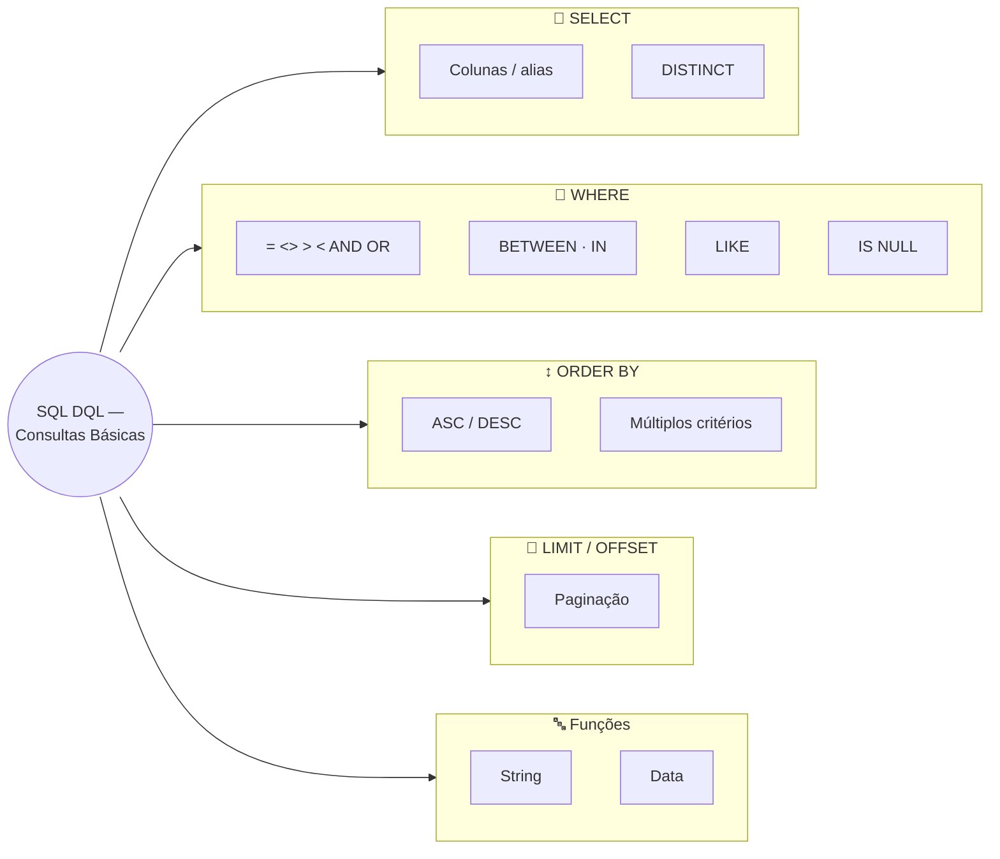
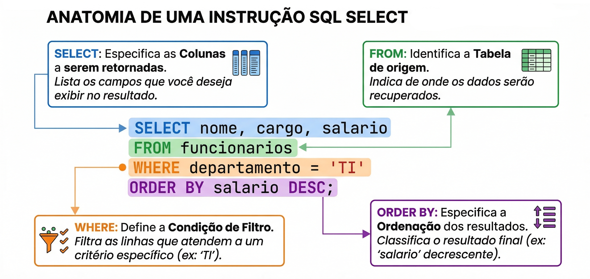

# Aula 06 — SQL: Consultas Básicas

**Disciplina:** Banco de Dados — Relacional (IBD015)
**Professor:** Ronan Adriel Zenatti · ronan.zenatti@cps.sp.gov.br
**Fatec Jahu — 2º Semestre/2026**

---

## 🎯 Objetivos da Aula

Ao final desta aula você deverá ser capaz de:

- Escrever consultas SQL com `SELECT`, selecionando colunas específicas e eliminando duplicatas com `DISTINCT`;
- Filtrar resultados com `WHERE`, usando operadores relacionais, `BETWEEN`, `IN`, `LIKE` e `IS NULL`;
- Ordenar resultados com `ORDER BY` e paginar com `LIMIT`/`OFFSET`;
- Aplicar funções básicas de string e data diretamente em uma consulta.

---

## 🗺️ Mapa Mental da Aula



---

## 🧭 Contexto

Depois de modelar, criar e popular seu próprio banco na Atividade T1, chegou a hora de consultar dados de verdade. A **DQL** — *Data Query Language* — é o subconjunto do SQL responsável pela consulta de dados. O `SELECT` é o comando mais usado em qualquer banco de dados: enquanto um sistema típico executa muito mais leituras do que escritas, saber construir consultas eficientes é uma das habilidades mais valorizadas no mercado. Os exemplos desta aula continuam operando sobre o schema `loja_virtual` construído na Aula 03 e populado na Aula 04.



---

## 1. Estrutura Básica do SELECT

```sql
SELECT coluna1, coluna2, ...
FROM   tabela
WHERE  condicao
ORDER BY coluna [ASC | DESC];
```

### 1.1 Selecionando colunas específicas vs todas

```sql
-- Todas as colunas (evite em produção — traz dados desnecessários)
SELECT * FROM produtos;

-- Colunas específicas (recomendado)
SELECT id_produto, nome, preco, estoque
FROM   produtos;

-- Alias: renomeia a coluna no resultado
SELECT
    nome    AS produto,
    preco   AS "Preço (R$)",
    estoque AS quantidade_disponivel
FROM produtos;
```

### 1.2 DISTINCT — eliminando duplicatas

```sql
-- Lista todas as cidades cadastradas (sem repetição)
SELECT DISTINCT cidade FROM enderecos ORDER BY cidade;

-- Combinação de colunas distintas
SELECT DISTINCT estado, cidade FROM enderecos ORDER BY estado, cidade;
```

!!! example "🔍 Checkpoint 1 — SELECT e DISTINCT: agricultura de precisão"
    Uma fazenda usa sensores IoT espalhados no campo, registrados na tabela `leituras_sensores (id_leitura PK, sensor_id FK, talhao, umidade_solo, temperatura, medido_em)`. Escreva uma consulta que retorne, sem repetição, todos os talhões que já tiveram alguma leitura registrada — ordenados alfabeticamente — usando um alias `talhao_monitorado` para a coluna no resultado.

    🔑 Resolução no [Gabarito da Aula 06](Aula_06_Gabarito.md#checkpoint-1) — tente resolver antes de conferir.

---

## 2. WHERE — Filtrando Resultados

### 2.1 Operadores relacionais

```sql
-- Igualdade e diferença
SELECT * FROM produtos WHERE ativo = 1;
SELECT * FROM produtos WHERE categoria_id <> 2;  -- diferente

-- Comparações numéricas
SELECT nome, preco FROM produtos WHERE preco > 500.00;
SELECT nome, preco FROM produtos WHERE preco <= 199.90;

-- Combinando condições com AND e OR
SELECT nome, preco FROM produtos
WHERE  preco > 100 AND preco < 1000 AND ativo = 1;

SELECT nome FROM pessoas p
JOIN   enderecos e ON e.pessoa_id = p.id_pessoa
WHERE  e.cidade = 'São Paulo' OR e.cidade = 'Campinas';
```

> 📌 O último exemplo já usa um `JOIN` só para deixar a consulta executável de verdade (`cidade` mora em `enderecos`, não em `pessoas`) — não se preocupe em entender a sintaxe do `JOIN` agora, ela é o assunto central da Aula 08. Por enquanto, foque no `WHERE ... OR ...`.

### 2.2 BETWEEN — intervalos inclusivos

```sql
-- Equivale a: preco >= 100 AND preco <= 500
SELECT nome, preco FROM produtos WHERE preco BETWEEN 100.00 AND 500.00;

-- Funciona com datas também
SELECT id_pedido, data_pedido FROM pedidos
WHERE  data_pedido BETWEEN '2026-01-01' AND '2026-03-31';
```

### 2.3 IN — lista de valores

```sql
-- Muito mais legível que múltiplos OR
SELECT nome, status FROM pedidos
WHERE  status IN ('confirmado', 'em_separacao', 'enviado');

-- NOT IN — exclui os valores da lista
SELECT nome FROM produtos WHERE categoria_id NOT IN (1, 3);
```

### 2.4 LIKE — busca por padrão

```sql
-- % substitui qualquer sequência de caracteres (zero ou mais)
-- _ substitui exatamente um caractere

SELECT nome FROM pessoas WHERE nome LIKE 'Ana%';        -- começa com Ana
SELECT nome FROM pessoas WHERE nome LIKE '%Lima';       -- termina com Lima
SELECT nome FROM pessoas WHERE nome LIKE '%Silva%';     -- contém Silva em qualquer posição
SELECT cpf  FROM pessoas WHERE cpf  LIKE '111_____44';  -- _ = um caractere qualquer
```

### 2.5 IS NULL / IS NOT NULL

```sql
-- NULL nunca é igual a nada — use IS NULL, nunca = NULL
SELECT nome FROM pessoas WHERE telefone IS NULL;
SELECT nome FROM pessoas WHERE telefone IS NOT NULL;

-- ❌ NUNCA funciona:
SELECT nome FROM pessoas WHERE telefone = NULL;  -- sempre retorna vazio!
```

!!! example "🔍 Checkpoint 2 — WHERE: app de adoção de pets"
    Um app de adoção tem a tabela `pets (id_pet PK, nome, especie, idade_meses, porte, disponivel_adocao)`, com `especie` podendo ser `'cachorro'`, `'gato'` ou `'outro'`, e `porte` `'pequeno'`, `'medio'` ou `'grande'`. Escreva uma única consulta que retorne `nome`, `especie` e `idade_meses` de todos os pets disponíveis para adoção (`disponivel_adocao = 1`), com idade entre 2 e 24 meses, cuja espécie esteja em `('cachorro', 'gato')`, e cujo nome comece com a letra 'B'.

    🔑 Resolução no [Gabarito da Aula 06](Aula_06_Gabarito.md#checkpoint-2) — tente resolver antes de conferir.

---

## 3. ORDER BY — Ordenando Resultados

```sql
-- Ordem crescente (padrão)
SELECT nome, preco FROM produtos ORDER BY preco;
SELECT nome, preco FROM produtos ORDER BY preco ASC;

-- Ordem decrescente
SELECT nome, preco FROM produtos ORDER BY preco DESC;

-- Múltiplos critérios de ordenação
SELECT nome, categoria_id, preco
FROM   produtos
ORDER BY categoria_id ASC, preco DESC;

-- Ordenando por alias (posição numérica da coluna também funciona, mas evite em código mantido)
SELECT nome AS produto, preco AS valor
FROM   produtos
ORDER BY valor DESC;
```

!!! example "🔍 Checkpoint 3 — ORDER BY: plataforma de ingressos para shows"
    Na tabela `eventos (id_evento PK, nome, cidade, data_evento, preco_ingresso)`, escreva uma consulta que liste `nome`, `cidade` e `preco_ingresso` de todos os eventos, ordenados primeiro por `cidade` (crescente) e, dentro de cada cidade, do ingresso mais caro para o mais barato.

    🔑 Resolução no [Gabarito da Aula 06](Aula_06_Gabarito.md#checkpoint-3) — tente resolver antes de conferir.

---

## 4. LIMIT e OFFSET — Paginação

```sql
-- Os 5 produtos mais caros
SELECT nome, preco FROM produtos ORDER BY preco DESC LIMIT 5;

-- Paginação: página 2 com 10 itens por página
-- OFFSET = (pagina - 1) * itens_por_pagina = (2-1)*10 = 10
SELECT nome, preco FROM produtos ORDER BY id_produto LIMIT 10 OFFSET 10;

-- Sintaxe alternativa: LIMIT offset, count
SELECT nome, preco FROM produtos ORDER BY id_produto LIMIT 10, 10;
```

!!! example "🔍 Checkpoint 4 — LIMIT/OFFSET: estacionamento inteligente"
    Um app de estacionamento inteligente tem `vagas (id_vaga PK, setor, ocupada)`. A tela do app mostra 5 vagas livres por vez, com botão "ver mais". Escreva a consulta SQL para a **segunda página** de vagas livres (`ocupada = 0`), ordenadas por `id_vaga`, 5 por página.

    🔑 Resolução no [Gabarito da Aula 06](Aula_06_Gabarito.md#checkpoint-4) — tente resolver antes de conferir.

---

## 5. Funções de String e Data Úteis

```sql
-- Funções de string
SELECT UPPER(nome), LOWER(email) FROM pessoas;
SELECT LENGTH(nome) AS tamanho, nome FROM pessoas ORDER BY tamanho DESC;
SELECT CONCAT(nome, ' — CPF: ', cpf) AS identificacao FROM pessoas;
SELECT SUBSTRING(cpf, 1, 3) AS primeiros_digitos FROM pessoas;  -- 3 primeiros dígitos

-- Funções de data
SELECT nome, data_nascimento,
       YEAR(data_nascimento)                       AS ano_nasc,
       TIMESTAMPDIFF(YEAR, data_nascimento, NOW())  AS idade
FROM   pessoas
ORDER BY idade DESC;

SELECT id_pedido, data_pedido,
       DATE_FORMAT(data_pedido, '%d/%m/%Y %H:%i') AS data_formatada
FROM   pedidos;
```

!!! example "🔍 Checkpoint 5 — Funções de String/Data: app de aulas de idiomas online"
    A tabela `alunos_idiomas (id_aluno PK, nome_completo, email, data_matricula)` guarda os alunos de um app de aulas de idiomas. Escreva uma consulta que retorne, para cada aluno: o `nome_completo` em maiúsculas, os 3 primeiros caracteres do `email`, e há quantos anos completos ele está matriculado (a partir de `data_matricula` até hoje) — ordenado do aluno mais antigo para o mais recente.

    🔑 Resolução no [Gabarito da Aula 06](Aula_06_Gabarito.md#checkpoint-5) — tente resolver antes de conferir.

---

## 6. Exercícios de Fixação

> 🔑 As resoluções destes cinco exercícios estão no [Gabarito da Aula 06](Aula_06_Gabarito.md) — tente resolver antes de conferir.

**Exercício 1:** liste o nome e preço de todos os produtos com preço entre R$ 100 e R$ 500, em ordem decrescente de preço.

**Exercício 2:** encontre todos os clientes cujo nome começa com a letra 'A' ou termina com 'Lima'.

**Exercício 3:** liste os 3 produtos mais baratos que estejam ativos (`ativo=1`) e com estoque maior que zero.

**Exercício 4:** liste todos os pedidos com status diferente de 'cancelado', mostrando `id_pedido`, data formatada (DD/MM/AAAA) e `valor_total`, ordenados por `valor_total` decrescente.

**Exercício 5:** quais produtos não possuem descrição cadastrada (campo `NULL`)?

---

## 📚 Referências desta Aula

- ELMASRI, R.; NAVATHE, S. B. *Sistemas de Banco de Dados*. 7 ed. Cap. 6.3 — SELECT. São Paulo: Pearson, 2018.
- FORTA, B. *SQL em 10 Minutos por Dia*. 5 ed. Lições 2–7. São Paulo: Novatec, 2021.
- Documentação oficial do MariaDB — [SELECT](https://mariadb.com/kb/en/select/), [String Functions](https://mariadb.com/kb/en/string-functions/), [Date & Time Functions](https://mariadb.com/kb/en/date-time-functions/)

---

## 🃏 Flashcards de Revisão

??? question "Por que usar SELECT * é desaconselhado em produção?"
    Porque traz colunas que a aplicação nem sempre precisa, aumentando o tráfego de rede
    e o processamento desnecessário, e porque o resultado muda silenciosamente se alguém
    adicionar uma coluna à tabela — listar as colunas explicitamente é mais previsível e
    mais eficiente.

??? question "Qual a diferença entre WHERE coluna = NULL e WHERE coluna IS NULL?"
    coluna = NULL nunca é verdadeiro — NULL representa ausência de valor, e nenhuma
    comparação de igualdade com NULL retorna verdadeiro, nem mesmo NULL = NULL. Por
    isso o SQL exige o operador especial IS NULL (ou IS NOT NULL) para testar ausência
    de valor.

??? question "O que os curingas % e _ significam dentro de um LIKE?"
    % substitui qualquer sequência de caracteres, incluindo zero caracteres. _ substitui
    exatamente um único caractere. 'Ana%' casa com "Ana", "Ana Lima", "Anabela"; 'A_a'
    casa apenas com palavras de 3 letras começando com A e terminando com a.

??? question "Um WHERE preco BETWEEN 100 AND 500 inclui os valores 100 e 500 exatos?"
    Sim. BETWEEN é inclusivo nos dois extremos — equivale exatamente a
    preco >= 100 AND preco <= 500.

??? question "Como calcular o OFFSET correto para a página N de uma listagem paginada?"
    OFFSET = (página - 1) × itens_por_página. Para a página 3 com 10 itens por página,
    OFFSET = (3-1)×10 = 20 — ou seja, LIMIT 10 OFFSET 20.

??? question "Qual a direção padrão do ORDER BY quando ASC/DESC não é especificado?"
    ASC (ascendente/crescente) é o padrão. ORDER BY preco e ORDER BY preco ASC produzem
    exatamente o mesmo resultado — DESC precisa sempre ser escrito explicitamente.

---

## ✅ Quiz de Fixação

<quiz>
Qual filtro é equivalente a WHERE preco BETWEEN 100.00 AND 500.00?
- [ ] WHERE preco > 100.00 AND preco < 500.00
- [x] WHERE preco >= 100.00 AND preco <= 500.00
- [ ] WHERE preco = 100.00 OR preco = 500.00
- [ ] WHERE preco IN (100.00, 500.00)

BETWEEN é inclusivo nos dois extremos — o valor mínimo e o máximo entram no resultado, equivalente a >= e <= combinados com AND.
</quiz>

<quiz>
O que a consulta SELECT nome FROM pessoas WHERE telefone = NULL; retorna?
- [ ] Todas as pessoas sem telefone cadastrado
- [ ] Um erro de sintaxe
- [x] Nenhuma linha, mesmo que existam pessoas com telefone NULL
- [ ] Todas as pessoas, com ou sem telefone

NULL nunca é igual a nada, nem a outro NULL — a comparação = NULL sempre avalia como desconhecida (não verdadeira), então o WHERE nunca é satisfeito. O filtro correto é IS NULL.
</quiz>

<quiz>
Marque todas as afirmações corretas sobre WHERE nome LIKE '%Silva%'.
- [x] Casa com "Silva", "Ana Silva" e "Silva Junior"
- [x] O símbolo % substitui qualquer sequência de caracteres, inclusive vazia
- [ ] É equivalente, em resultado, a WHERE nome = 'Silva'
- [ ] Diferencia maiúsculas de minúsculas por padrão no MariaDB com collation utf8mb4_unicode_ci

Com % nos dois lados, o padrão casa com qualquer nome que contenha "Silva" em qualquer posição. A collation padrão desta disciplina (utf8mb4_unicode_ci) é case-insensitive, então "silva" também casaria.
</quiz>

<quiz>
Para exibir a página 3 de uma listagem com 20 itens por página, qual comando está correto?
- [ ] SELECT ... LIMIT 3 OFFSET 20;
- [ ] SELECT ... LIMIT 20 OFFSET 3;
- [x] SELECT ... LIMIT 20 OFFSET 40;
- [ ] SELECT ... LIMIT 60;

OFFSET = (página - 1) × itens_por_página = (3-1)×20 = 40. O LIMIT continua sendo o tamanho da página (20); é o OFFSET que muda conforme a página avança.
</quiz>

<quiz>
O que SELECT DISTINCT estado, cidade FROM enderecos; retorna?
- [ ] Uma lista de todos os estados distintos, ignorando a cidade
- [x] Todas as combinações distintas de (estado, cidade) — a mesma cidade em estados diferentes conta como linhas separadas
- [ ] Apenas a primeira linha de cada estado
- [ ] Um erro, pois DISTINCT só aceita uma coluna por vez

DISTINCT com múltiplas colunas elimina duplicatas considerando a combinação de todas elas juntas — duas linhas só são consideradas duplicadas se TODAS as colunas listadas forem iguais.
</quiz>

---

## 📝 Resumo

Nesta aula demos o primeiro passo na Data Query Language: construímos consultas
`SELECT` selecionando colunas específicas e eliminando duplicatas com `DISTINCT`,
filtramos resultados com `WHERE` usando operadores relacionais, `BETWEEN`, `IN`,
`LIKE` e o tratamento correto de `NULL` (nunca `= NULL`, sempre `IS NULL`),
ordenamos com `ORDER BY` e paginamos com `LIMIT`/`OFFSET`, e aplicamos funções
básicas de string e data direto na consulta. Na próxima aula veremos funções de
agregação, `GROUP BY` e `HAVING` para criar consultas que resumem e agrupam dados.

---

## 🏆 Conquista da Aula

!!! success "Selo desbloqueado: 🔍 Investigador(a) de Dados"
    Você já sabe extrair exatamente a informação que precisa de um banco de dados —
    filtrando, ordenando e paginando resultados com precisão. A próxima parada da
    Trilha do(a) Consultor(a) SQL é aprender a resumir e agrupar esses dados com
    funções de agregação.

---

## 🔑 Gabarito desta Aula

As respostas dos 5 checkpoints espalhados pela aula, e dos 5 Exercícios de Fixação da
Seção 6, estão em um arquivo separado, para não estragar a tentativa de quem ainda não
chegou até aqui: [Gabarito — Aula 06](Aula_06_Gabarito.md).

---

## 🔗 Navegação

⬅️ 🔒 Aula 05 — ainda não publicada · ➡️ 🔒 Aula 07 — em breve.

---

*Fatec Jahu · IBD015 · Prof. Ronan Adriel Zenatti · 2026*
