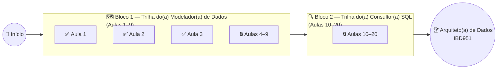

# 🗄️ Banco de Dados e Aplicações (IBD951)

> **Fatec Jahu** · Tecnologia em Desenvolvimento de Software Multiplataforma · 2º Semestre/2026

Bem-vindo(a) à **Trilha do(a) Arquiteto(a) de Dados** — a jornada desta disciplina, do
primeiro contato com modelagem até o domínio prático de consultas SQL. Cada aula
desbloqueia um selo; ao final dos dois blocos, você terá o selo de **🏆 Arquiteto(a) de
Dados — IBD951**.

---

## 👨‍🏫 Informações do Professor

| Campo | Informação |
|---|---|
| **Professor** | Ronan Adriel Zenatti |
| **E-mail** | ronan.zenatti@cps.sp.gov.br |
| **Instituição** | Fatec Jahu — Centro Paula Souza |
| **Curso** | Tecnologia em Desenvolvimento de Software Multiplataforma |
| **Disciplina** | Banco de Dados e Aplicações |
| **Sigla** | IBD951 |
| **Semestre** | 2º Semestre / 2026 |

---

## 📋 Ementa

Esta disciplina abrange o projeto e a implementação de bancos de dados relacionais,
desde a modelagem conceitual até a construção de consultas SQL complexas. Os principais
temas trabalhados são:

Modelagem conceitual (MER) e lógica de dados; normalização; definição de estruturas com
DDL; manipulação e consulta de dados com DML/DQL; junções (JOINs), subconsultas e
visões; e restrições de integridade.

> ⚠️ **Nota:** a ementa acima cobre o que já está confirmado pelas 3 primeiras aulas
> publicadas. O plano completo das Aulas 4–20 ainda não foi definido neste repositório —
> veja o aviso no Sumário de Aulas abaixo.

---

## 🎯 Objetivos

Ao final da disciplina, o aluno será capaz de:

- Aplicar modelagem conceitual e normalização na concepção de um banco de dados relacional;
- Implementar estruturas de banco de dados utilizando adequadamente os conceitos de
  linguagem de definição, manipulação e consulta de dados (DDL, DML e DQL);
- Construir consultas SQL complexas com junções, subconsultas e visões.

---

## ⏱️ Carga Horária

| Tipo | Horas |
|---|---|
| Carga Horária Semanal | 4 horas |
| **Carga Horária Semestral** | **80 horas** |

---

## 📐 Metodologia

As aulas são conduzidas no formato **expositivo e prático**, combinando explicações
conceituais com exercícios aplicados diretamente no SGBD. A ênfase é sempre na resolução
de problemas reais, preparando o aluno para o mercado de trabalho.

---

## 📊 Critérios de Avaliação

```
Nota Final = (T1 + P1 + T2 + P2) × 1 + R
```

| Componente | Descrição |
|---|---|
| **T1** | Modelagem de um sistema de Streaming (Conceitual, Lógico e DDL) |
| **P1** | Avaliação individual teórica e prática sobre modelagem e SQL fundamental |
| **T2** | Trabalho prático envolvendo consultas complexas e *views* |
| **P2** | Avaliação individual sobre consultas avançadas |
| **R** | Avaliação Substitutiva — substitui a menor nota entre P1 e P2 |

> ⚠️ **Nota:** posição exata (em qual aula cai cada avaliação) ainda não confirmada além
> do que já está nas aulas publicadas — a Aula 1 já referencia o T1 (streaming) como
> próxima atividade prática do bloco.

---

## 🗺️ Trilha do(a) Arquiteto(a) de Dados



---

## 📚 Sumário de Aulas

Cada aula está organizada em `docs/aulas/` e chega progressivamente ao longo do
semestre.

### Bloco 1 — Trilha do(a) Modelador(a) de Dados (Aulas 1–9)

| Aula | Título | Selo | Status |
|---|---|---|---|
| 01 | [Revisão de Modelagem de Dados (Conceitual)](./aulas/Aula_01_Revisao_Modelagem_Conceitual.md) | 🧭 Explorador(a) de Dados | ✅ Disponível |
| 02 | [Normalização e Passagem ao Modelo Lógico](./aulas/Aula_02_Normalizacao.md) | 🧹 Guardião(ã) da Normalização | ✅ Disponível |
| 03 | [SQL — DDL: Definição de Estruturas](./aulas/Aula_03_SQL_DDL.md) | 🛠️ Construtor(a) DDL | ✅ Disponível |
| 04–09 | — | — | 🔒 Em breve |

### Bloco 2 — Trilha do(a) Consultor(a) SQL (Aulas 10–20)

| Aula | Título | Selo | Status |
|---|---|---|---|
| 10–20 | — | — | 🔒 Em breve |

> ⚠️ **Nota:** as Aulas 4–20 ainda não foram adicionadas a este repositório. Os selos
> das Aulas 2 e 3 acima foram escolhidos pelo conteúdo real de cada arquivo publicado
> (Normalização e DDL), e não necessariamente coincidem com os exemplos de selo
> originalmente listados no `CLAUDE.md` para essas posições — vale alinhar isso com o
> professor conforme as próximas aulas forem chegando.

---

## 📖 Bibliografia

### Básica

- DATE, C. J. *Introdução a sistemas de bancos de dados*. Rio de Janeiro: Elsevier/Campus, 2004.
- ELMASRI, R.; NAVATHE, S. B. *Sistemas de Banco de Dados*. 7 ed. São Paulo: Pearson, 2018.
- SILBERSCHATZ, A.; SUNDARSHAN, S.; KORTH, H. F. *Sistema de banco de dados*. Rio de Janeiro: Elsevier Brasil, 2016.

### Complementar

- BEAULIEU, A. *Aprendendo SQL*. São Paulo: Novatec, 2010.
- GILLENSON, M. L. *Fundamentos de Sistemas de Gerência de Banco de Dados*. Rio de Janeiro: LTC, 2006.
- MACHADO, F. N. R. *Banco de Dados: Projeto e Implementação*. São Paulo: Érica, 2005.
- RAMAKRISHNAN, R.; GEHRKE, J. *Sistemas de Gerenciamento de Bancos de Dados*. 3 ed. Porto Alegre: Bookman, 2008.
- ROB, P.; CORONEL, C. *Sistemas de Banco de Dados: Projeto, Implementação e Gerenciamento*. 8 ed. São Paulo: Cengage Learning, 2011.
- TEOREY, T.; LIGHTSTONE, S.; NADEAU, T. *Projeto e Modelagem de Bancos de Dados*. São Paulo: Campus, 2006.

### Referência

- DEBARROS, A. *SQL Prático: um guia para iniciantes*. 2 ed. São Paulo: Novatec, 2022.
- TANIMURA, C. *SQL para Análise de Dados: técnicas avançadas para transformar dados em insights*. São Paulo: Novatec, 2022.
- FORTA, B. *SQL em 10 Minutos por Dia*. 5 ed. São Paulo: Novatec, 2021.

---

## 💬 Contato e Dúvidas

📧 **ronan.zenatti@cps.sp.gov.br**

> *"Dados bem modelados são a fundação de qualquer sistema confiável."*

---

<div align="center">
  <sub>Fatec Jahu · Centro Paula Souza · Governo do Estado de São Paulo · 2026</sub>
</div>
