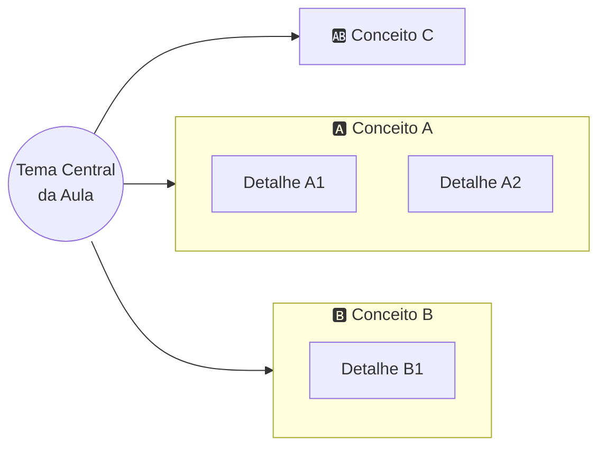

<!--
GABARITO ESTRUTURAL DE AULA — vive fora de docs/, não é publicado no site.
Use como referência de seções obrigatórias ao remodelar uma aula. A ordem importa:
ela foi desenhada para intercalar teoria com prática de memorização em vez de
empilhar tudo no fim. Nem toda aula terá conteúdo para todas as seções (ex.: aulas
que são só atividade/prova pulam mapa mental e flashcards) — use bom senso e,
na dúvida, pergunte ao professor em vez de forçar uma seção vazia.

IMPORTANTE — Verificação parcial de entendimento (Checkpoints): o erro pedagógico que
motivou este padrão é deixar o aluno consumir teoria e exemplos por uma aula inteira
sem nenhuma chance de auto-testar o entendimento antes do quiz final. Toda aula com
conteúdo conceitual deve intercalar um "🔍 Checkpoint N" logo após cada bloco de
conceito fechado (não só no fim da aula) — ver Seção 4 abaixo para o formato exato e
a Seção "🔑 Gabarito desta Aula" para onde a resposta vive.
-->

# Aula NN — [Título da Aula]

**Disciplina:** Banco de Dados — Relacional (IBD015)
**Professor:** Ronan Adriel Zenatti · ronan.zenatti@cps.sp.gov.br
**Fatec Jahu — 2º Semestre/2026**

---

## 🎯 Objetivos da Aula

Ao final desta aula você deverá ser capaz de:
- [objetivo 1, verbo de ação: explicar/aplicar/identificar/...]
- [objetivo 2]
- [objetivo 3]

---

## 🗺️ Mapa Mental da Aula

Visão geral dos conceitos antes de entrar no detalhe — ajuda a criar a "moldura" onde o
conteúdo que vem a seguir vai se encaixando.

> ⚠️ **Use `flowchart LR` com subgraphs, não o diagrama `mindmap` do Mermaid nem
> `flowchart TD`.**
> - `mindmap` usa um layout orgânico/de força sem controle de colisão entre linhas e
>   texto — as linhas de conexão cruzam por cima dos rótulos e ficam ilegíveis, sem
>   correção confiável na versão do Mermaid empacotada pelo Material.
> - `flowchart TD` com vários subgraphs irmãos espalha tudo lado a lado
>   horizontalmente — o diagrama fica mais largo que a coluna de conteúdo do site e o
>   Material encolhe o SVG inteiro para caber, virando ilegível de tão pequeno.
> - `flowchart LR` empilha os mesmos subgraphs na vertical em vez de espalhar na
>   horizontal — largura controlada (cresce só com a profundidade da árvore), altura
>   livre (a página rola, sem problema). Veja o padrão abaixo.

---

## 1. [Primeiro bloco de conteúdo]

[Mantém a didática já usada nas aulas do 1º semestre: parte de um problema/situação
concreta antes de nomear o conceito teórico. Use tabelas, exemplos em SQL e diagramas
Mermaid (`flowchart`, `erDiagram`) onde ajudar a visualizar.]

!!! example "🔍 Checkpoint 1 — [tema do bloco 1]"
    [Enunciado de um exercício **prático** — escrever SQL, montar um MER, classificar
    atributos, identificar violação de regra etc. — aplicado a um cenário **atual
    (2026)**, evitando o óbvio de livro (biblioteca, escola, aluno/nota). Prefira
    domínios como apps de mobilidade urbana/elétrica, fintechs e carteiras digitais,
    streaming e plataformas de criadores, e-sports, marketplaces de aluguel/gig
    economy, energia solar residencial, saúde digital, entrega por drone/robô, cloud
    gaming — troque de domínio a cada checkpoint dentro da mesma aula para não repetir
    cenário.

    🔑 Resolução no [Gabarito desta aula](Aula_NN_Gabarito.md#checkpoint-1) — tente
    resolver **antes** de conferir.

> 📌 **Por que `!!! example` (admonition), e não uma blockquote `>` solta?** Um
> checkpoint precisa ser visualmente inconfundível com um parágrafo normal — o aluno
> deve reconhecer de relance "isto é um desafio, não teoria". A admonition colorida do
> Material (ícone + barra de título) garante esse contraste; uma blockquote simples
> (reservada a callouts de atenção — 💡, 📌, ⚠️ — dentro do texto corrido) se confunde
> visualmente com o restante da prosa. Use sempre `!!! example` para Checkpoints (nunca
> `!!! question`, reservado às flashcards) e `!!! tip` para os blocos de "Verificação
> Rápida" teóricos abaixo — dois tipos diferentes, para o aluno distinguir "exercício
> prático com gabarito" de "confira-se agora com um quiz".

## 2. [Segundo bloco de conteúdo]

[...]

!!! tip "✅ Verificação Rápida — [tema do bloco 2]"
    Use este formato só quando o bloco for **puramente conceitual/teórico**, sem
    material suficiente para um exercício prático (ex.: comparação de dois conceitos,
    uma definição, uma diferenciação). Neste caso, em vez do checkpoint com gabarito
    externo, insira **dois `<quiz>` normais** (mesma sintaxe do mkdocs-quiz usada na
    Seção "Quiz de Fixação" no fim da aula), **fora** da admonition (os componentes de
    quiz não devem ficar indentados dentro do bloco) — a resposta já é revelada na
    hora, então **não** precisa de entrada no gabarito.

<quiz>
[Pergunta objetiva sobre o Bloco 2]?
- [ ] Alternativa incorreta
- [x] Alternativa correta
- [ ] Alternativa incorreta

[Feedback curto explicando por que a resposta certa é certa.]
</quiz>

<quiz>
[Segunda pergunta objetiva sobre o Bloco 2]?
- [ ] Alternativa incorreta
- [x] Alternativa correta
- [ ] Alternativa incorreta

[Feedback curto.]
</quiz>

---

## 🃏 Flashcards de Revisão

Bloco colapsado por padrão — o aluno tenta responder mentalmente antes de clicar para
revelar. Usar 3 a 6 flashcards por aula, cobrindo os conceitos mais prováveis de cair
em prova ou de serem esquecidos primeiro.

??? question "Pergunta objetiva sobre o Conceito A?"
    Resposta direta e curta — 1 a 3 frases. Pode incluir um mini-exemplo.

??? question "Pergunta objetiva sobre o Conceito B?"
    Resposta direta e curta.

??? question "Pegadinha comum ou erro típico sobre o tema desta aula?"
    Explicação de por que é um erro e qual o raciocínio correto.

---

## ✅ Quiz de Fixação

3 a 5 perguntas cobrindo os pontos que mais importam da aula. Pelo menos uma pergunta
de múltipla resposta (checkbox) para variar o formato.

<quiz>
[Pergunta 1]?
- [ ] Alternativa incorreta
- [x] Alternativa correta
- [ ] Alternativa incorreta
- [ ] Alternativa incorreta

[Feedback explicando por que a resposta certa é certa — não só "Correto!".]
</quiz>

---

## 📝 Resumo

[3 a 5 frases amarrando os conceitos principais da aula — o que o aluno deve levar
consigo, não uma repetição do conteúdo.]

---

## 🏆 Conquista da Aula

!!! success "Selo desbloqueado: [Nome temático do selo, ex. \"Normalizador Iniciante\"]"
    Você completou a Aula NN. [Uma frase curta conectando esta aula à próxima —
    reforço de progresso, não apenas decoração.]

---

## 🔑 Gabarito desta Aula

As respostas dos checkpoints espalhados pela aula — e dos Exercícios de Fixação, se
houver — estão em um arquivo separado, para não estragar a tentativa de quem ainda não
chegou até aqui: [Gabarito — Aula NN](Aula_NN_Gabarito.md).

> 📄 **Sobre o arquivo de gabarito:** vive em `docs/aulas/Aula_NN_Gabarito.md`, **fora
> do `nav` do `mkdocs.yml`** (mesmo padrão do `Cardinalidade_MER_Completo.md`) — existe
> como página do site, acessível pelo link acima, mas não aparece no menu lateral. Cada
> checkpoint da aula deve ter uma entrada correspondente `## Checkpoint N — [tema] {:
> #checkpoint-N }` no gabarito (o `{: #checkpoint-N }` fixa o id do cabeçalho via
> `attr_list`, para que o link `Aula_NN_Gabarito.md#checkpoint-N` funcione mesmo que o
> texto do título mude).

---

## 🔗 Navegação

⬅️ [Aula NN-1 — Título anterior](Aula_NN-1_Titulo.md) · ➡️ [Aula NN+1 — Título seguinte](Aula_NN+1_Titulo.md)

---

*Fatec Jahu · IBD015 · Prof. Ronan Adriel Zenatti · 2026*
